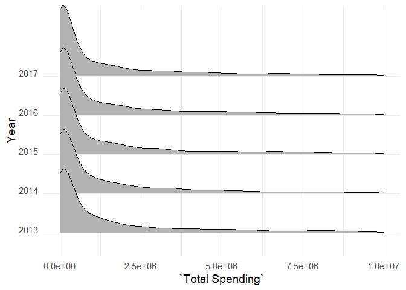
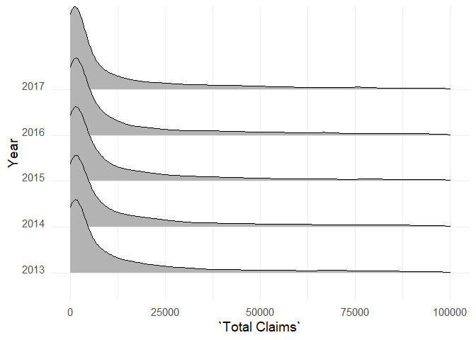
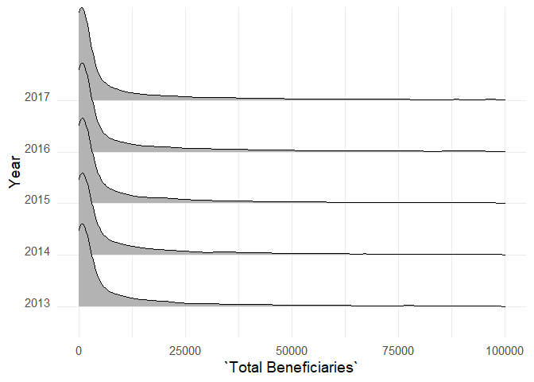
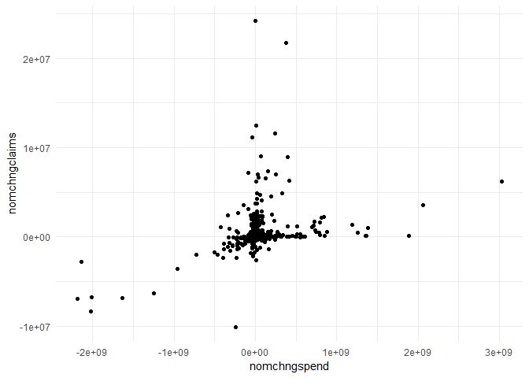
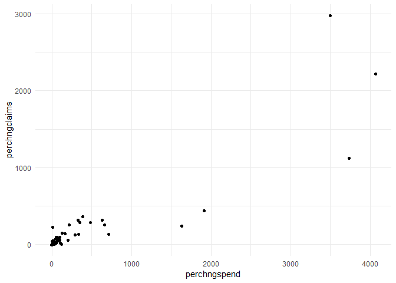
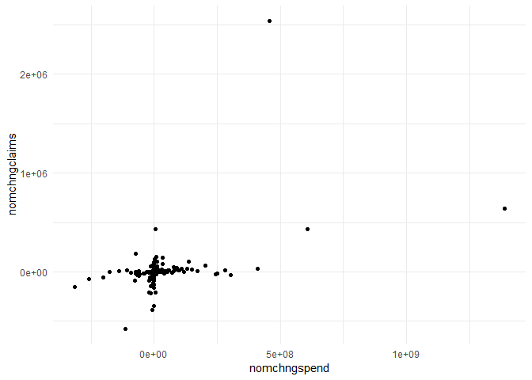
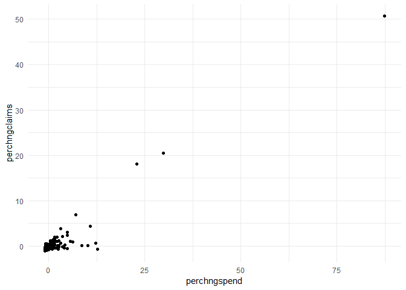

Prescription Drug Price EDA
================
USAFactsTyler
21 May, 2019

-   [Introduction](#introduction)
    -   [Research Question 1](#research-question-1)

``` r
rm(list=ls(all=T))

library(tidyverse)
library(tidyselect)
library(viridis)
library(ggthemes)
library(ggridges)
```

Introduction
============

This document reflects my exploration of the datasets found at the [CMS Drug Spending](https://www.cms.gov/Research-Statistics-Data-and-Systems/Statistics-Trends-and-Reports/Information-on-Prescription-Drugs/index.html) site. This document is broken up into three different sections with the following research questions driving each phase of data exploration:

1.  What is the relationship between spend and claims at a brand level and has that relationship changed over the past five years?
2.  Is there a material difference in the relationships discovered in Research Question 1 between the three programs for which CMS has provided data, namely Medicare Part B, Medicare Part D and Medicaid?
3.  Where there is manufacturer level information available, does the relationship between spend and claims vary by the manufacturer, and if so, are certain manufacturer's exhibiting higher costs generally across brands?

Research Question 1
-------------------

``` r
medicaid <- read_csv("medicaid.csv")
partb <- read_csv("medicarepartb.csv")
partd <- read_csv("medicarepartd.csv")
```

``` r
partd <- partd %>%
  mutate_at(c("Brand Name", "Generic Name", "Manufacturer", "Year"), as_factor) %>%
  na.omit(.)

colnames(partd)[6] <- "Total Claims"

partb <- partb %>%
  mutate_at(c("Medicare Billing Code (HCPCS Code)", "Brand Name", "Generic Name", "Year"), as_factor) %>%
  na.omit(.)

medicaid <- medicaid %>%
  mutate_at(c("Brand Name", "Generic Name", "Manufacturer", "Year"), as_factor) %>%
  na.omit(.)
```

``` r
summary(partd)
```

    ##                Brand Name                            Generic Name  
    ##  Insulin Syringe    :  205   Pen Needle, Diabetic          :  211  
    ##  Levetiracetam*     :  131   Syringe And Needle,Insulin,1ml:  207  
    ##  Amlodipine Besylate:  122   Metformin HCl                 :  188  
    ##  Gabapentin         :  120   Alcohol Antiseptic Pads       :  182  
    ##  Montelukast Sodium :  110   Syringe-Needle,Insulin,0.5 Ml :  179  
    ##  Lisinopril         :  103   Syring-Needl,Disp,Insul,0.3 Ml:  165  
    ##  (Other)            :27034   (Other)                       :26693  
    ##           Manufacturer   Total Spending      Total Dosage Units 
    ##  Mylan          : 1383   Min.   :5.000e+01   Min.   :2.500e+01  
    ##  Sandoz         : 1192   1st Qu.:1.083e+05   1st Qu.:7.139e+04  
    ##  Teva USA       : 1128   Median :1.164e+06   Median :5.946e+05  
    ##  Mylan Instituti:  770   Mean   :2.213e+07   Mean   :1.541e+07  
    ##  AHP            :  769   3rd Qu.:7.244e+06   3rd Qu.:5.485e+06  
    ##  Apotex Corp    :  541   Max.   :7.031e+09   Max.   :1.665e+09  
    ##  (Other)        :22042                                          
    ##   Total Claims      Total Beneficiaries
    ##  Min.   :      11   Min.   :     11    
    ##  1st Qu.:    1488   1st Qu.:    542    
    ##  Median :   11020   Median :   3817    
    ##  Mean   :  228747   Mean   :  71155    
    ##  3rd Qu.:   97029   3rd Qu.:  33925    
    ##  Max.   :22488587   Max.   :5273526    
    ##                                        
    ##  Average Spending Per Dosage Unit (Weighted) Average Spending Per Claim
    ##  Min.   :    0.00                            Min.   :     0.42         
    ##  1st Qu.:    0.31                            1st Qu.:    18.48         
    ##  Median :    1.07                            Median :    55.90         
    ##  Mean   :   74.05                            Mean   :   600.94         
    ##  3rd Qu.:    5.12                            3rd Qu.:   222.06         
    ##  Max.   :39026.76                            Max.   :119126.15         
    ##                                                                        
    ##  Average Spending Per Beneficiary   Year     
    ##  Min.   :      0.0                2013:4380  
    ##  1st Qu.:     48.5                2014:5024  
    ##  Median :    151.1                2015:5609  
    ##  Mean   :   3298.0                2016:5621  
    ##  3rd Qu.:    659.3                2017:7191  
    ##  Max.   :1218965.3                           
    ## 

Looking at the summary for Medicare Part D, there are four things that I want to highlight:

1.  The distance between the first two quartiles and the max value is heavily right skewed for each of the "Total" metrics. This likely implies there are some large outliers for each of the univariate distributions
2.  There are many more drugs on the market in 2017 than in 2013. The jump between 2016 and 2017 was especially large, at a 27% increase in one year.
3.  There top 6 manufacturers supplied 26% of all brands in this time frame, implying the market is characterized by several large players but also consists of many smaller and mid-level firms.
4.  The products with the most brand nad manufacturer combinations seem to be diabetic insulin needles.

``` r
summary(partb)
```

    ##  Medicare Billing Code (HCPCS Code) Drug Description  
    ##  90371  :   5                       Length:2177       
    ##  90375  :   5                       Class :character  
    ##  90376  :   5                       Mode  :character  
    ##  90586  :   5                                         
    ##  90632  :   5                                         
    ##  90670  :   5                                         
    ##  (Other):2147                                         
    ##                       Brand Name                        Generic Name 
    ##  HyperHEP B S-D*           :   5   MethylprednIsolone Acetate*:  15  
    ##  HyperRAB S-D              :   5   0.9 % Sodium Chloride      :  15  
    ##  Imogam Rabies-HT          :   5   Antihemophilic Factor/VWF  :  15  
    ##  BCG (Tice Strain) (90586)*:   5   Methotrexate Sodium*       :  15  
    ##  Havrix*                   :   5   Tacrolimus                 :  11  
    ##  Prevnar 13                :   5   Rabies Immune Globulin/PF  :  10  
    ##  (Other)                   :2147   (Other)                    :2096  
    ##  Total Spending      Total Dosage Units   Total Claims    
    ##  Min.   :1.100e+01   Min.   :       58   Min.   :     15  
    ##  1st Qu.:1.158e+05   1st Qu.:    15732   1st Qu.:   1341  
    ##  Median :1.267e+06   Median :   142686   Median :   7630  
    ##  Mean   :5.544e+07   Mean   :  5606214   Mean   : 108766  
    ##  3rd Qu.:1.910e+07   3rd Qu.:  1733469   3rd Qu.:  60414  
    ##  Max.   :2.466e+09   Max.   :428726351   Max.   :5743305  
    ##                                                           
    ##  Total Beneficiaries Average Spending Per Dosage Unit
    ##  Min.   :     11     Min.   :    0.01                
    ##  1st Qu.:    352     1st Qu.:    1.97                
    ##  Median :   2404     Median :    9.54                
    ##  Mean   :  45370     Mean   :  215.16                
    ##  3rd Qu.:  13656     3rd Qu.:   50.47                
    ##  Max.   :5693733     Max.   :38716.24                
    ##                                                      
    ##  Average Spending Per Claim Average Spending Per Beneficiary   Year    
    ##  Min.   :    0.10           Min.   :     0.2                 2013:407  
    ##  1st Qu.:   16.19           1st Qu.:    37.2                 2014:426  
    ##  Median :  189.97           Median :   637.2                 2015:435  
    ##  Mean   : 2635.10           Mean   : 19519.8                 2016:454  
    ##  3rd Qu.: 1992.93           3rd Qu.:  7374.7                 2017:455  
    ##  Max.   :58621.51           Max.   :792223.8                           
    ## 

Looking at the summary for Medicare Part B, there are three things that I want to highlight:

1.  There is no manufacturer level information for this particular dataset
2.  The Total metrics are again all heavily right skewed
3.  The introduction of drugs over each of the years has been much slower than Medicare Part D.

``` r
summary(medicaid)
```

    ##                Brand Name                Generic Name  
    ##  Levetiracetam*     :  164   Levetiracetam     :  204  
    ##  Ondansetron HCl*   :  127   Metformin HCl     :  170  
    ##  Promethazine HCl*  :  126   Promethazine HCl  :  144  
    ##  Montelukast Sodium :  114   Lamotrigine       :  141  
    ##  Gabapentin         :  113   Potassium Chloride:  140  
    ##  Amlodipine Besylate:  107   Diltiazem HCl     :  136  
    ##  (Other)            :33682   (Other)           :33498  
    ##           Manufacturer   Total Spending      Total Dosage Units 
    ##  Mylan          : 1369   Min.   :0.000e+00   Min.   :2.000e+00  
    ##  Teva USA       : 1295   1st Qu.:5.988e+04   1st Qu.:2.205e+04  
    ##  Sandoz         : 1260   Median :4.272e+05   Median :1.948e+05  
    ##  Actavis Pharma/: 1037   Mean   :7.678e+06   Mean   :5.265e+06  
    ##  Mylan Instituti:  868   3rd Qu.:2.416e+06   3rd Qu.:1.757e+06  
    ##  Ahp            :  686   Max.   :2.465e+09   Max.   :1.220e+09  
    ##  (Other)        :27918                                          
    ##   Total Claims      Average Spending Per Dosage Unit (Weighted)
    ##  Min.   :      11   Min.   :    0.00                           
    ##  1st Qu.:     852   1st Qu.:    0.39                           
    ##  Median :    5234   Median :    1.45                           
    ##  Mean   :   86611   Mean   :   73.21                           
    ##  3rd Qu.:   37905   3rd Qu.:    7.32                           
    ##  Max.   :10036481   Max.   :33809.93                           
    ##                                                                
    ##  Average Spending Per Claim   Year     
    ##  Min.   :    0.00           2013:5555  
    ##  1st Qu.:   17.20           2014:6292  
    ##  Median :   52.26           2015:7066  
    ##  Mean   :  596.73           2016:7760  
    ##  3rd Qu.:  179.16           2017:7760  
    ##  Max.   :99527.18                      
    ## 

Looking at the summary for Medicaid, there are three things I want to highlight:

1.  Surprisingly, there does not appear to be any change in the number of drugs offered between 2016 and 2017. There is still
2.  The Total Metrics are again heavily right skewed
3.  The medicaid information doesn't contain benificiary information, but does contain manufacturer level data.

Just to visually confirm what I was seeing in the quartile summary, I want to look at a ridgeplot of each of the three primary metrics that I'm interested in: Total Spend, Total Claims, and Total Beneficiaries.

``` r
partd %>%
  group_by(`Brand Name`) %>%
  summarise(numyrs = n_distinct(Year)) %>%
  ungroup(.) %>%
  right_join(partd, by = "Brand Name") %>%
  filter(numyrs == 5) %>%
  ggplot(aes(x = `Total Spending`, y = Year)) +
  geom_density_ridges() +
  theme_minimal(base_size = 14) + theme(axis.text.y = element_text(vjust = 0)) +
  xlim(0, 1e7)
```



``` r
partd %>%
  group_by(`Brand Name`) %>%
  summarise(numyrs = n_distinct(Year)) %>%
  ungroup(.) %>%
  right_join(partd, by = "Brand Name") %>%
  filter(numyrs == 5) %>%
  ggplot(aes(x = `Total Claims`, y = Year)) +
  geom_density_ridges() +
  theme_minimal(base_size = 14) + theme(axis.text.y = element_text(vjust = 0)) +
  xlim(0, 1e5)
```



``` r
partd %>%
  group_by(`Brand Name`) %>%
  summarise(numyrs = n_distinct(Year)) %>%
  ungroup(.) %>%
  right_join(partd, by = "Brand Name") %>%
  filter(numyrs == 5) %>%
  ggplot(aes(x = `Total Beneficiaries`, y = Year)) +
  geom_density_ridges() +
  theme_minimal(base_size = 14) + theme(axis.text.y = element_text(vjust = 0)) +
  xlim(0, 1e5)
```



These metrics are so heavily right skewed that it's very difficult to assess if the distributions have shown any meaningful change over time. As such I want to look at the "total" metrics from a log-transformed univariate perspective across each of the three datasets. Ridgeplots are my preferred way to look at univariate distributions separated by a factor level so I'll continue to use them heavily through this part of the EDA.

``` r
partd %>%
  group_by(`Brand Name`) %>%
  summarise(numyrs = n_distinct(Year)) %>%
  ungroup(.) %>%
  right_join(partd, by = "Brand Name") %>%
  filter(numyrs == 5) %>%
  group_by(`Brand Name`, Year) %>%
  summarise(brandspend = sum(`Total Spending`), 
            branddose = sum(`Total Dosage Units`), 
            brandclaims = sum(`Total Claims`), 
            brandbens = sum(`Total Beneficiaries`)) %>%
  ungroup(.) %>%
  mutate(logspend = log(brandspend)) %>%
  ggplot(aes(x = logspend, y = fct_relevel(Year, rev), fill = factor(..quantile..))) +
  stat_density_ridges(
    geom = "density_ridges_gradient", calc_ecdf = TRUE,
    quantiles = 4, quantile_lines = TRUE
  ) +
  scale_fill_viridis(discrete = TRUE, name = "Quartiles", option = "E") +
  theme_minimal(base_size = 14) +
  theme(axis.text.y = element_text(vjust = 0)) +
  labs(x = "Log of Total Spend", y = "Year", title = "Total Spend of Medicare Part D on prescription drugs\nfor only brands available all five years")
```


``` r
partd %>%
  group_by(`Brand Name`) %>%
  summarise(numyrs = n_distinct(Year)) %>%
  ungroup(.) %>%
  right_join(partd, by = "Brand Name") %>%
  filter(numyrs == 5) %>%
  group_by(`Brand Name`, Year) %>%
  summarise(brandspend = sum(`Total Spending`), 
            branddose = sum(`Total Dosage Units`), 
            brandclaims = sum(`Total Claims`), 
            brandbens = sum(`Total Beneficiaries`)) %>%
  ungroup(.) %>%
  mutate(logclaims = log(brandclaims)) %>%
  ggplot(aes(x = logclaims, y = fct_relevel(Year, rev), fill = factor(..quantile..))) +
  stat_density_ridges(
    geom = "density_ridges_gradient", calc_ecdf = TRUE,
    quantiles = 4, quantile_lines = TRUE
  ) +
  scale_fill_viridis(discrete = TRUE, name = "Quartiles", option = "E") +
  theme_minimal(base_size = 14) +
  theme(axis.text.y = element_text(vjust = 0)) +
  labs(x = "Log of Total Claims", y = "Year", title = "Total Claims of Medicare Part D on prescription drugs\nfor only brands available all five years")
```


``` r
partd %>%
  group_by(`Brand Name`) %>%
  summarise(numyrs = n_distinct(Year)) %>%
  ungroup(.) %>%
  right_join(partd, by = "Brand Name") %>%
  filter(numyrs == 5) %>%
  group_by(`Brand Name`, Year) %>%
  summarise(brandspend = sum(`Total Spending`), 
            branddose = sum(`Total Dosage Units`), 
            brandclaims = sum(`Total Claims`), 
            brandbens = sum(`Total Beneficiaries`)) %>%
  ungroup(.) %>%
  mutate(logbens = log(brandbens)) %>%
  ggplot(aes(x = logbens, y = fct_relevel(Year, rev), fill = factor(..quantile..))) +
  stat_density_ridges(
    geom = "density_ridges_gradient", calc_ecdf = TRUE,
    quantiles = 4, quantile_lines = TRUE
  ) +
  scale_fill_viridis(discrete = TRUE, name = "Quartiles", option = "E") +
  theme_minimal(base_size = 14) +
  theme(axis.text.y = element_text(vjust = 0)) +
  labs(x = "Log of Total Beneficiaries", y = "Year", title = "Total Beneficiaries of Medicare Part D on prescription drugs\nfor only brands available all five years")
```


``` r
partb %>%
  group_by(`Brand Name`) %>%
  summarise(numyrs = n_distinct(Year)) %>%
  ungroup(.) %>%
  right_join(partb, by = "Brand Name") %>%
  filter(numyrs == 5) %>%
  mutate(logspend = log(`Total Spending`)) %>%
  ggplot(aes(x = logspend, y = fct_relevel(Year, rev), fill = factor(..quantile..))) +
  stat_density_ridges(
    geom = "density_ridges_gradient", calc_ecdf = TRUE,
    quantiles = 4, quantile_lines = TRUE
  ) +
  scale_fill_viridis(discrete = TRUE, name = "Quartiles", option = "E") +
  theme_minimal(base_size = 14) +
  theme(axis.text.y = element_text(vjust = 0)) +
  labs(x = "Log of Total Spend", y = "Year", title = "Total Spend of Medicare Part B on prescription drugs\nfor only brands available all five years")
```


``` r
partb %>%
  group_by(`Brand Name`) %>%
  summarise(numyrs = n_distinct(Year)) %>%
  ungroup(.) %>%
  right_join(partb, by = "Brand Name") %>%
  filter(numyrs == 5) %>%
  mutate(logclaims = log(`Total Claims`)) %>%
  ggplot(aes(x = logclaims, y = fct_relevel(Year, rev), fill = factor(..quantile..))) +
  stat_density_ridges(
    geom = "density_ridges_gradient", calc_ecdf = TRUE,
    quantiles = 4, quantile_lines = TRUE
  ) +
  scale_fill_viridis(discrete = TRUE, name = "Quartiles", option = "E") +
  theme_minimal(base_size = 14) +
  theme(axis.text.y = element_text(vjust = 0)) +
  labs(x = "Log of Total Claims", y = "Year", title = "Total Claims of Medicare Part B on prescription drugs\nfor only brands available all five years")
```


``` r
partb %>%
  group_by(`Brand Name`) %>%
  summarise(numyrs = n_distinct(Year)) %>%
  ungroup(.) %>%
  right_join(partb, by = "Brand Name") %>%
  filter(numyrs == 5) %>%
  mutate(logbens = log(`Total Beneficiaries`)) %>%
  ggplot(aes(x = logbens, y = fct_relevel(Year, rev), fill = factor(..quantile..))) +
  stat_density_ridges(
    geom = "density_ridges_gradient", calc_ecdf = TRUE,
    quantiles = 4, quantile_lines = TRUE
  ) +
  scale_fill_viridis(discrete = TRUE, name = "Quartiles", option = "E") +
  theme_minimal(base_size = 14) +
  theme(axis.text.y = element_text(vjust = 0)) +
  labs(x = "Log of Total Beneficiaries", y = "Year", title = "Total Beneficiaries of Medicare Part B on prescription drugs\nfor only brands available all five years")
```


``` r
medicaid %>%
  group_by(`Brand Name`) %>%
  summarise(numyrs = n_distinct(Year)) %>%
  ungroup(.) %>%
  right_join(medicaid, by = "Brand Name") %>%
  filter(numyrs == 5) %>%
  group_by(`Brand Name`, Year) %>%
  summarise(brandspend = sum(`Total Spending`), 
            branddose = sum(`Total Dosage Units`), 
            brandclaims = sum(`Total Claims`)) %>%
  ungroup(.) %>%
  mutate(logspend = log1p(brandspend)) %>%
  ggplot(aes(x = logspend, y = fct_relevel(Year, rev), fill = factor(..quantile..))) +
  stat_density_ridges(
    geom = "density_ridges_gradient", calc_ecdf = TRUE,
    quantiles = 4, quantile_lines = TRUE
  ) +
  scale_fill_viridis(discrete = TRUE, name = "Quartiles", option = "E") +
  theme_minimal(base_size = 14) +
  theme(axis.text.y = element_text(vjust = 0)) +
  labs(x = "Log of Total Spend", y = "Year", title = "Total Spend of Medicaid on prescription drugs\nfor only brands available all five years")
```


``` r
medicaid %>%
  group_by(`Brand Name`) %>%
  summarise(numyrs = n_distinct(Year)) %>%
  ungroup(.) %>%
  right_join(medicaid, by = "Brand Name") %>%
  filter(numyrs == 5) %>%
  group_by(`Brand Name`, Year) %>%
  summarise(brandspend = sum(`Total Spending`), 
            branddose = sum(`Total Dosage Units`), 
            brandclaims = sum(`Total Claims`)) %>%
  ungroup(.) %>%
  mutate(logclaims = log1p(brandclaims)) %>%
  ggplot(aes(x = logclaims, y = fct_relevel(Year, rev), fill = factor(..quantile..))) +
  stat_density_ridges(
    geom = "density_ridges_gradient", calc_ecdf = TRUE,
    quantiles = 4, quantile_lines = TRUE
  ) +
  scale_fill_viridis(discrete = TRUE, name = "Quartiles", option = "E") +
  theme_minimal(base_size = 14) +
  theme(axis.text.y = element_text(vjust = 0)) +
  labs(x = "Log of Total Claims", y = "Year", title = "Total Claims of Medicaid on prescription drugs\nfor only brands available all five years")
```


``` r
chngyr <- 2017 - 2013

partdbrandchng <- partd %>%
  group_by(`Brand Name`) %>%
  summarise(numyrs = n_distinct(Year)) %>%
  ungroup(.) %>%
  right_join(partd, by = "Brand Name") %>%
  filter(numyrs == 5) %>%
  group_by(`Brand Name`, Year) %>%
  summarise(brandspend = sum(`Total Spending`), 
            branddose = sum(`Total Dosage Units`), 
            brandclaims = sum(`Total Claims`), 
            brandbens = sum(`Total Beneficiaries`)) %>%
  ungroup(.) %>%
  group_by(`Brand Name`) %>%
  arrange(Year, .by_group = TRUE) %>%
  mutate(nomchngspend = brandspend - lag(brandspend, n = chngyr), 
         nomchngdose = branddose - lag(branddose, n = chngyr), 
         nomchngclaims = brandclaims - lag(brandclaims, n = chngyr), 
         nomchngbens = brandbens - lag(brandbens, n = chngyr),
         perchngspend = (brandspend-lag(brandspend, n = chngyr))/lag(brandspend, n = chngyr),
         perchngdose = (branddose-lag(branddose, n = chngyr))/lag(branddose, n = chngyr),
         perchngclaims = (brandclaims-lag(brandclaims, n = chngyr))/lag(brandclaims, n = chngyr),
         perchngbens = (brandbens-lag(brandbens, n = chngyr))/lag(brandbens, n = chngyr)
         ) %>%
  fill(nomchngspend, 
       nomchngdose, 
       nomchngclaims, 
       nomchngbens,
       perchngspend,
       perchngdose,
       perchngclaims,
       perchngbens,
       .direction = "up")

partdbrandchng %>%
  select(everything(), -Year, -brandspend, -branddose, -brandclaims, -brandbens) %>%
  distinct() %>%
  ggplot(aes(x = nomchngspend, y = nomchngclaims)) +
  geom_point(stat = "identity", position = "jitter") +
  theme_minimal()
```



``` r
partdbrandchng %>%
  select(everything(), -Year, -brandspend, -branddose, -brandclaims, -brandbens) %>%
  distinct() %>%
  ggplot(aes(x = perchngspend, y = perchngclaims)) +
  geom_point(stat = "identity", position = "jitter") +
  theme_minimal()
```



``` r
partbbrandchng <- partb %>%
  group_by(`Brand Name`) %>%
  summarise(numyrs = n_distinct(Year)) %>%
  ungroup(.) %>%
  right_join(partb, by = "Brand Name") %>%
  filter(numyrs == 5) %>%
  group_by(`Brand Name`, Year) %>%
  summarise(brandspend = sum(`Total Spending`), 
            branddose = sum(`Total Dosage Units`), 
            brandclaims = sum(`Total Claims`), 
            brandbens = sum(`Total Beneficiaries`)) %>%
  ungroup(.) %>%
  group_by(`Brand Name`) %>%
  arrange(Year, .by_group = TRUE) %>%
  mutate(nomchngspend = brandspend - lag(brandspend, n = chngyr), 
         nomchngdose = branddose - lag(branddose, n = chngyr), 
         nomchngclaims = brandclaims - lag(brandclaims, n = chngyr), 
         nomchngbens = brandbens - lag(brandbens, n = chngyr),
         perchngspend = (brandspend/lag(brandspend, n = chngyr)) - 1,
         perchngdose = (branddose/lag(branddose, n = chngyr)) - 1,
         perchngclaims = (brandclaims/lag(brandclaims, n = chngyr)) - 1,
         perchngbens = (brandbens/lag(brandbens, n = chngyr)) - 1) %>%
  fill(nomchngspend, 
       nomchngdose, 
       nomchngclaims, 
       nomchngbens,
       perchngspend,
       perchngdose,
       perchngclaims,
       perchngbens,
       .direction = "up")

partbbrandchng %>%
  select(everything(), -Year, -brandspend, -branddose, -brandclaims, -brandbens) %>%
  distinct() %>%
  ggplot(aes(x = nomchngspend, y = nomchngclaims)) +
  geom_point(stat = "identity") +
  theme_minimal()
```



``` r
partbbrandchng %>%
  select(everything(), -Year, -brandspend, -branddose, -brandclaims, -brandbens) %>%
  distinct() %>%
  ggplot(aes(x = perchngspend, y = perchngclaims)) +
  geom_point(stat = "identity") +
  theme_minimal()
```



``` r
medicaidbrandchng <- medicaid %>%
  group_by(`Brand Name`) %>%
  summarise(numyrs = n_distinct(Year)) %>%
  ungroup(.) %>%
  right_join(medicaid, by = "Brand Name") %>%
  filter(numyrs == 5) %>%
  group_by(`Brand Name`, Year) %>%
  summarise(brandspend = sum(`Total Spending`), 
            branddose = sum(`Total Dosage Units`), 
            brandclaims = sum(`Total Claims`)) %>%
  ungroup(.) %>%
  group_by(`Brand Name`) %>%
  arrange(Year, .by_group = TRUE) %>%
  mutate(nomchngspend = brandspend - lag(brandspend, n = chngyr), 
         nomchngdose = branddose - lag(branddose, n = chngyr), 
         nomchngclaims = brandclaims - lag(brandclaims, n = chngyr),
         perchngspend = (brandspend/lag(brandspend, n = chngyr)) - 1,
         perchngdose = (branddose/lag(branddose, n = chngyr)) - 1,
         perchngclaims = (brandclaims/lag(brandclaims, n = chngyr)) - 1) %>%
  fill(nomchngspend, 
       nomchngdose, 
       nomchngclaims,
       perchngspend,
       perchngdose,
       perchngclaims,
       .direction = "up")

medicaidbrandchng %>%
  select(everything(), -Year, -brandspend, -branddose, -brandclaims) %>%
  distinct() %>%
  ggplot(aes(x = nomchngspend, y = nomchngclaims)) +
  geom_point(stat = "identity") +
  theme_minimal()
```


``` r
medicaidbrandchng %>%
  select(everything(), -Year, -brandspend, -branddose, -brandclaims) %>%
  distinct() %>%
  ggplot(aes(x = perchngspend, y = perchngclaims)) +
  geom_point(stat = "identity") +
  theme_minimal()
```


``` r
partd_manufac <- partd %>%
  group_by(`Brand Name`, Year) %>%
  mutate(avg_spend_per_claim_brand = signif(sum(`Total Spending`)/sum(`Total Claims`), 3)) %>%
  group_by(Manufacturer, add = TRUE) %>%
  mutate(avg_spend_per_claim_manufac = sum(`Total Spending`)/sum(`Total Claims`)) %>%
  mutate(avg_spend_per_claim_resid = signif(avg_spend_per_claim_manufac, 3) - signif(avg_spend_per_claim_brand, 3), 
         avg_spend_per_claim_status = ifelse(avg_spend_per_claim_resid == 0, "at_average", ifelse(avg_spend_per_claim_resid < 0, "below_average", "above_average")), 
         market_diff = avg_spend_per_claim_resid * `Total Claims`) %>%
  ungroup(.) %>%
  group_by(Manufacturer, Year, avg_spend_per_claim_status) %>%
  summarise(manufacturer_diff = sum(market_diff), price_status_drugs = n()) 
```

``` r
medicaid_manufac <- medicaid %>%
  group_by(`Brand Name`, Year) %>%
  mutate(avg_spend_per_claim_brand = signif(sum(`Total Spending`)/sum(`Total Claims`), 3)) %>%
  group_by(Manufacturer, add = TRUE) %>%
  mutate(avg_spend_per_claim_manufac = sum(`Total Spending`)/sum(`Total Claims`)) %>%
  mutate(avg_spend_per_claim_resid = signif(avg_spend_per_claim_manufac, 3) - signif(avg_spend_per_claim_brand, 3), 
         avg_spend_per_claim_status = ifelse(avg_spend_per_claim_resid == 0, "at_average", ifelse(avg_spend_per_claim_resid < 0, "below_average", "above_average")), 
         market_diff = avg_spend_per_claim_resid * `Total Claims`) %>%
  ungroup(.) %>%
  group_by(Manufacturer, Year, avg_spend_per_claim_status) %>%
  summarise(manufacturer_diff = sum(market_diff), price_status_drugs = n()) 
```

``` r
partd %>% 
  filter(str_detect(`Generic Name`, "Insulin")) %>%
  group_by(Year) %>%
  summarise(totalspend = sum(`Total Spending`)) %>%
  ggplot(aes(x = Year, y = totalspend, fill = totalspend)) +
  geom_bar(stat = "identity") +
  theme_minimal()
```


``` r
partd %>% 
  filter(str_detect(`Generic Name`, "Insulin")) %>%
  group_by(Year) %>%
  summarise(totalbens = sum(`Total Beneficiaries`)) %>%
  ggplot(aes(x = Year, y = totalbens, fill = totalbens)) +
  geom_bar(stat = "identity") +
  theme_minimal()
```


