Prescription Drug Price EDA
================
USAFactsTyler
29 May, 2019

-   [Introduction](#introduction)
    -   [Background Definitions](#background-definitions)
    -   [Preliminary Cleaning/Summary](#preliminary-cleaningsummary)
-   [Body](#body)
    -   [Aggregate Trends](#aggregate-trends)
        -   [Combined](#combined)
    -   [Univariatie Distribution Trends - Brand Level](#univariatie-distribution-trends---brand-level)
        -   [Medicare Part D](#medicare-part-d)
        -   [Medicare Part B](#medicare-part-b)
        -   [Medicaid](#medicaid)
    -   [Bivariate Change - Brand Level](#bivariate-change---brand-level)
        -   [Medicare Part D](#medicare-part-d-1)
        -   [Medicare Part B](#medicare-part-b-1)
        -   [Medicaid](#medicaid-1)
    -   [Manufacturer Level](#manufacturer-level)
    -   [Insulin](#insulin)
-   [Conclusion](#conclusion)

Introduction
============

This document reflects my exploration of the datasets found at the [CMS Drug Spending](https://www.cms.gov/Research-Statistics-Data-and-Systems/Statistics-Trends-and-Reports/Information-on-Prescription-Drugs/index.html) site. This document is broken up into three different sections with the following research questions driving each phase of data exploration:

1.  What is the relationship between spend and claims at a brand level and has that relationship changed over the past five years?
2.  Is there a material difference in the relationships discovered in Research Question 1 between the three programs for which CMS has provided data, namely Medicare Part B, Medicare Part D and Medicaid?
3.  Are there sub-categories of prescription drugs that exhibit noticeably higher growth in spend relative to claims? Conversely, are there sub categories of prescription drugs that exhibit noticeably lower growth in spend relative to claims?

Background Definitions
----------------------

-   Types of drugs covered by Medicare Part B - Medicare Part B covers prescription drugs that are either administered by a medical professional in a patient setting or in various outpatient settings

-   Types of drugs covered by Medicare Part D - Medicare Part D covers prescription drugs that can be self-administered and

-   Total Spend Medicare Part B - Drug spending metrics for Part B drugs represent the full value of the product, including the Medicare payment and beneficiary liability. All Part B drug spending metrics are calculated at the Healthcare Common Procedure Coding System (HCPCS) level.

-   Total Spend Medicare Part D - Drug spending metrics for Part D drugs are based on the gross drug cost, which represents total spending for the prescription claim, including Medicare, plan, and beneficiary payments. The Part D spending metrics do not reflect any manufacturers’ rebates or other price concessions as CMS is prohibited from publicly disclosing such information.

-   Total Spend Medicaid - Drug spending metrics for Medicaid represent the total amount reimbursed by both Medicaid and non-Medicaid entities to pharmacies for the drug. Medicaid drug spending contains both the Federal and State Reimbursement and is inclusive of any applicable dispensing fees. In addition, this total is not reduced or affected by Medicaid rebates paid to the states.

-   Total Claims - Number of prescription fills for each drug. Includes original prescriptions and refills.

Preliminary Cleaning/Summary
----------------------------

Theree are two things that need to be done with these datasets before we can start exploring them:

1.  General data cleaning tasks such as changing variable types to the appropriate values and omitting missing values.
2.  Convert the total spend metrics across each of the three programs to be inflation adjusted. Given that we are generally interested in comparing how things have changed over time, I will be using the inflation adjusted spend values as a default.

``` r
summary(partd)
```

    ##                Brand Name                            Generic Name  
    ##  Insulin Syringe    :  205   Pen Needle, Diabetic          :  211  
    ##  Levetiracetam*     :  131   Syringe And Needle,Insulin,1ml:  207  
    ##  Amlodipine Besylate:  122   Metformin HCl                 :  188  
    ##  Gabapentin         :  120   Alcohol Antiseptic Pads       :  182  
    ##  Montelukast Sodium :  110   Syringe-Needle,Insulin,0.5 Ml :  179  
    ##  Lisinopril         :  103   Syring-Needl,Disp,Insul,0.3 Ml:  165  
    ##  (Other)            :27034   (Other)                       :26693  
    ##           Manufacturer   Total Spending      Total Dosage Units 
    ##  Mylan          : 1383   Min.   :5.000e+01   Min.   :2.500e+01  
    ##  Sandoz         : 1192   1st Qu.:1.083e+05   1st Qu.:7.139e+04  
    ##  Teva USA       : 1128   Median :1.164e+06   Median :5.946e+05  
    ##  Mylan Instituti:  770   Mean   :2.213e+07   Mean   :1.541e+07  
    ##  AHP            :  769   3rd Qu.:7.244e+06   3rd Qu.:5.485e+06  
    ##  Apotex Corp    :  541   Max.   :7.031e+09   Max.   :1.665e+09  
    ##  (Other)        :22042                                          
    ##   Total Claims      Total Beneficiaries
    ##  Min.   :      11   Min.   :     11    
    ##  1st Qu.:    1488   1st Qu.:    542    
    ##  Median :   11020   Median :   3817    
    ##  Mean   :  228747   Mean   :  71155    
    ##  3rd Qu.:   97029   3rd Qu.:  33925    
    ##  Max.   :22488587   Max.   :5273526    
    ##                                        
    ##  Average Spending Per Dosage Unit (Weighted) Average Spending Per Claim
    ##  Min.   :    0.00                            Min.   :     0.42         
    ##  1st Qu.:    0.31                            1st Qu.:    18.48         
    ##  Median :    1.07                            Median :    55.90         
    ##  Mean   :   74.05                            Mean   :   600.94         
    ##  3rd Qu.:    5.12                            3rd Qu.:   222.06         
    ##  Max.   :39026.76                            Max.   :119126.15         
    ##                                                                        
    ##  Average Spending Per Beneficiary      Year         inf_rate    
    ##  Min.   :      0.0                Min.   :2013   Min.   :1.000  
    ##  1st Qu.:     48.5                1st Qu.:2014   1st Qu.:1.000  
    ##  Median :    151.1                Median :2015   Median :1.030  
    ##  Mean   :   3298.0                Mean   :2015   Mean   :1.024  
    ##  3rd Qu.:    659.3                3rd Qu.:2017   3rd Qu.:1.033  
    ##  Max.   :1218965.3                Max.   :2017   Max.   :1.050  
    ##                                                                 
    ##     baseyear      yeartype         Inf Total Spend    
    ##  Min.   :2017   Length:27825       Min.   :5.200e+01  
    ##  1st Qu.:2017   Class :character   1st Qu.:1.100e+05  
    ##  Median :2017   Mode  :character   Median :1.190e+06  
    ##  Mean   :2017                      Mean   :2.266e+07  
    ##  3rd Qu.:2017                      3rd Qu.:7.410e+06  
    ##  Max.   :2017                      Max.   :7.240e+09  
    ## 

Looking at the summary for Medicare Part D, there are four things that I want to highlight:

1.  The distance between the first two quartiles and the max value is heavily right skewed for each of the "Total" metrics. This likely implies there are some large outliers for each of the univariate distributions
2.  There are many more drugs on the market in 2017 than in 2013. The jump between 2016 and 2017 was especially large, at a 27% increase in one year.
3.  There top 6 manufacturers supplied 26% of all brands in this time frame, implying the market is characterized by several large players but also consists of many smaller and mid-level firms.
4.  The products with the most brand nad manufacturer combinations seem to be diabetic insulin needles.

``` r
summary(partb)
```

    ##  Medicare Billing Code (HCPCS Code) Drug Description  
    ##  90371  :   5                       Length:2299       
    ##  90375  :   5                       Class :character  
    ##  90376  :   5                       Mode  :character  
    ##  90586  :   5                                         
    ##  90632  :   5                                         
    ##  90656  :   5                                         
    ##  (Other):2269                                         
    ##                                                          Brand Name  
    ##  HyperHEP B S-D*                                              :   5  
    ##  HyperRAB S-D                                                 :   5  
    ##  Imogam Rabies-HT                                             :   5  
    ##  BCG (Tice Strain) (90586)*                                   :   5  
    ##  Havrix*                                                      :   5  
    ##  Vaccine Influenza Injection Muscle (Fluvirin), Age 3+ Years**:   5  
    ##  (Other)                                                      :2269  
    ##                       Generic Name  Total Spending     
    ##  Not Supplied               : 122   Min.   :1.100e+01  
    ##  MethylprednIsolone Acetate*:  15   1st Qu.:1.224e+05  
    ##  0.9 % Sodium Chloride      :  15   Median :1.445e+06  
    ##  Antihemophilic Factor/VWF  :  15   Mean   :5.382e+07  
    ##  Methotrexate Sodium*       :  15   3rd Qu.:1.873e+07  
    ##  Tacrolimus                 :  11   Max.   :2.466e+09  
    ##  (Other)                    :2106                      
    ##  Total Dosage Units   Total Claims     Total Beneficiaries
    ##  Min.   :       23   Min.   :     15   Min.   :     11    
    ##  1st Qu.:    16109   1st Qu.:   1374   1st Qu.:    370    
    ##  Median :   140172   Median :   7867   Median :   2496    
    ##  Mean   :  5345747   Mean   : 137666   Mean   :  76754    
    ##  3rd Qu.:  1629801   3rd Qu.:  66016   3rd Qu.:  15872    
    ##  Max.   :428726351   Max.   :8929660   Max.   :8788267    
    ##                                                           
    ##  Average Spending Per Dosage Unit Average Spending Per Claim
    ##  Min.   :    0.01                 Min.   :    0.10          
    ##  1st Qu.:    2.12                 1st Qu.:   17.03          
    ##  Median :   11.52                 Median :  173.76          
    ##  Mean   :  206.55                 Mean   : 2518.66          
    ##  3rd Qu.:   52.41                 3rd Qu.: 1809.25          
    ##  Max.   :38716.24                 Max.   :58621.51          
    ##                                                             
    ##  Average Spending Per Beneficiary      Year         inf_rate    
    ##  Min.   :     0.2                 Min.   :2013   Min.   :1.000  
    ##  1st Qu.:    34.5                 1st Qu.:2014   1st Qu.:1.021  
    ##  Median :   574.2                 Median :2015   Median :1.030  
    ##  Mean   : 18554.0                 Mean   :2015   Mean   :1.026  
    ##  3rd Qu.:  6108.7                 3rd Qu.:2016   3rd Qu.:1.033  
    ##  Max.   :792223.8                 Max.   :2017   Max.   :1.050  
    ##                                                                 
    ##     baseyear      yeartype         Inf Total Spend    
    ##  Min.   :2017   Length:2299        Min.   :1.200e+01  
    ##  1st Qu.:2017   Class :character   1st Qu.:1.230e+05  
    ##  Median :2017   Mode  :character   Median :1.470e+06  
    ##  Mean   :2017                      Mean   :5.514e+07  
    ##  3rd Qu.:2017                      3rd Qu.:1.905e+07  
    ##  Max.   :2017                      Max.   :2.470e+09  
    ## 

Looking at the summary for Medicare Part B, there are three things that I want to highlight:

1.  There is no manufacturer level information for this particular dataset
2.  The Total metrics are again all heavily right skewed
3.  The introduction of drugs over each of the years has been much slower than Medicare Part D.

``` r
summary(medicaid)
```

    ##                Brand Name                Generic Name  
    ##  Levetiracetam*     :  164   Levetiracetam     :  204  
    ##  Ondansetron HCl*   :  127   Metformin HCl     :  170  
    ##  Promethazine HCl*  :  126   Promethazine HCl  :  144  
    ##  Montelukast Sodium :  114   Lamotrigine       :  141  
    ##  Gabapentin         :  113   Potassium Chloride:  140  
    ##  Amlodipine Besylate:  107   Diltiazem HCl     :  136  
    ##  (Other)            :33682   (Other)           :33498  
    ##           Manufacturer   Total Spending      Total Dosage Units 
    ##  Mylan          : 1369   Min.   :0.000e+00   Min.   :2.000e+00  
    ##  Teva USA       : 1295   1st Qu.:5.988e+04   1st Qu.:2.205e+04  
    ##  Sandoz         : 1260   Median :4.272e+05   Median :1.948e+05  
    ##  Actavis Pharma/: 1037   Mean   :7.678e+06   Mean   :5.265e+06  
    ##  Mylan Instituti:  868   3rd Qu.:2.416e+06   3rd Qu.:1.757e+06  
    ##  Ahp            :  686   Max.   :2.465e+09   Max.   :1.220e+09  
    ##  (Other)        :27918                                          
    ##   Total Claims      Average Spending Per Dosage Unit (Weighted)
    ##  Min.   :      11   Min.   :    0.00                           
    ##  1st Qu.:     852   1st Qu.:    0.39                           
    ##  Median :    5234   Median :    1.45                           
    ##  Mean   :   86611   Mean   :   73.21                           
    ##  3rd Qu.:   37905   3rd Qu.:    7.32                           
    ##  Max.   :10036481   Max.   :33809.93                           
    ##                                                                
    ##  Average Spending Per Claim      Year         inf_rate        baseyear   
    ##  Min.   :    0.00           Min.   :2013   Min.   :1.000   Min.   :2017  
    ##  1st Qu.:   17.20           1st Qu.:2014   1st Qu.:1.021   1st Qu.:2017  
    ##  Median :   52.26           Median :2015   Median :1.030   Median :2017  
    ##  Mean   :  596.73           Mean   :2015   Mean   :1.025   Mean   :2017  
    ##  3rd Qu.:  179.16           3rd Qu.:2016   3rd Qu.:1.033   3rd Qu.:2017  
    ##  Max.   :99527.18           Max.   :2017   Max.   :1.050   Max.   :2017  
    ##                                                                          
    ##    yeartype         Inf Total Spend    
    ##  Length:34433       Min.   :0.000e+00  
    ##  Class :character   1st Qu.:6.110e+04  
    ##  Mode  :character   Median :4.380e+05  
    ##                     Mean   :7.859e+06  
    ##                     3rd Qu.:2.470e+06  
    ##                     Max.   :2.550e+09  
    ## 

Looking at the summary for Medicaid, there are three things I want to highlight:

1.  Surprisingly, there does not appear to be any change in the number of drugs offered between 2016 and 2017. There is still
2.  The Total Metrics are again heavily right skewed
3.  The medicaid information doesn't contain benificiary information, but does contain manufacturer level data.

Body
====

Aggregate Trends
----------------

The first thing that I'm going to look at is what's happening in aggregate across each of the three programs. The only things we can compare across all three programs are the inflation adjusted total spend and total claims at a brand level. There are two features I'm going to extract from this data, which are the following: the first year that each brand was introduced and whether or not a brand was continually offered through 2017. This will allow us to minorly control for the different lifecycle stages that drugs are at in terms of how long they have been on the market (although this is still imperfect given we don't know things like if a brand has patent that is expiring).

### Combined

The first graphic I want to look at is the average spend per claim is across each of the programs. A caveat here is that I'm only going to look at drugs that have been on the market for every year of data included in this dataset because I want to see how this metric is changing over time in and want to account for new drugs influencing that measure of central tendency rather than other forces.

``` r
# Average spend per claim for medicare part d, medicare part b, and medicaid from 2013-2017 (inflation adjusted), only drugs on market all 5 years 
combined %>%
  filter(numyrs == 5) %>%
  group_by(Program, Year) %>%
  summarise(`Average Spend Per Claim` = sum(`Inf Total Spend`)/sum(`Total Claims`), `Total Claims` = sum(`Total Claims`)) %>%
  ggplot(aes(x = Year, y = `Average Spend Per Claim`, colour = Program)) +
  geom_line(size = 1, aes(group=Program)) +
  labs(y = "Average Spend per Claim", title = "Average spend per claim* for Medicare Part B has grown by\n63 dollars over 5 years in real terms", caption = "*Only examining drugs that have been on market for all 5 years") +
  scale_y_continuous(labels = function(x) paste0("$", x), limits = c(0,600)) +
  scale_color_viridis(option = "E", end = 0.8, discrete = TRUE) +
  theme_minimal()
```

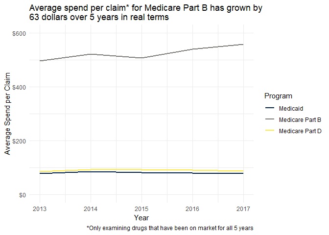

The most interesting thing here appears to be the increase in average cost per claim for Medicare Part B, which has increased $63 dollars in real terms. Medicaid and Medicare Part D both experienced minor bumps between 2013 and 2014 but have since fallen back to the same value they had in 2013.

``` r
# Percent change from 2013-2017 (inflation adjusted), in average spend per claim for medicare part d, medicare part b, and medicaid, only drugs on market all 5 years
combined %>%
  filter(numyrs == 5) %>%
  group_by(Program, Year) %>%
  summarise(`Average Spend Per Claim` = sum(`Inf Total Spend`)/sum(`Total Claims`)) %>%
  mutate(perchange = `Average Spend Per Claim`/lag(`Average Spend Per Claim`, n = 4) - 1) %>%
  na.omit(.) %>%
  ggplot(aes(x = Program, y = perchange, fill = "foo")) +
  geom_bar(stat = "identity") +
  labs(y = "% Diff in Avg Cost Per Claim", title = "Average spend per claim* for Medicare Part B has grown by\n13.5% over 5 years in real terms", caption = "*Only examining drugs that have been on market for all 5 years") +
  scale_y_continuous(labels = function(x) paste0(x*100, "%")) +
  scale_fill_manual(values = "#00204DFF") +
  theme_minimal() +
  theme(legend.position = "none") 
```

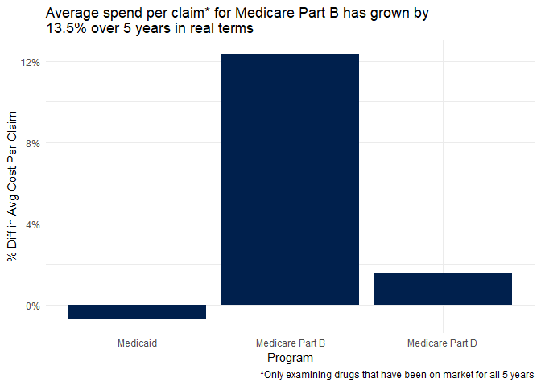

Looking at the same metric on a percentage change basis from 2013 to 2017, there has been a 13.5% increase of average spend per claim for Medicare Part B. Medicaid is flat, while Medicare Part D shows only a 1.5% increase. All of these percentage changes are in real terms.

``` r
# Prescription drug spend as % of total medicare part b spend from 2013-2017 (inflation adjusted)
combined %>%
  filter(Program %in% c("Medicare Part B")) %>%
  group_by(Year, Program) %>%
  summarise(totalcost_drugs = sum(`Inf Total Spend`)) %>%
  left_join(select(medicare_spend, Program, Year, infspend_2017), by = c("Program", "Year")) %>%
  mutate(drugsper_total = totalcost_drugs/infspend_2017) %>%
  ggplot(aes(x=Year, y = drugsper_total, color = "foo")) +
  geom_line(size = 1) +
  scale_y_continuous(labels = function(x) paste0(x*100, "%"), limits = c(0,0.1)) +
  scale_color_manual(values = "#00204DFF") +
  labs(y = "Drug Spend as % of Part B", title = "Prescription drug spending* has grown 1 percentage point\nas a portion of all Medicare Part B spend", caption = "*Spend in 2017 inflation adjusted dollars") +
  theme_minimal() +
  theme(legend.position = "none") 
```

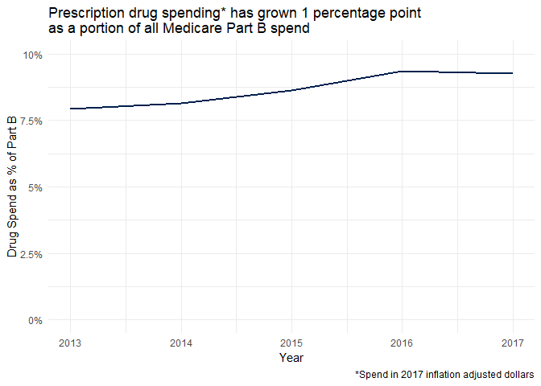

As a point of reference, the portion of the total Medicare Part B spend that prescription drugs account for has only increased by about 1%. Even though the average spend per claim for this program has substantially increased over the past five years, the total effect on Medicare Part B's cost is not as significant.

``` r
# Average claims per beneficiary for medicare part b and part d
combined %>%
  filter(numyrs == 5, Program != "Medicaid") %>%
  group_by(Program, Year) %>%
  summarise(`Average Claims Per Beneficiary` = sum(`Total Claims`)/sum(`Total Beneficiaries`)) %>%
  ggplot(aes(x = Year, y = `Average Claims Per Beneficiary`, colour = Program)) +
  geom_line(size = 1, aes(group=Program)) +
  labs(y = "Average Claims per Beneficiary", title = "Average claims per beneficiary have fallen since 2013\nfor both Medicare programs", caption = "*Only examining drugs that have been on market for all 5 years") +
  scale_color_viridis(option = "E", end = 0.8, discrete = TRUE) +
  theme_minimal()
```

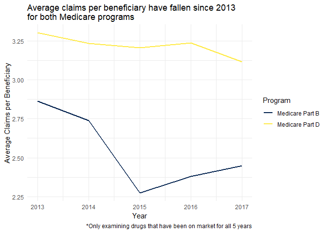

Another dynamic that I wanted to understand was the rate at which beneficiaries were making claims over time. Again I was only looking at drugs that have been available for all five years in the dataset as a controlling factor. For Medicare Part D, this rate has consistently declined at a fairly slow rate, while Medicare Part B shows a slightly different trend with a large drop between 2014 and 2015 which has slowly crept up in the two years following. As a baseline, Medicare Part D has a higher rate of claims per beneficiary than Medicare Part B, but I would guess this is due to the expected treatment cycles of the drugs that are covered by each program, as Medicare Part B covers things like vaccinations which are not expected to have a high claims per beneficiary ratio.

``` r
# Count of drugs introduced each year 2014-2017
combined %>% 
  group_by(Program, firstyear) %>%
  tally() %>%
  filter(firstyear != 2013) %>%
  ggplot(aes(x = firstyear, y = n, fill = Program)) +
  geom_bar(stat = "identity", position = position_dodge2(preserve = "single")) +
  scale_fill_viridis(option = "E", end = 0.8, discrete = TRUE) +
  labs(x = "Year", y = "Count of new drugs on market", title = "The number of new drugs that government health programs\nare covering has slowed") +
  theme_minimal()
```

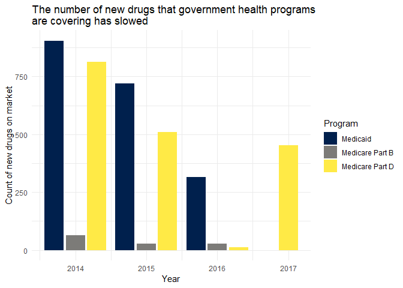

Finally I also wanted to see how many drugs have been introduced in each successive year and it appears that the rate of new drugs that are landing on the market is slowing down, although Medicare Part D had a large increase in 2017. I suspect that over a larger period of time a seasonal component to this might be visible but it's too short to tell for now.

Univariatie Distribution Trends - Brand Level
---------------------------------------------

Before diving deeper into these datasets, there are a few general notes I want to make:

1.  I am planning to just examine the subset of drugs that have been consistently avaiable all five years of the dataset.
2.  My suspicion (based on the summary quartiles in the introduction) is that all of these variables are close to a lognormal distribution, so I am planning on log-transforming the variables of interest and looking at their distributions then.
3.  All spend variables will be examined in terms of inflation adjusted spend.

### Medicare Part D

``` r
partd %>%
  group_by(`Brand Name`) %>%
  summarise(numyrs = n_distinct(Year)) %>%
  ungroup(.) %>%
  right_join(partd, by = "Brand Name") %>%
  filter(numyrs == 5) %>%
  group_by(`Brand Name`, Year) %>%
  summarise(brandspend = sum(`Inf Total Spend`), 
            branddose = sum(`Total Dosage Units`), 
            brandclaims = sum(`Total Claims`), 
            brandbens = sum(`Total Beneficiaries`)) %>%
  ungroup(.) %>%
  mutate(logspend = log(brandspend)) %>%
  ggplot(aes(x = logspend, y = as_factor(Year), fill = factor(..quantile..))) +
  stat_density_ridges(
    geom = "density_ridges_gradient", calc_ecdf = TRUE,
    quantiles = 4, quantile_lines = TRUE
  ) +
  scale_fill_viridis(discrete = TRUE, name = "Quartiles", option = "E") +
  theme_minimal(base_size = 14) +
  theme(axis.text.y = element_text(vjust = 0)) +
  labs(x = "Log of Total Spend", y = "Year", title = "Total Spend of Medicare Part D on prescription drugs\nfor only brands available all five years")
```

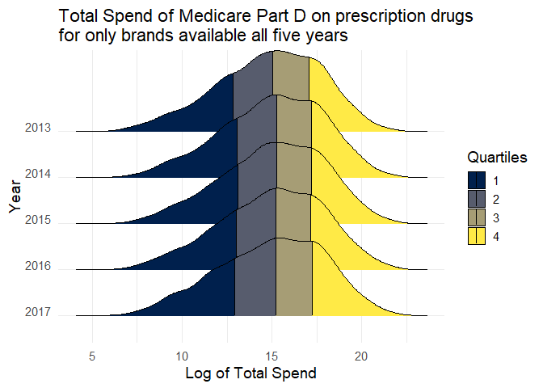

Looking at Medicare Part D's log transformed Total Spend variabile by year, it appears that the distribution is becoming more spread out. Quartile 4 appears to be shifting right and the quartile 1 followed until 2015 but began to shift left afterwards. My quick thoughts are that these changes are a result of two separate market forces. First, since we are only looking at drugs that have been available for the past five years, there may be a set of brands that are winding down their product life cycle or have had a patent expire, thereby requiring them to either reduce prices or consumers are substituting to generic competitors. Second, there does appear to be a subset of drugs that are increasing in spend over time, which could be driven by either an increase of claims at a consistent price or a general price increase.

``` r
partd %>%
  group_by(`Brand Name`) %>%
  summarise(numyrs = n_distinct(Year)) %>%
  ungroup(.) %>%
  right_join(partd, by = "Brand Name") %>%
  filter(numyrs == 5) %>%
  group_by(`Brand Name`, Year) %>%
  summarise(brandspend = sum(`Inf Total Spend`), 
            branddose = sum(`Total Dosage Units`), 
            brandclaims = sum(`Total Claims`), 
            brandbens = sum(`Total Beneficiaries`)) %>%
  ungroup(.) %>%
  mutate(logclaims = log(brandclaims)) %>%
  ggplot(aes(x = logclaims, y = as_factor(Year), fill = factor(..quantile..))) +
  stat_density_ridges(
    geom = "density_ridges_gradient", calc_ecdf = TRUE,
    quantiles = 4, quantile_lines = TRUE
  ) +
  scale_fill_viridis(discrete = TRUE, name = "Quartiles", option = "E") +
  theme_minimal(base_size = 14) +
  theme(axis.text.y = element_text(vjust = 0)) +
  labs(x = "Log of Total Claims", y = "Year", title = "Total Claims of Medicare Part D on prescription drugs\nfor only brands available all five years")
```

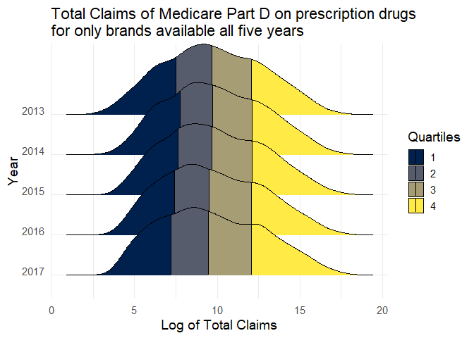

Looking at Medicare Part D's log transformed Total Claims variabile by year, it appears that the distribution is starting to become bimodal. Quartile 1 is becoming more dense and has shifted left while quartile 4 has remained relatively constant since 2013 but is showing greater density right around the 75th percentile. As a result, the third quartile has grown in width. This seems to reinforce the notion that the distribution of drugs is representative of two sub-groups.

``` r
partd %>%
  group_by(`Brand Name`) %>%
  summarise(numyrs = n_distinct(Year)) %>%
  ungroup(.) %>%
  right_join(partd, by = "Brand Name") %>%
  filter(numyrs == 5) %>%
  group_by(`Brand Name`, Year) %>%
  summarise(brandspend = sum(`Inf Total Spend`), 
            branddose = sum(`Total Dosage Units`), 
            brandclaims = sum(`Total Claims`), 
            brandbens = sum(`Total Beneficiaries`)) %>%
  ungroup(.) %>%
  mutate(logbens = log(brandbens)) %>%
  ggplot(aes(x = logbens, y = as_factor(Year), fill = factor(..quantile..))) +
  stat_density_ridges(
    geom = "density_ridges_gradient", calc_ecdf = TRUE,
    quantiles = 4, quantile_lines = TRUE
  ) +
  scale_fill_viridis(discrete = TRUE, name = "Quartiles", option = "E") +
  theme_minimal(base_size = 14) +
  theme(axis.text.y = element_text(vjust = 0)) +
  labs(x = "Log of Total Beneficiaries", y = "Year", title = "Total Beneficiaries of Medicare Part D on prescription drugs\nfor only brands available all five years")
```


Looking at Medicare Part D's log transformed Total Beneficiaries variable by year, the lower half of the distribution appears to be shifting left while the upper half is becoming more spread out. In general, this means that there are more drugs that are serving less individuals.

### Medicare Part B

``` r
partb %>%
  group_by(`Brand Name`) %>%
  summarise(numyrs = n_distinct(Year)) %>%
  ungroup(.) %>%
  right_join(partb, by = "Brand Name") %>%
  filter(numyrs == 5) %>%
  mutate(logspend = log(`Inf Total Spend`)) %>%
  ggplot(aes(x = logspend, y = as_factor(Year), fill = factor(..quantile..))) +
  stat_density_ridges(
    geom = "density_ridges_gradient", calc_ecdf = TRUE,
    quantiles = 4, quantile_lines = TRUE
  ) +
  scale_fill_viridis(discrete = TRUE, name = "Quartiles", option = "E") +
  theme_minimal(base_size = 14) +
  theme(axis.text.y = element_text(vjust = 0)) +
  labs(x = "Log of Total Spend", y = "Year", title = "Total Spend of Medicare Part B on prescription drugs\nfor only brands available all five years")
```

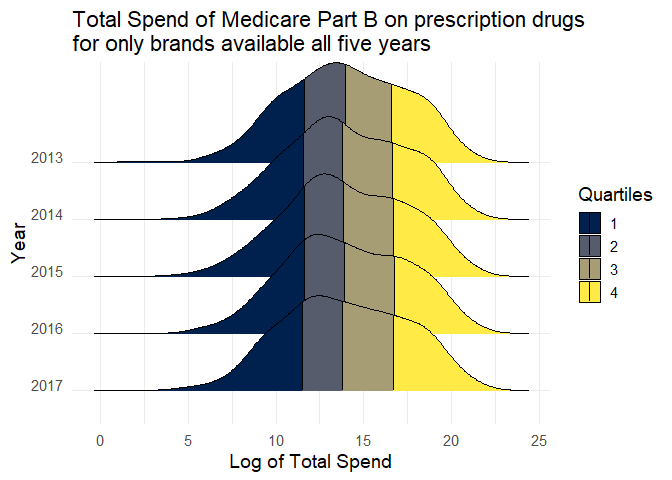

Looking at Medicare Part B's log transformed Total Spend variable, there was a noticeable density consolidation in the second quartile from 2013 to 2016 but in 2017 this trend has somewhat reversed. Relative to 2013, the largest difference between the two distributions is a more even density within the third quartile, implying a number of brands are now more expensive than they were in 2013.

``` r
partb %>%
  group_by(`Brand Name`) %>%
  summarise(numyrs = n_distinct(Year)) %>%
  ungroup(.) %>%
  right_join(partb, by = "Brand Name") %>%
  filter(numyrs == 5) %>%
  mutate(logclaims = log(`Total Claims`)) %>%
  ggplot(aes(x = logclaims, y = as_factor(Year), fill = factor(..quantile..))) +
  stat_density_ridges(
    geom = "density_ridges_gradient", calc_ecdf = TRUE,
    quantiles = 4, quantile_lines = TRUE
  ) +
  scale_fill_viridis(discrete = TRUE, name = "Quartiles", option = "E") +
  theme_minimal(base_size = 14) +
  theme(axis.text.y = element_text(vjust = 0)) +
  labs(x = "Log of Total Claims", y = "Year", title = "Total Claims of Medicare Part B on prescription drugs\nfor only brands available all five years")
```

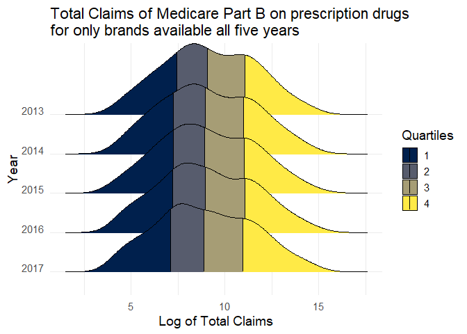

Looking at Medicare Part B's log transformed Total Claims, it appears that the density of brands around the third and fourth quartile in 2013 has been gradually shifting solidly into the third quartile, while the first and second quartiles have been slightly shifting left. This implies that a number of brands are having fewer claims relative to 2013.

``` r
partb %>%
  group_by(`Brand Name`) %>%
  summarise(numyrs = n_distinct(Year)) %>%
  ungroup(.) %>%
  right_join(partb, by = "Brand Name") %>%
  filter(numyrs == 5) %>%
  mutate(logbens = log(`Total Beneficiaries`)) %>%
  ggplot(aes(x = logbens, y = as_factor(Year), fill = factor(..quantile..))) +
  stat_density_ridges(
    geom = "density_ridges_gradient", calc_ecdf = TRUE,
    quantiles = 4, quantile_lines = TRUE
  ) +
  scale_fill_viridis(discrete = TRUE, name = "Quartiles", option = "E") +
  theme_minimal(base_size = 14) +
  theme(axis.text.y = element_text(vjust = 0)) +
  labs(x = "Log of Total Beneficiaries", y = "Year", title = "Total Beneficiaries of Medicare Part B on prescription drugs\nfor only brands available all five years")
```

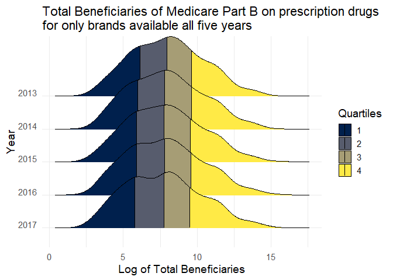 Looking at Medicare Part B's log transformed Total Beneficiaries, the fourth quartile appears less dense with a longer tail in 2017 relative to 2013. There also seems to be a greater density appearing on the border between the first and second quartile as the distribution is becoming closer to bimodal. This implies that a number of brands are reaching less beneficiaries in 2017 relative to 2013.

### Medicaid

``` r
medicaid %>%
  group_by(`Brand Name`) %>%
  summarise(numyrs = n_distinct(Year)) %>%
  ungroup(.) %>%
  right_join(medicaid, by = "Brand Name") %>%
  filter(numyrs == 5) %>%
  group_by(`Brand Name`, Year) %>%
  summarise(brandspend = sum(`Inf Total Spend`), 
            branddose = sum(`Total Dosage Units`), 
            brandclaims = sum(`Total Claims`)) %>%
  ungroup(.) %>%
  mutate(logspend = log1p(brandspend)) %>%
  ggplot(aes(x = logspend, y = as_factor(Year), fill = factor(..quantile..))) +
  stat_density_ridges(
    geom = "density_ridges_gradient", calc_ecdf = TRUE,
    quantiles = 4, quantile_lines = TRUE
  ) +
  scale_fill_viridis(discrete = TRUE, name = "Quartiles", option = "E") +
  theme_minimal(base_size = 14) +
  theme(axis.text.y = element_text(vjust = 0)) +
  labs(x = "Log of Total Spend", y = "Year", title = "Total Spend of Medicaid on prescription drugs\nfor only brands available all five years")
```

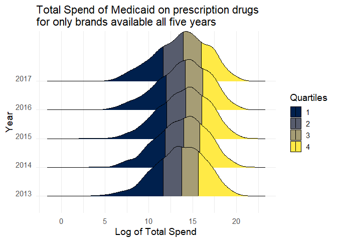

Looking at Medicaid's log transformed Total Spend, the distribution is showing an increase of density in the fourth quartile as well as at the median point in 2017 relative to 2013. Additionally the fourth quartile was continually shifting left through 2016 but reversed trend in 2017.

``` r
medicaid %>%
  group_by(`Brand Name`) %>%
  summarise(numyrs = n_distinct(Year)) %>%
  ungroup(.) %>%
  right_join(medicaid, by = "Brand Name") %>%
  filter(numyrs == 5) %>%
  group_by(`Brand Name`, Year) %>%
  summarise(brandspend = sum(`Inf Total Spend`), 
            branddose = sum(`Total Dosage Units`), 
            brandclaims = sum(`Total Claims`)) %>%
  ungroup(.) %>%
  mutate(logclaims = log1p(brandclaims)) %>%
  ggplot(aes(x = logclaims, y = as_factor(Year), fill = factor(..quantile..))) +
  stat_density_ridges(
    geom = "density_ridges_gradient", calc_ecdf = TRUE,
    quantiles = 4, quantile_lines = TRUE
  ) +
  scale_fill_viridis(discrete = TRUE, name = "Quartiles", option = "E") +
  theme_minimal(base_size = 14) +
  theme(axis.text.y = element_text(vjust = 0)) +
  labs(x = "Log of Total Claims", y = "Year", title = "Total Claims of Medicaid on prescription drugs\nfor only brands available all five years")
```

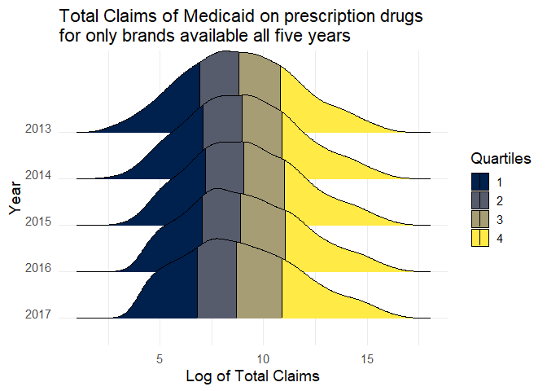

Looking at Medicaid's log transformed Total Spend, the distribution appears to have a greater density of brands in the first quartile. This implies that there are less brands with a very small amount of claims being made against them. This makes sense as brands have spent more time on the market their exposure grows. It also appears that the distribution is skewing left, implying there is a general trend of brands receiving less claims.

Bivariate Change - Brand Level
------------------------------

### Medicare Part D

``` r
partd_brandchng %>%
  select(everything(), -Year, -brandspend, -branddose, -brandclaims, -brandbens) %>%
  distinct() %>%
  ggplot(aes(x = nomchngspend, y = nomchngclaims)) +
  geom_point(stat = "identity", position = "jitter") +
  labs(x = "Nominal Inflation Adj. Change in Spend", y = "Nominal Change in Claims", title = "Bivariate relationship between Change in Spend and Claims", subtitle = "Change between 2013 & 2017") +
  theme_minimal()
```

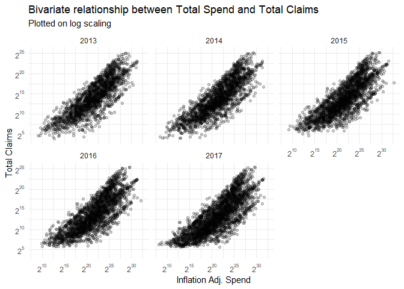

``` r
partd_brandchng %>%
  select(everything(), -Year, -brandspend, -branddose, -brandclaims, -brandbens) %>%
  distinct() %>%
  ggplot(aes(x = perchngspend, y = perchngclaims)) +
  geom_point(stat = "identity", position = "jitter") +
  labs(x = "Percent Inflation Adj. Change in Spend", y = "Percent Change in Claims", title = "Bivariate relationship between Percent Change in Spend and Claims", subtitle ="Change between 2013 & 2017") +
  theme_minimal()
```

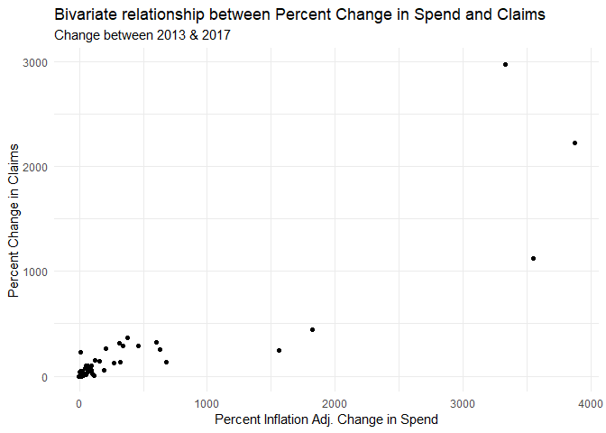

### Medicare Part B

``` r
partb_brandchng %>%
  select(everything(), -Year, -brandspend, -branddose, -brandclaims, -brandbens) %>%
  distinct() %>%
  ggplot(aes(x = nomchngspend, y = nomchngclaims)) +
  geom_point(stat = "identity") +
  labs(x = "Nominal Inflation Adj. Change in Spend", y = "Nominal Change in Claims", title = "Bivariate relationship between Change in Spend and Claims", subtitle = "Change between 2013 & 2017") +
  theme_minimal()
```

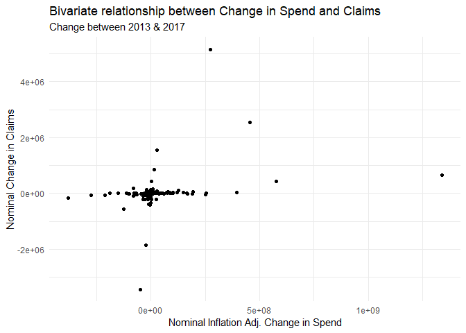

``` r
partb_brandchng %>%
  select(everything(), -Year, -brandspend, -branddose, -brandclaims, -brandbens) %>%
  distinct() %>%
  ggplot(aes(x = perchngspend, y = perchngclaims)) +
  geom_point(stat = "identity") +
  labs(x = "Percent Inflation Adj. Change in Spend", y = "Percent Change in Claims", title = "Bivariate relationship between Percent Change in Spend and Claims", subtitle ="Change between 2013 & 2017") +
  theme_minimal()
```


### Medicaid

``` r
medicaid_brandchng %>%
  select(everything(), -Year, -brandspend, -branddose, -brandclaims) %>%
  distinct() %>%
  ggplot(aes(x = nomchngspend, y = nomchngclaims)) +
  geom_point(stat = "identity") +
  labs(x = "Nominal Inflation Adj. Change in Spend", y = "Nominal Change in Claims", title = "Bivariate relationship between Change in Spend and Claims", subtitle = "Change between 2013 & 2017") +
  theme_minimal()
```


``` r
medicaid_brandchng %>%
  select(everything(), -Year, -brandspend, -branddose, -brandclaims) %>%
  distinct() %>%
  ggplot(aes(x = perchngspend, y = perchngclaims)) +
  geom_point(stat = "identity") +
  labs(x = "Percent Inflation Adj. Change in Spend", y = "Percent Change in Claims", title = "Bivariate relationship between Percent Change in Spend and Claims", subtitle ="Change between 2013 & 2017") +
  theme_minimal()
```

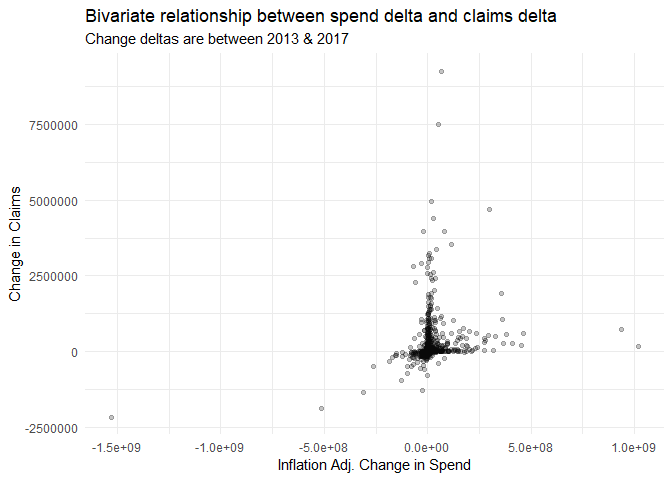

Manufacturer Level
------------------

TODO

``` r
medicaid_manufac <- medicaid %>%
  group_by(`Brand Name`, Year) %>%
  mutate(avg_spend_per_claim_brand = signif(sum(`Inf Total Spend`)/sum(`Total Claims`), 3)) %>%
  group_by(Manufacturer, add = TRUE) %>%
  mutate(avg_spend_per_claim_manufac = sum(`Inf Total Spend`)/sum(`Total Claims`)) %>%
  mutate(avg_spend_per_claim_resid = signif(avg_spend_per_claim_manufac, 3) - signif(avg_spend_per_claim_brand, 3), 
         avg_spend_per_claim_status = ifelse(avg_spend_per_claim_resid == 0, "at_average", ifelse(avg_spend_per_claim_resid < 0, "below_average", "above_average")), 
         market_diff = avg_spend_per_claim_resid * `Total Claims`) %>%
  ungroup(.) %>%
  group_by(Manufacturer, Year, avg_spend_per_claim_status) %>%
  summarise(manufacturer_diff = sum(market_diff), price_status_drugs = n()) 
```

Insulin
-------

Average spend per claim on Medicare Part D has gone up dramatically since 2013.

``` r
partd %>% 
  filter(str_detect(`Generic Name`, "Insulin")) %>%
  group_by(Year) %>%
  summarise(totalspend = sum(`Inf Total Spend`), totalclaims = sum(`Total Claims`)) %>%
  mutate(`Average Spend Per Claim` = totalspend/totalclaims) %>%
  ggplot(aes(x=Year, y = `Average Spend Per Claim`, color = "foo")) +
  geom_line(size = 1) +
  scale_y_continuous(labels = function(x) paste0("$", x), limits = c(0,550)) +
  scale_color_manual(values = "#00204DFF") +
  labs(y = "Average Spend Per Claim", title = "Average Spend Per Claim in Medicare Part D on Insulin related drugs\nhas grown by 78%, or $220") +
  theme_minimal() +
  theme(legend.position = "none") 
```

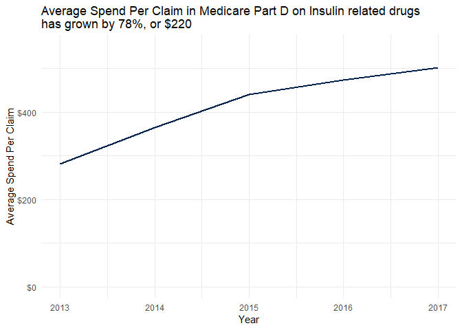

Conclusion
==========

TODO
