# Introduction

This document reflects my exploration of the datasets found at the [CMS Drug Spending](https://www.cms.gov/Research-Statistics-Data-and-Systems/Statistics-Trends-and-Reports/Information-on-Prescription-Drugs/index.html) site. This document is broken up into three different sections with the following research questions driving each phase of data exploration:

1. What is the relationship between spend and claims at a brand level and has that relationship changed over the past five years?
2. Is there a material difference in the relationships discovered in Research Question 1 between the three programs for which CMS has provided data, namely Medicare Part B, Medicare Part D and Medicaid?
3. Are there sub-categories of prescription drugs that exhibit noticeably higher growth in spend relative to claims? Conversely, are there sub categories of prescription drugs that exhibit noticeably lower growth in spend relative to claims?

## Background Definitions

* Types of drugs covered by Medicare Part B - Medicare Part B covers prescription drugs that are either administered by a medical professional in a patient setting or in various outpatient settings

* Types of drugs covered by Medicare Part D - Medicare Part D covers prescription drugs that can be self-administered and 

* Total Spend Medicare Part B - Drug spending metrics for Part B drugs represent the full value of the product, including the Medicare payment and beneficiary liability. All Part B drug spending metrics are calculated at the Healthcare Common Procedure Coding System (HCPCS) level.

* Total Spend Medicare Part D - Drug spending metrics for Part D drugs are based on the gross drug cost, which represents total spending for the prescription claim, including Medicare, plan, and beneficiary payments. The Part D spending metrics do not reflect any manufacturers’ rebates or other price concessions as CMS is prohibited from publicly disclosing such information.

* Total Spend Medicaid - Drug spending metrics for Medicaid represent the total amount reimbursed by both Medicaid and non-Medicaid entities to pharmacies for the drug. Medicaid drug spending contains both the Federal and State Reimbursement and is inclusive of any applicable dispensing fees. In addition, this total is not reduced or affected by Medicaid rebates paid to the states.

* Total Claims - Number of prescription fills for each drug. Includes original prescriptions and refills. 

## Preliminary Cleaning/Summary

Theree are two things that need to be done with these datasets before we can start exploring them:

1. General data cleaning tasks such as changing variable types to the appropriate values and omitting missing values.
2. Convert the total spend metrics across each of the three programs to be inflation adjusted. Given that we are generally interested in comparing how things have changed over time, I will be using the inflation adjusted spend values as a default.


```r
summary(partd)
```

```
##   Brand Name        Generic Name       Manufacturer      
##  Length:27825       Length:27825       Length:27825      
##  Class :character   Class :character   Class :character  
##  Mode  :character   Mode  :character   Mode  :character  
##                                                          
##                                                          
##                                                          
##  Total Spending      Total Dosage Units   Total Claims     
##  Min.   :5.000e+01   Min.   :2.500e+01   Min.   :      11  
##  1st Qu.:1.083e+05   1st Qu.:7.139e+04   1st Qu.:    1488  
##  Median :1.164e+06   Median :5.946e+05   Median :   11020  
##  Mean   :2.213e+07   Mean   :1.541e+07   Mean   :  228747  
##  3rd Qu.:7.244e+06   3rd Qu.:5.485e+06   3rd Qu.:   97029  
##  Max.   :7.031e+09   Max.   :1.665e+09   Max.   :22488587  
##  Total Beneficiaries Average Spending Per Dosage Unit (Weighted)
##  Min.   :     11     Min.   :    0.00                           
##  1st Qu.:    542     1st Qu.:    0.31                           
##  Median :   3817     Median :    1.07                           
##  Mean   :  71155     Mean   :   74.05                           
##  3rd Qu.:  33925     3rd Qu.:    5.12                           
##  Max.   :5273526     Max.   :39026.76                           
##  Average Spending Per Claim Average Spending Per Beneficiary
##  Min.   :     0.42          Min.   :      0.0               
##  1st Qu.:    18.48          1st Qu.:     48.5               
##  Median :    55.90          Median :    151.1               
##  Mean   :   600.94          Mean   :   3298.0               
##  3rd Qu.:   222.06          3rd Qu.:    659.3               
##  Max.   :119126.15          Max.   :1218965.3               
##       Year      Description          Category            inf_rate    
##  Min.   :2013   Length:27825       Length:27825       Min.   :1.000  
##  1st Qu.:2014   Class :character   Class :character   1st Qu.:1.000  
##  Median :2015   Mode  :character   Mode  :character   Median :1.030  
##  Mean   :2015                                         Mean   :1.024  
##  3rd Qu.:2017                                         3rd Qu.:1.033  
##  Max.   :2017                                         Max.   :1.050  
##     baseyear      yeartype         Inf Total Spend    
##  Min.   :2017   Length:27825       Min.   :5.200e+01  
##  1st Qu.:2017   Class :character   1st Qu.:1.100e+05  
##  Median :2017   Mode  :character   Median :1.190e+06  
##  Mean   :2017                      Mean   :2.266e+07  
##  3rd Qu.:2017                      3rd Qu.:7.410e+06  
##  Max.   :2017                      Max.   :7.240e+09
```

Looking at the summary for Medicare Part D, there are four things that I want to highlight:

1. The distance between the first two quartiles and the max value is heavily right skewed for each of the "Total" metrics. This likely implies there are some large outliers for each of the univariate distributions
2. There are many more drugs on the market in 2017 than in 2013. The jump between 2016 and 2017 was especially large, at a 27% increase in one year.
3. There top 6 manufacturers supplied 26% of all brands in this time frame, implying the market is characterized by several large players but also consists of many smaller and mid-level firms.
4. The products with the most brand nad manufacturer combinations seem to be diabetic insulin needles.


```r
summary(partb)
```

```
##  Medicare Billing Code (HCPCS Code) Drug Description    Brand Name       
##  Length:1672                        Length:1672        Length:1672       
##  Class :character                   Class :character   Class :character  
##  Mode  :character                   Mode  :character   Mode  :character  
##                                                                          
##                                                                          
##                                                                          
##  Generic Name       Total Spending      Total Dosage Units 
##  Length:1672        Min.   :1.100e+01   Min.   :       58  
##  Class :character   1st Qu.:2.237e+05   1st Qu.:    25693  
##  Mode  :character   Median :2.698e+06   Median :   302986  
##                     Mean   :7.029e+07   Mean   :  7141550  
##                     3rd Qu.:3.244e+07   3rd Qu.:  2335068  
##                     Max.   :2.466e+09   Max.   :428726351  
##   Total Claims     Total Beneficiaries Average Spending Per Dosage Unit
##  Min.   :     15   Min.   :     11     Min.   :    0.01                
##  1st Qu.:   1765   1st Qu.:    363     1st Qu.:    2.11                
##  Median :  10287   Median :   2524     Median :    9.45                
##  Mean   : 129823   Mean   :  50790     Mean   :  237.40                
##  3rd Qu.:  78302   3rd Qu.:  15896     3rd Qu.:   46.73                
##  Max.   :5743305   Max.   :5693733     Max.   :38716.24                
##  Average Spending Per Claim Average Spending Per Beneficiary
##  Min.   :    0.10           Min.   :     0.2                
##  1st Qu.:   21.88           1st Qu.:    76.5                
##  Median :  295.12           Median :  1077.9                
##  Mean   : 2899.17           Mean   : 21316.1                
##  3rd Qu.: 2546.25           3rd Qu.: 13856.8                
##  Max.   :58621.51           Max.   :792223.8                
##       Year      Description           inf_rate        baseyear   
##  Min.   :2013   Length:1672        Min.   :1.000   Min.   :2017  
##  1st Qu.:2014   Class :character   1st Qu.:1.021   1st Qu.:2017  
##  Median :2015   Mode  :character   Median :1.030   Median :2017  
##  Mean   :2015                      Mean   :1.026   Mean   :2017  
##  3rd Qu.:2016                      3rd Qu.:1.033   3rd Qu.:2017  
##  Max.   :2017                      Max.   :1.050   Max.   :2017  
##    yeartype         Inf Total Spend    
##  Length:1672        Min.   :1.200e+01  
##  Class :character   1st Qu.:2.298e+05  
##  Mode  :character   Median :2.715e+06  
##                     Mean   :7.202e+07  
##                     3rd Qu.:3.350e+07  
##                     Max.   :2.470e+09
```

Looking at the summary for Medicare Part B, there are three things that I want to highlight:

1. There is no manufacturer level information for this particular dataset
2. The Total metrics are again all heavily right skewed
3. The introduction of drugs over each of the years has been much slower than Medicare Part D.


```r
summary(medicaid)
```

```
##   Brand Name        Generic Name       Manufacturer      
##  Length:34433       Length:34433       Length:34433      
##  Class :character   Class :character   Class :character  
##  Mode  :character   Mode  :character   Mode  :character  
##                                                          
##                                                          
##                                                          
##  Total Spending      Total Dosage Units   Total Claims     
##  Min.   :0.000e+00   Min.   :2.000e+00   Min.   :      11  
##  1st Qu.:5.988e+04   1st Qu.:2.205e+04   1st Qu.:     852  
##  Median :4.272e+05   Median :1.948e+05   Median :    5234  
##  Mean   :7.678e+06   Mean   :5.265e+06   Mean   :   86611  
##  3rd Qu.:2.416e+06   3rd Qu.:1.757e+06   3rd Qu.:   37905  
##  Max.   :2.465e+09   Max.   :1.220e+09   Max.   :10036481  
##  Average Spending Per Dosage Unit (Weighted) Average Spending Per Claim
##  Min.   :    0.00                            Min.   :    0.00          
##  1st Qu.:    0.39                            1st Qu.:   17.20          
##  Median :    1.45                            Median :   52.26          
##  Mean   :   73.21                            Mean   :  596.73          
##  3rd Qu.:    7.32                            3rd Qu.:  179.16          
##  Max.   :33809.93                            Max.   :99527.18          
##       Year      Description          Category            inf_rate    
##  Min.   :2013   Length:34433       Length:34433       Min.   :1.000  
##  1st Qu.:2014   Class :character   Class :character   1st Qu.:1.021  
##  Median :2015   Mode  :character   Mode  :character   Median :1.030  
##  Mean   :2015                                         Mean   :1.025  
##  3rd Qu.:2016                                         3rd Qu.:1.033  
##  Max.   :2017                                         Max.   :1.050  
##     baseyear      yeartype         Inf Total Spend    
##  Min.   :2017   Length:34433       Min.   :0.000e+00  
##  1st Qu.:2017   Class :character   1st Qu.:6.110e+04  
##  Median :2017   Mode  :character   Median :4.380e+05  
##  Mean   :2017                      Mean   :7.859e+06  
##  3rd Qu.:2017                      3rd Qu.:2.470e+06  
##  Max.   :2017                      Max.   :2.550e+09
```

Looking at the summary for Medicaid, there are three things I want to highlight:

1. Surprisingly, there does not appear to be any change in the number of drugs offered between 2016 and 2017. There is still
2. The Total Metrics are again heavily right skewed
3. The medicaid information doesn't contain benificiary information, but does contain manufacturer level data.

# Body

## Aggregate Trends

The first thing that I'm going to look at is what's happening in aggregate across each of the three programs. The only things we can compare across all three programs are the inflation adjusted total spend and total claims at a brand level. There are two features I'm going to extract from this data, which are the following: the first year that each brand was introduced and whether or not a brand was continually offered through 2017. This will allow us to minorly control for the different lifecycle stages that drugs are at in terms of how long they have been on the market (although this is still imperfect given we don't know things like if a brand has patent that is expiring).

### Combined

The first graphic I want to look at is the average spend per claim is across each of the programs. A caveat here is that I'm only going to look at drugs that have been on the market for every year of data included in this dataset because I want to see how this metric is changing over time in and want to account for new drugs influencing that measure of central tendency rather than other forces.


```r
# Average spend per claim for medicare part d, medicare part b, and medicaid from 2013-2017 (inflation adjusted), only drugs on market all 5 years 
combined %>%
  filter(numyrs == 5) %>%
  group_by(Program, Year) %>%
  summarise(`Average Spend Per Claim` = sum(`Inf Total Spend`)/sum(`Total Claims`), `Total Claims` = sum(`Total Claims`)) %>%
  ggplot(aes(x = Year, y = `Average Spend Per Claim`, colour = Program)) +
  geom_line(size = 1, aes(group=Program)) +
  labs(y = "Average Spend per Claim", title = "Average spend per claim* for Medicare Part B has grown by\n63 dollars over 5 years in real terms", caption = "*Only examining drugs that have been on market for all 5 years") +
  scale_y_continuous(labels = function(x) paste0("$", x), limits = c(0,600)) +
  scale_color_viridis(option = "E", discrete = TRUE) +
  theme_minimal()
```

<!-- -->

The most interesting thing here appears to be the increase in average cost per claim for Medicare Part B, which has increased \$63 dollars in real terms. Medicaid and Medicare Part D both experienced minor bumps between 2013 and 2014 but have since fallen back to the same value they had in 2013.


```r
# Percent change from 2013-2017 (inflation adjusted), in average spend per claim for medicare part d, medicare part b, and medicaid, only drugs on market all 5 years
combined %>%
  filter(numyrs == 5) %>%
  group_by(Program, Year) %>%
  summarise(`Average Spend Per Claim` = sum(`Inf Total Spend`)/sum(`Total Claims`)) %>%
  mutate(perchange = `Average Spend Per Claim`/lag(`Average Spend Per Claim`, n = 4) - 1) %>%
  na.omit(.) %>%
  ggplot(aes(x = Program, y = perchange, fill = "foo")) +
  geom_bar(stat = "identity") +
  labs(y = "% Diff in Avg Cost Per Claim", title = "Average spend per claim* for Medicare Part B has grown by\n13.5% over 5 years in real terms", caption = "*Only examining drugs that have been on market for all 5 years") +
  scale_y_continuous(labels = function(x) paste0(x*100, "%")) +
  scale_fill_manual(values = "#00204DFF") +
  theme_minimal() +
  theme(legend.position = "none") 
```

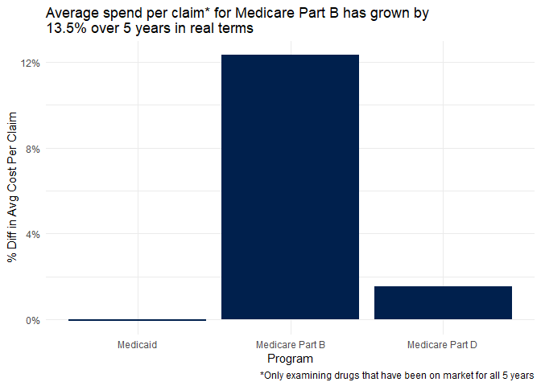<!-- -->

Looking at the same metric on a percentage change basis from 2013 to 2017, there has been a 13.5% increase of average spend per claim for Medicare Part B. Medicaid is flat, while Medicare Part D shows only a 1.5% increase. All of these percentage changes are in real terms.


```r
# Prescription drug spend as % of total medicare part b spend from 2013-2017 (inflation adjusted)
combined %>%
  filter(Program %in% c("Medicare Part B")) %>%
  group_by(Year, Program) %>%
  summarise(totalcost_drugs = sum(`Inf Total Spend`)) %>%
  left_join(select(medicare_spend, Program, Year, infspend_2017), by = c("Program", "Year")) %>%
  mutate(drugsper_total = totalcost_drugs/infspend_2017) %>%
  ggplot(aes(x=Year, y = drugsper_total, color = "foo")) +
  geom_line(size = 1) +
  scale_y_continuous(labels = function(x) paste0(x*100, "%"), limits = c(0,0.1)) +
  scale_color_manual(values = "#00204DFF") +
  labs(y = "Drug Spend as % of Part B", title = "Prescription drug spending* has grown 1 percentage point\nas a portion of all Medicare Part B spend", caption = "*Spend in 2017 inflation adjusted dollars") +
  theme_minimal() +
  theme(legend.position = "none") 
```

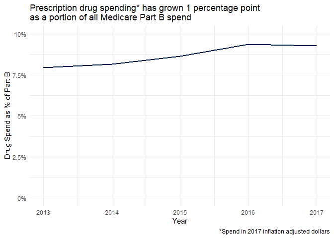<!-- -->

As a point of reference, the portion of the total Medicare Part B spend that prescription drugs account for has only increased by about 1%. Even though the average spend per claim for this program has substantially increased over the past five years, the total effect on Medicare Part B's cost is not as significant.


```r
# Average claims per beneficiary for medicare part b and part d
combined %>%
  filter(numyrs == 5, Program != "Medicaid") %>%
  group_by(Program, Year) %>%
  summarise(`Average Claims Per Beneficiary` = sum(`Total Claims`)/sum(`Total Beneficiaries`)) %>%
  ggplot(aes(x = Year, y = `Average Claims Per Beneficiary`, colour = Program)) +
  geom_line(size = 1, aes(group=Program)) +
  labs(y = "Average Claims per Beneficiary", title = "Average claims per beneficiary have fallen since 2013\nfor both Medicare programs", caption = "*Only examining drugs that have been on market for all 5 years") +
  scale_color_viridis(option = "E", discrete = TRUE) +
  theme_minimal()
```

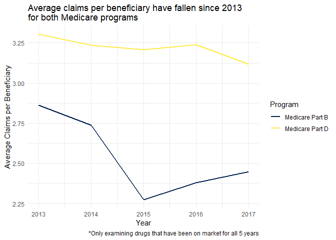<!-- -->

Another dynamic that I wanted to understand was the rate at which beneficiaries were making claims over time. Again I was only looking at drugs that have been available for all five years in the dataset as a controlling factor. For Medicare Part D, this rate has consistently declined at a fairly slow rate, while Medicare Part B shows a slightly different trend with a large drop between 2014 and 2015 which has slowly crept up in the two years following. As a baseline, Medicare Part D has a higher rate of claims per beneficiary than Medicare Part B, but I would guess this is due to the expected treatment cycles of the drugs that are covered by each program, as Medicare Part B covers things like vaccinations which are not expected to have a high claims per beneficiary ratio.


```r
# top-20 drugs spend percent of total spend by program by year
combined %>%
  group_by(Program, Year) %>%
  summarise(`Program Spend` = sum(`Nom Total Spend`)) %>%
  right_join(combined, by = c("Program","Year")) %>%
  group_by(Program, Year) %>%
  mutate(percent_program = `Nom Total Spend`/`Program Spend`, percent_program_rank = min_rank(desc(percent_program))) %>%
  filter(percent_program_rank <= 20) %>%
  arrange(Program, Year, percent_program_rank) %>%
  summarise(top_20_perspend = sum(percent_program)) %>%
  mutate(rest_perspend = 1 - top_20_perspend, ind = row_number()) %>%
  rename("Top 20 Drugs" = top_20_perspend, "All Other Drugs" = rest_perspend) %>%
  gather(drug_group, ind, -Program, -Year) %>%
  filter(drug_group != "ind") %>%
  rename("Percent" = ind) %>%
  ggplot(aes(x = Year, y = Percent, fill = drug_group)) +
  geom_bar(stat = "identity", position = "fill") +
  scale_y_continuous(labels = function(x) paste0(x*100, "%")) +
  scale_fill_viridis(option = "E", discrete = TRUE) +
  facet_grid(. ~ Program) +
  theme_minimal() +
  labs(title = "The top 20 drugs in terms of spend as a percent of total program spend", subtitle = "Medicaid & Medicare Part D drugs have become less concentrated in spend over time") +
  theme(axis.text.x = element_text(angle = 90)) +
  guides(fill = guide_legend(title="Drug Spend Category"))
```

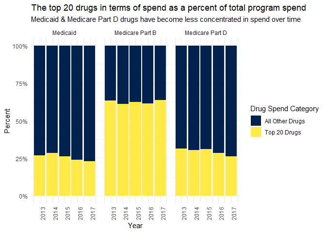<!-- -->

Both Medicaid and Medicare Part D have had the top 20 drugs comprising a smaller portion of the total spend in 2017 relative to 2013. This seems to provide some evidence that the prescription drug markets are not becoming more concentrated over the past five years, but we can look to confirm this later on by looking at full distributions.


```r
# Count of drugs introduced each year 2014-2017
combined %>% 
  group_by(Program, firstyear) %>%
  tally() %>%
  filter(firstyear != 2013) %>%
  ggplot(aes(x = firstyear, y = n, fill = Program)) +
  geom_bar(stat = "identity", position = position_dodge2(preserve = "single")) +
  scale_fill_viridis(option = "E", discrete = TRUE) +
  labs(x = "Year", y = "Count of new drugs on market", title = "The number of new drugs that government health programs\nare covering has slowed") +
  theme_minimal()
```

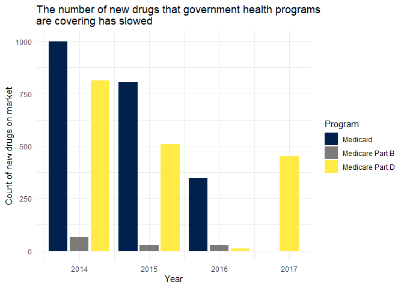<!-- -->

Finally I also wanted to see how many drugs have been introduced in each successive year and it appears that the rate of new drugs that are landing on the market is slowing down, although Medicare Part D had a large increase in 2017. I suspect that over a larger period of time a seasonal component to this might be visible but it's too short to tell for now.

## Univariate Distribution Trends - Brand Level

Before diving deeper into these datasets, there are a few general notes I want to make:

1. I am planning to just examine the subset of drugs that have been consistently avaiable all five years of the dataset.
2. My suspicion (based on the summary quartiles in the introduction) is that all of these variables are close to a lognormal distribution, so I am planning on log-transforming the variables of interest and looking at their distributions then.
3. All spend variables will be examined in terms of inflation adjusted spend.

### Medicare Part D


```r
partd %>%
  group_by(`Brand Name`) %>%
  summarise(numyrs = n_distinct(Year)) %>%
  ungroup(.) %>%
  right_join(partd, by = "Brand Name") %>%
  filter(numyrs == 5) %>%
  group_by(`Brand Name`, Year) %>%
  summarise(brandspend = sum(`Inf Total Spend`), 
            branddose = sum(`Total Dosage Units`), 
            brandclaims = sum(`Total Claims`), 
            brandbens = sum(`Total Beneficiaries`)) %>%
  ungroup(.) %>%
  mutate(logspend = log(brandspend)) %>%
  ggplot(aes(x = logspend, y = as_factor(Year), fill = factor(..quantile..))) +
  stat_density_ridges(
    geom = "density_ridges_gradient", calc_ecdf = TRUE,
    quantiles = 4, quantile_lines = TRUE
  ) +
  scale_fill_viridis(discrete = TRUE, name = "Quartiles", option = "E") +
  theme_minimal(base_size = 14) +
  theme(axis.text.y = element_text(vjust = 0)) +
  labs(x = "Log of Total Spend", y = "Year", title = "Total Spend of Medicare Part D on prescription drugs\nfor only brands available all five years")
```

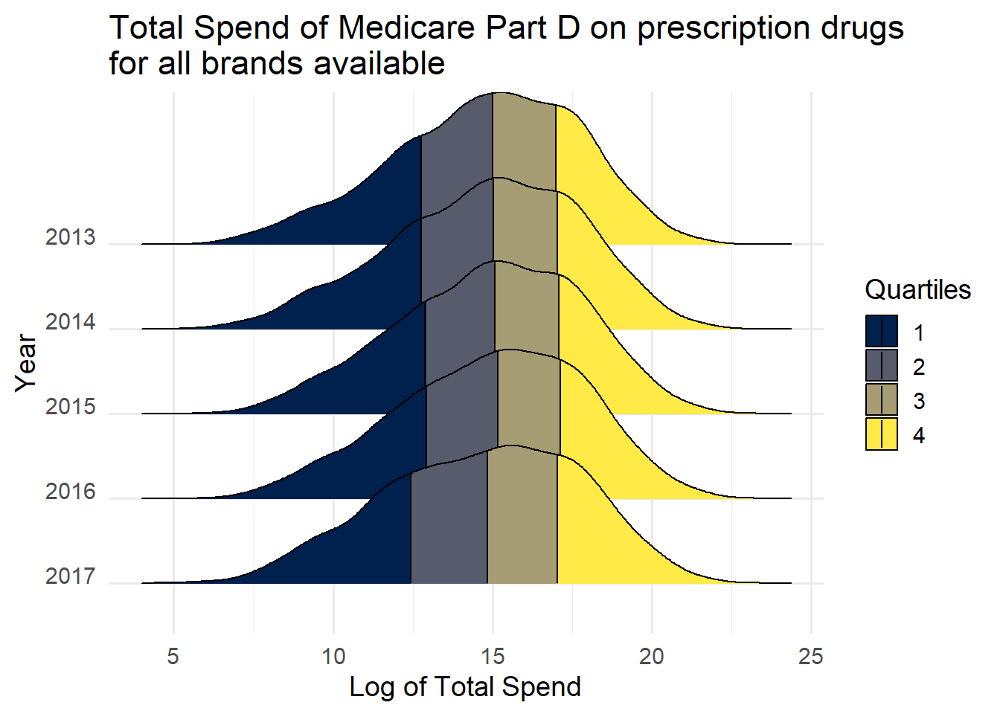<!-- -->

Looking at Medicare Part D's log transformed Total Spend variabile by year, it appears that the distribution is becoming more spread out. Quartile 4 appears to be shifting right and the quartile 1 followed until 2015 but began to shift left afterwards. My quick thoughts are that these changes are a result of two separate market forces. First, since we are only looking at drugs that have been available for the past five years, there may be a set of brands that are winding down their product life cycle or have had a patent expire, thereby requiring them to either reduce prices or consumers are substituting to generic competitors. Second, there does appear to be a subset of drugs that are increasing in spend over time, which could be driven by either an increase of claims at a consistent price or a general price increase.


```r
partd %>%
  group_by(`Brand Name`) %>%
  summarise(numyrs = n_distinct(Year)) %>%
  ungroup(.) %>%
  right_join(partd, by = "Brand Name") %>%
  filter(numyrs == 5) %>%
  group_by(`Brand Name`, Year) %>%
  summarise(brandspend = sum(`Inf Total Spend`), 
            branddose = sum(`Total Dosage Units`), 
            brandclaims = sum(`Total Claims`), 
            brandbens = sum(`Total Beneficiaries`)) %>%
  ungroup(.) %>%
  mutate(logclaims = log(brandclaims)) %>%
  ggplot(aes(x = logclaims, y = as_factor(Year), fill = factor(..quantile..))) +
  stat_density_ridges(
    geom = "density_ridges_gradient", calc_ecdf = TRUE,
    quantiles = 4, quantile_lines = TRUE
  ) +
  scale_fill_viridis(discrete = TRUE, name = "Quartiles", option = "E") +
  theme_minimal(base_size = 14) +
  theme(axis.text.y = element_text(vjust = 0)) +
  labs(x = "Log of Total Claims", y = "Year", title = "Total Claims of Medicare Part D on prescription drugs\nfor only brands available all five years")
```

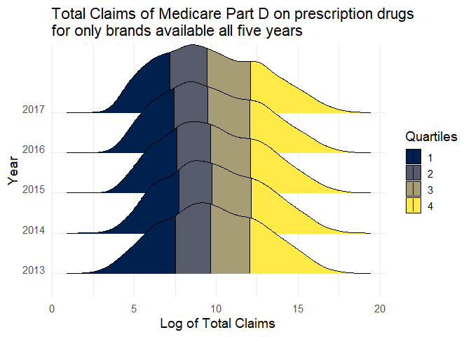<!-- -->

Looking at Medicare Part D's log transformed Total Claims variabile by year, it appears that the distribution is starting to become bimodal. Quartile 1 is becoming more dense and has shifted left while quartile 4 has remained relatively constant since 2013 but is showing greater density right around the 75th percentile. As a result, the third quartile has grown in width. This seems to reinforce the notion that the distribution of drugs is representative of two sub-groups.


```r
partd %>%
  group_by(`Brand Name`) %>%
  summarise(numyrs = n_distinct(Year)) %>%
  ungroup(.) %>%
  right_join(partd, by = "Brand Name") %>%
  filter(numyrs == 5) %>%
  group_by(`Brand Name`, Year) %>%
  summarise(brandspend = sum(`Inf Total Spend`), 
            branddose = sum(`Total Dosage Units`), 
            brandclaims = sum(`Total Claims`), 
            brandbens = sum(`Total Beneficiaries`)) %>%
  ungroup(.) %>%
  mutate(logbens = log(brandbens)) %>%
  ggplot(aes(x = logbens, y = as_factor(Year), fill = factor(..quantile..))) +
  stat_density_ridges(
    geom = "density_ridges_gradient", calc_ecdf = TRUE,
    quantiles = 4, quantile_lines = TRUE
  ) +
  scale_fill_viridis(discrete = TRUE, name = "Quartiles", option = "E") +
  theme_minimal(base_size = 14) +
  theme(axis.text.y = element_text(vjust = 0)) +
  labs(x = "Log of Total Beneficiaries", y = "Year", title = "Total Beneficiaries of Medicare Part D on prescription drugs\nfor only brands available all five years")
```

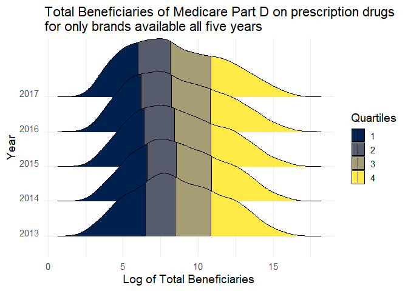<!-- -->

Looking at Medicare Part D's log transformed Total Beneficiaries variable by year, the lower half of the distribution appears to be shifting left while the upper half is becoming more spread out. In general, this means that there are more drugs that are serving less individuals.

### Medicare Part B


```r
partb %>%
  group_by(`Brand Name`) %>%
  summarise(numyrs = n_distinct(Year)) %>%
  ungroup(.) %>%
  right_join(partb, by = "Brand Name") %>%
  filter(numyrs == 5) %>%
  mutate(logspend = log(`Inf Total Spend`)) %>%
  ggplot(aes(x = logspend, y = as_factor(Year), fill = factor(..quantile..))) +
  stat_density_ridges(
    geom = "density_ridges_gradient", calc_ecdf = TRUE,
    quantiles = 4, quantile_lines = TRUE
  ) +
  scale_fill_viridis(discrete = TRUE, name = "Quartiles", option = "E") +
  theme_minimal(base_size = 14) +
  theme(axis.text.y = element_text(vjust = 0)) +
  labs(x = "Log of Total Spend", y = "Year", title = "Total Spend of Medicare Part B on prescription drugs\nfor only brands available all five years")
```

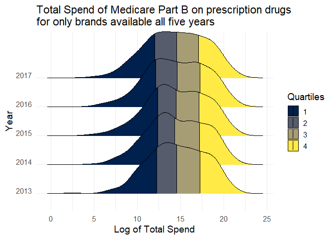<!-- -->

Looking at Medicare Part B's log transformed Total Spend variable, there was a noticeable density consolidation in the second quartile from 2013 to 2016 but in 2017 this trend has somewhat reversed. Relative to 2013, the largest difference between the two distributions is a more even density within the third quartile, implying a number of brands are now more expensive than they were in 2013.


```r
partb %>%
  group_by(`Brand Name`) %>%
  summarise(numyrs = n_distinct(Year)) %>%
  ungroup(.) %>%
  right_join(partb, by = "Brand Name") %>%
  filter(numyrs == 5) %>%
  mutate(logclaims = log(`Total Claims`)) %>%
  ggplot(aes(x = logclaims, y = as_factor(Year), fill = factor(..quantile..))) +
  stat_density_ridges(
    geom = "density_ridges_gradient", calc_ecdf = TRUE,
    quantiles = 4, quantile_lines = TRUE
  ) +
  scale_fill_viridis(discrete = TRUE, name = "Quartiles", option = "E") +
  theme_minimal(base_size = 14) +
  theme(axis.text.y = element_text(vjust = 0)) +
  labs(x = "Log of Total Claims", y = "Year", title = "Total Claims of Medicare Part B on prescription drugs\nfor only brands available all five years")
```

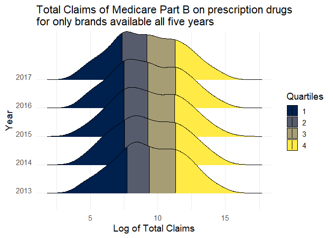<!-- -->

Looking at Medicare Part B's log transformed Total Claims, it appears that the density of brands around the third and fourth quartile in 2013 has been gradually shifting solidly into the third quartile, while the first and second quartiles have been slightly shifting left. This implies that a number of brands are having fewer claims relative to 2013.


```r
partb %>%
  group_by(`Brand Name`) %>%
  summarise(numyrs = n_distinct(Year)) %>%
  ungroup(.) %>%
  right_join(partb, by = "Brand Name") %>%
  filter(numyrs == 5) %>%
  mutate(logbens = log(`Total Beneficiaries`)) %>%
  ggplot(aes(x = logbens, y = as_factor(Year), fill = factor(..quantile..))) +
  stat_density_ridges(
    geom = "density_ridges_gradient", calc_ecdf = TRUE,
    quantiles = 4, quantile_lines = TRUE
  ) +
  scale_fill_viridis(discrete = TRUE, name = "Quartiles", option = "E") +
  theme_minimal(base_size = 14) +
  theme(axis.text.y = element_text(vjust = 0)) +
  labs(x = "Log of Total Beneficiaries", y = "Year", title = "Total Beneficiaries of Medicare Part B on prescription drugs\nfor only brands available all five years")
```

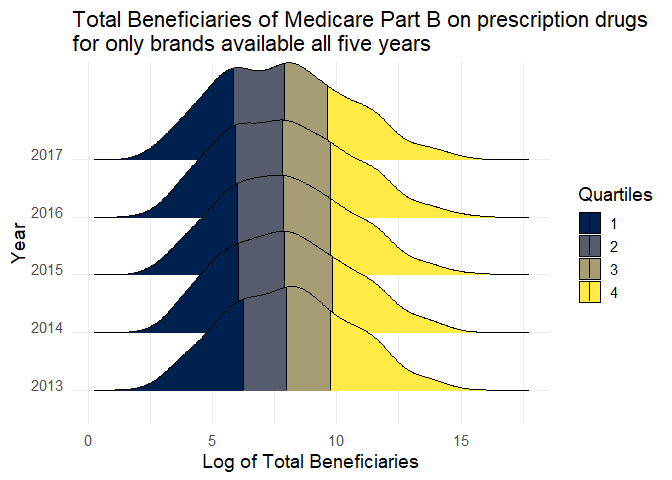<!-- -->
Looking at Medicare Part B's log transformed Total Beneficiaries, the fourth quartile appears less dense with a longer tail in 2017 relative to 2013. There also seems to be a greater density appearing on the border between the first and second quartile as the distribution is becoming closer to bimodal. This implies that a number of brands are reaching less beneficiaries in 2017 relative to 2013.

### Medicaid


```r
medicaid %>%
  group_by(`Brand Name`) %>%
  summarise(numyrs = n_distinct(Year)) %>%
  ungroup(.) %>%
  right_join(medicaid, by = "Brand Name") %>%
  filter(numyrs == 5) %>%
  group_by(`Brand Name`, Year) %>%
  summarise(brandspend = sum(`Inf Total Spend`), 
            branddose = sum(`Total Dosage Units`), 
            brandclaims = sum(`Total Claims`)) %>%
  ungroup(.) %>%
  mutate(logspend = log1p(brandspend)) %>%
  ggplot(aes(x = logspend, y = as_factor(Year), fill = factor(..quantile..))) +
  stat_density_ridges(
    geom = "density_ridges_gradient", calc_ecdf = TRUE,
    quantiles = 4, quantile_lines = TRUE
  ) +
  scale_fill_viridis(discrete = TRUE, name = "Quartiles", option = "E") +
  theme_minimal(base_size = 14) +
  theme(axis.text.y = element_text(vjust = 0)) +
  labs(x = "Log of Total Spend", y = "Year", title = "Total Spend of Medicaid on prescription drugs\nfor only brands available all five years")
```

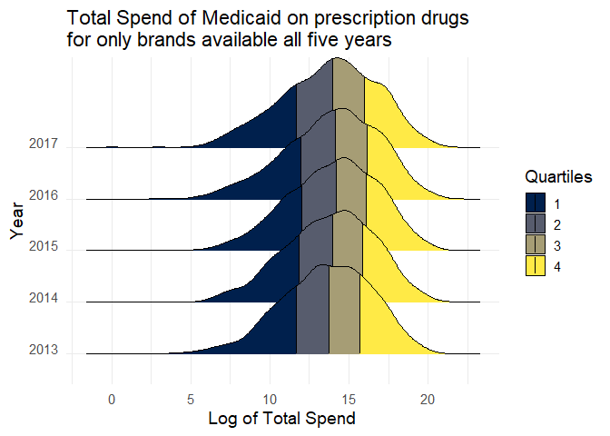<!-- -->

Looking at Medicaid's log transformed Total Spend, the distribution is showing an increase of density in the fourth quartile as well as at the median point in 2017 relative to 2013. Additionally the fourth quartile was continually shifting left through 2016 but reversed trend in 2017.


```r
medicaid %>%
  group_by(`Brand Name`) %>%
  summarise(numyrs = n_distinct(Year)) %>%
  ungroup(.) %>%
  right_join(medicaid, by = "Brand Name") %>%
  filter(numyrs == 5) %>%
  group_by(`Brand Name`, Year) %>%
  summarise(brandspend = sum(`Inf Total Spend`), 
            branddose = sum(`Total Dosage Units`), 
            brandclaims = sum(`Total Claims`)) %>%
  ungroup(.) %>%
  mutate(logclaims = log1p(brandclaims)) %>%
  ggplot(aes(x = logclaims, y = as_factor(Year), fill = factor(..quantile..))) +
  stat_density_ridges(
    geom = "density_ridges_gradient", calc_ecdf = TRUE,
    quantiles = 4, quantile_lines = TRUE
  ) +
  scale_fill_viridis(discrete = TRUE, name = "Quartiles", option = "E") +
  theme_minimal(base_size = 14) +
  theme(axis.text.y = element_text(vjust = 0)) +
  labs(x = "Log of Total Claims", y = "Year", title = "Total Claims of Medicaid on prescription drugs\nfor only brands available all five years")
```

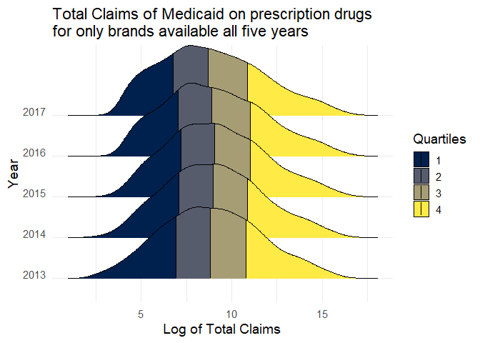<!-- -->

Looking at Medicaid's log transformed Total Spend, the distribution appears to have a greater density of brands in the first quartile. This implies that there are less brands with a very small amount of claims being made against them. This makes sense as brands have spent more time on the market their exposure grows. It also appears that the distribution is skewing left, implying there is a general trend of brands receiving less claims.

## Bivariate Change - Brand Level


### Medicare Part D


```r
partd %>%
  group_by(`Brand Name`, Year) %>%
  summarise(brandspend = sum(`Inf Total Spend`), 
            branddose = sum(`Total Dosage Units`), 
            brandclaims = sum(`Total Claims`),
            avgspendperclaim = brandspend/brandclaims) %>%
  ggplot(aes(x = brandspend, y = brandclaims)) +
  geom_point(stat = "identity", alpha = 0.2) +
  facet_wrap(~ as_factor(Year)) +
  scale_x_continuous(trans = log2_trans(),
    breaks = trans_breaks("log2", function(x) 2^x),
    labels = trans_format("log2", math_format(2^.x))) +
  scale_y_continuous(trans = log2_trans(),
    breaks = trans_breaks("log2", function(x) 2^x),
    labels = trans_format("log2", math_format(2^.x))) +
  labs(x = "Inflation Adj. Spend", y = "Total Claims", title = "Bivariate relationship between Total Spend and Total Claims", subtitle = "Plotted on log scaling") +
  theme_minimal()
```

<!-- -->

```r
partd_brandchng %>%
  select(everything(), -Year, -brandspend, -branddose, -brandclaims, -brandbens) %>%
  distinct() %>%
  ggplot(aes(x = nomchngspend, y = nomchngclaims)) +
  geom_point(stat = "identity", alpha = 0.05) +
  labs(x = "Inflation Adj. Change in Spend", y = "Change in Claims", title = "Bivariate relationship between spend delta and claims delta", subtitle = "Change deltas are between 2013 & 2017") +
  theme_minimal()
```

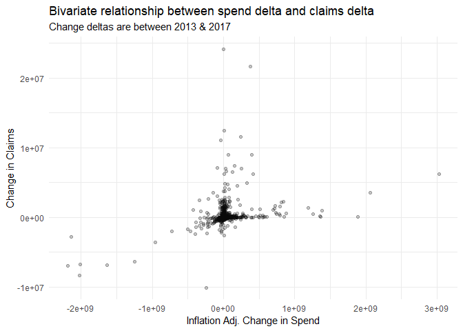<!-- -->

There are several things to note of the bivariate relationship of spend and claims for Medicare Part D:

1. When plotting spend and claims on a log axis, there is a clear positive linear relationship between the two. This is expected but good to confirm.
2. There are several observations that have either increased dramatically in the number of claims per drug or in the spend per drug, but very rarely both.
3. These graphs together indicate that the drugs could potentially be clustered into several subcategories that each exhibit a single more consistent relationship.

Below are the top 20 drugs in terms of the change from 2013 to 2017 of their average spend per claim. The change in average spend per claim for these drugs is quite large, but many of these drugs serve very niche populations, with only 3 drugs serving over 1000 individuals and none over 3200. 


```r
partd_brandchng %>%
  ungroup(.) %>%
  group_by(`Brand Name`) %>%
  mutate(bens_max = max(`brandbens`)) %>%
  select(`Brand Name`, nomchngspendperclaim, perchngspendperclaim, Description, bens_max) %>%
  distinct() %>%
  arrange(desc(nomchngspendperclaim)) %>%
  ungroup(.) %>%
  top_n(20, wt = nomchngspendperclaim) %>%
  mutate(Rank = row_number(), 
         perchngspendperclaim = paste0(round(perchngspendperclaim*100, 2), "%"), 
         nomchngspendperclaim = ifelse(nomchngspendperclaim < 0, 
                                       paste0("($", abs(round(nomchngspendperclaim, 2)), ")"),
                                       paste0("$", round(nomchngspendperclaim, 2))
                                       )
         ) %>%
  rename("Nominal Average Spend per Claim Delta" = nomchngspendperclaim, "Percentage Average Spend per Claim Delta" = perchngspendperclaim, "Maximum Beneficiaries Between 2013-2017" = bens_max) %>%
  select(Rank, `Brand Name`, `Nominal Average Spend per Claim Delta`, `Percentage Average Spend per Claim Delta`, `Maximum Beneficiaries Between 2013-2017`, Description) %>%
  kable(format = "html") %>%
  kable_styling(bootstrap_options = c("striped", "hover")) %>%
  scroll_box(width = "100%", height = "600px")
```

<div style="border: 1px solid #ddd; padding: 0px; overflow-y: scroll; height:600px; overflow-x: scroll; width:100%; "><table class="table table-striped table-hover" style="margin-left: auto; margin-right: auto;">
 <thead>
  <tr>
   <th style="text-align:right;position: sticky; top:0; background-color: #FFFFFF;"> Rank </th>
   <th style="text-align:left;position: sticky; top:0; background-color: #FFFFFF;"> Brand Name </th>
   <th style="text-align:left;position: sticky; top:0; background-color: #FFFFFF;"> Nominal Average Spend per Claim Delta </th>
   <th style="text-align:left;position: sticky; top:0; background-color: #FFFFFF;"> Percentage Average Spend per Claim Delta </th>
   <th style="text-align:right;position: sticky; top:0; background-color: #FFFFFF;"> Maximum Beneficiaries Between 2013-2017 </th>
   <th style="text-align:left;position: sticky; top:0; background-color: #FFFFFF;"> Description </th>
  </tr>
 </thead>
<tbody>
  <tr>
   <td style="text-align:right;"> 1 </td>
   <td style="text-align:left;"> Actimmune </td>
   <td style="text-align:left;"> $22986.06 </td>
   <td style="text-align:left;"> 75.54% </td>
   <td style="text-align:right;"> 64 </td>
   <td style="text-align:left;"> This medication is used to reduce the frequency and severity of serious infections due to chronic granulomatous disease, a disorder that runs in families. This drug is often used along with antibiotics to help prevent these serious infections. This medication is also used to slow the worsening of malignant osteopetrosis, another disorder that runs in families, that affects bones, nerves, and blood. This medication is the same as a protein that your body naturally produces (interferon). In the body, it is thought to work by affecting cell function/growth and the body's natural defenses (immune system) in many ways. Adding more interferon may help your body fight off serious infections. NOTE:  This is a summary and does NOT have all possible information about this product. This information does not assure that this product is safe, effective, or appropriate for you. This information is not individual medical advice and does not substitute for the advice of your health care professional. Always ask your health care professional for complete information about this product and your specific health needs. </td>
  </tr>
  <tr>
   <td style="text-align:right;"> 2 </td>
   <td style="text-align:left;"> Cuprimine </td>
   <td style="text-align:left;"> $22189.15 </td>
   <td style="text-align:left;"> 1613.34% </td>
   <td style="text-align:right;"> 597 </td>
   <td style="text-align:left;"> This medication is used to treat rheumatoid arthritis, Wilson's disease (a condition in which high levels of copper in the body cause damage to the liver, brain, and other organs), and a certain disorder which causes kidney stones (cystinuria). For the treatment of rheumatoid arthritis, penicillamine is known as a disease-modifying antirheumatic drug (DMARD). It helps to decrease pain/tenderness/swelling in the joints. For the treatment of Wilson's disease, penicillamine binds to copper and helps it to be removed from the body. Decreasing copper levels helps to improve liver function and the mental/mood/nerve problems (such as confusion, difficulty speaking/walking) caused by the disease. For the treatment of cystinuria, penicillamine helps to decrease the amount of a certain substance (cystine) in the urine which can cause kidney stones. NOTE:  This is a summary and does NOT have all possible information about this product. This information does not assure that this product is safe, effective, or appropriate for you. This information is not individual medical advice and does not substitute for the advice of your health care professional. Always ask your health care professional for complete information about this product and your specific health needs. </td>
  </tr>
  <tr>
   <td style="text-align:right;"> 3 </td>
   <td style="text-align:left;"> Demser </td>
   <td style="text-align:left;"> $20767.99 </td>
   <td style="text-align:left;"> 818.13% </td>
   <td style="text-align:right;"> 32 </td>
   <td style="text-align:left;"> This medication is used to treat high blood pressure in people with a certain adrenal gland tumor (pheochromocytoma). Metyrosine is used to prevent high blood pressure before and immediately after surgery to remove the tumor. It is also used long-term in people who cannot have the surgery. It is not used for other kinds of high blood pressure. Metyrosine prevents the tumor from making certain natural substances (catecholamines) that raise the blood pressure and make the heart beat faster. Lowering the amount of catecholamines lessens the risk of a very serious attack of high blood pressure (hypertensive crisis). NOTE:  This is a summary and does NOT have all possible information about this product. This information does not assure that this product is safe, effective, or appropriate for you. This information is not individual medical advice and does not substitute for the advice of your health care professional. Always ask your health care professional for complete information about this product and your specific health needs. </td>
  </tr>
  <tr>
   <td style="text-align:right;"> 4 </td>
   <td style="text-align:left;"> Tasmar </td>
   <td style="text-align:left;"> $19510.06 </td>
   <td style="text-align:left;"> 1085.32% </td>
   <td style="text-align:right;"> 348 </td>
   <td style="text-align:left;"> This medication is used with other medications (levodopa/carbidopa) to treat Parkinson's disease. Tolcapone belongs to a class of drugs known as COMT inhibitors. Many people taking levodopa for Parkinson's have problems with the effects of the levodopa wearing off between scheduled doses, causing symptoms to return or worsen. Tolcapone blocks a certain natural substance (COMT enzyme) that breaks down levodopa in the body. This effect allows the levodopa to last longer in the system so that it doesn't wear off before the next dose. NOTE:  This is a summary and does NOT have all possible information about this product. This information does not assure that this product is safe, effective, or appropriate for you. This information is not individual medical advice and does not substitute for the advice of your health care professional. Always ask your health care professional for complete information about this product and your specific health needs. </td>
  </tr>
  <tr>
   <td style="text-align:right;"> 5 </td>
   <td style="text-align:left;"> Zavesca </td>
   <td style="text-align:left;"> $18374.58 </td>
   <td style="text-align:left;"> 91.48% </td>
   <td style="text-align:right;"> 20 </td>
   <td style="text-align:left;"> Miglustat is used for the long-term treatment of a certain rare genetic problem (Gaucher's disease). It works by decreasing the amount of a certain natural fatty substance (glucosylceramide) that builds up due to this condition. This can help improve symptoms of Gaucher's disease, such as tiredness, pain in the joints/bones, and a swollen liver or spleen. NOTE:  This is a summary and does NOT have all possible information about this product. This information does not assure that this product is safe, effective, or appropriate for you. This information is not individual medical advice and does not substitute for the advice of your health care professional. Always ask your health care professional for complete information about this product and your specific health needs. </td>
  </tr>
  <tr>
   <td style="text-align:right;"> 6 </td>
   <td style="text-align:left;"> Kalbitor </td>
   <td style="text-align:left;"> $15697.51 </td>
   <td style="text-align:left;"> 85.1% </td>
   <td style="text-align:right;"> 92 </td>
   <td style="text-align:left;"> This medication is used to treat an acute attack of a certain immune disease passed down through families (hereditary angioedema-HAE). Ecallantide blocks a natural substance produced by the body (kallikrein) which acts to increase amounts of another natural substance (bradykinin) thought to cause the symptoms seen during an acute attack of HAE. This medication does not cure HAE. Ecallantide may lessen the symptoms during an acute attack of HAE such as rapid swelling and pain of the hands, feet, limbs, face, tongue, or throat. When attacks involve the intestines, symptoms may include abdominal pain/cramps, diarrhea or vomiting. Attacks of swelling may occur without reason. However, anxiety, stress, sickness, and surgery may trigger attacks in some people. NOTE:  This is a summary and does NOT have all possible information about this product. This information does not assure that this product is safe, effective, or appropriate for you. This information is not individual medical advice and does not substitute for the advice of your health care professional. Always ask your health care professional for complete information about this product and your specific health needs. </td>
  </tr>
  <tr>
   <td style="text-align:right;"> 7 </td>
   <td style="text-align:left;"> Berinert </td>
   <td style="text-align:left;"> $15317.35 </td>
   <td style="text-align:left;"> 34.66% </td>
   <td style="text-align:right;"> 133 </td>
   <td style="text-align:left;"> This medication is used to treat the swelling problems that occur with a certain immune disease passed down through families (hereditary angioedema-HAE). HAE is caused by low levels or improper function of a natural substance produced by the body (C1-inhibitor). Symptoms such as rapid swelling of the hands, feet, limbs, face, tongue, or throat can occur. Swelling of the intestinal tract may cause symptoms such as abdominal cramps, diarrhea, or vomiting. Attacks of swelling may occur without reason. However, anxiety, stress, sickness, and surgery may trigger attacks in some people. This medication increases the level of C1-inhibitor to help treat attacks of sudden swelling due to hereditary angioedema. NOTE:  This is a summary and does NOT have all possible information about this product. This information does not assure that this product is safe, effective, or appropriate for you. This information is not individual medical advice and does not substitute for the advice of your health care professional. Always ask your health care professional for complete information about this product and your specific health needs. </td>
  </tr>
  <tr>
   <td style="text-align:right;"> 8 </td>
   <td style="text-align:left;"> H.P. Acthar </td>
   <td style="text-align:left;"> $13876.8 </td>
   <td style="text-align:left;"> 34.13% </td>
   <td style="text-align:right;"> 3104 </td>
   <td style="text-align:left;"> Drug uses not available </td>
  </tr>
  <tr>
   <td style="text-align:right;"> 9 </td>
   <td style="text-align:left;"> Sabril </td>
   <td style="text-align:left;"> $11549.28 </td>
   <td style="text-align:left;"> 125.84% </td>
   <td style="text-align:right;"> 206 </td>
   <td style="text-align:left;"> This medication is used in combination with other medications to treat seizure disorders (epilepsy). Vigabatrin decreases the number of seizures in adults and children who have not been able to control their seizures with other treatment. Vigabatrin is an anticonvulsant. It is thought to work by stopping the breakdown of a natural calming substance (GABA) in the brain. NOTE:  This is a summary and does NOT have all possible information about this product. This information does not assure that this product is safe, effective, or appropriate for you. This information is not individual medical advice and does not substitute for the advice of your health care professional. Always ask your health care professional for complete information about this product and your specific health needs. </td>
  </tr>
  <tr>
   <td style="text-align:right;"> 10 </td>
   <td style="text-align:left;"> Juxtapid </td>
   <td style="text-align:left;"> $11514.57 </td>
   <td style="text-align:left;"> 45.62% </td>
   <td style="text-align:right;"> 392 </td>
   <td style="text-align:left;"> Drug uses not available </td>
  </tr>
  <tr>
   <td style="text-align:right;"> 11 </td>
   <td style="text-align:left;"> Gattex </td>
   <td style="text-align:left;"> $11329.47 </td>
   <td style="text-align:left;"> 40.19% </td>
   <td style="text-align:right;"> 720 </td>
   <td style="text-align:left;"> Drug uses not available </td>
  </tr>
  <tr>
   <td style="text-align:right;"> 12 </td>
   <td style="text-align:left;"> Korlym </td>
   <td style="text-align:left;"> $11120.02 </td>
   <td style="text-align:left;"> 82.93% </td>
   <td style="text-align:right;"> 432 </td>
   <td style="text-align:left;"> This medication is used to control high blood sugar in people who have a certain condition (Cushing's syndrome), and who have failed surgery or cannot have surgery to correct the condition. Cushing's syndrome is caused by the body producing too much of a certain hormone (cortisol) which can cause glucose intolerance or type 2 diabetes. Mifepristone works by blocking the effects of cortisol. NOTE:  This is a summary and does NOT have all possible information about this product. This information does not assure that this product is safe, effective, or appropriate for you. This information is not individual medical advice and does not substitute for the advice of your health care professional. Always ask your health care professional for complete information about this product and your specific health needs. </td>
  </tr>
  <tr>
   <td style="text-align:right;"> 13 </td>
   <td style="text-align:left;"> Subsys </td>
   <td style="text-align:left;"> $10318.24 </td>
   <td style="text-align:left;"> 160.51% </td>
   <td style="text-align:right;"> 2991 </td>
   <td style="text-align:left;"> See also Warning section. This medication is used to help relieve sudden (breakthrough) cancer pain in people who are regularly taking moderate to large amounts of opioid pain medication. Fentanyl belongs to a class of drugs known as opioid (narcotic) analgesics. It works in the brain to change how your body feels and responds to pain. This medication should not be used to relieve mild or short-term pain (such as due to headache/migraine, dental procedures, surgery). NOTE:  This is a summary and does NOT have all possible information about this product. This information does not assure that this product is safe, effective, or appropriate for you. This information is not individual medical advice and does not substitute for the advice of your health care professional. Always ask your health care professional for complete information about this product and your specific health needs. </td>
  </tr>
  <tr>
   <td style="text-align:right;"> 14 </td>
   <td style="text-align:left;"> Xenazine </td>
   <td style="text-align:left;"> $9321.83 </td>
   <td style="text-align:left;"> 137.03% </td>
   <td style="text-align:right;"> 3188 </td>
   <td style="text-align:left;"> Tetrabenazine is used to decrease the uncontrollable movements (chorea) caused by Huntington's disease. However, it is not a cure for the disease. Reducing the chorea will help you take part in more of your normal daily activities. This medication is thought to work by decreasing the amount of certain natural substances in the brain (monoamines such as dopamine, serotonin, and norepinephrine), which are involved with nerve and muscle function. Tetrabenazine belongs to a class of drugs called monoamine depletors. NOTE:  This is a summary and does NOT have all possible information about this product. This information does not assure that this product is safe, effective, or appropriate for you. This information is not individual medical advice and does not substitute for the advice of your health care professional. Always ask your health care professional for complete information about this product and your specific health needs. </td>
  </tr>
  <tr>
   <td style="text-align:right;"> 15 </td>
   <td style="text-align:left;"> Flucytosine </td>
   <td style="text-align:left;"> $9120.79 </td>
   <td style="text-align:left;"> 231.66% </td>
   <td style="text-align:right;"> 133 </td>
   <td style="text-align:left;"> Flucytosine is used to treat serious fungal infections in the body. It belongs to a class of drugs known as antifungal drugs. It is often used with other medications. It works by slowing the growth of certain types of fungus. NOTE:  This is a summary and does NOT have all possible information about this product. This information does not assure that this product is safe, effective, or appropriate for you. This information is not individual medical advice and does not substitute for the advice of your health care professional. Always ask your health care professional for complete information about this product and your specific health needs. </td>
  </tr>
  <tr>
   <td style="text-align:right;"> 16 </td>
   <td style="text-align:left;"> Soliris </td>
   <td style="text-align:left;"> $8723.61 </td>
   <td style="text-align:left;"> 38.2% </td>
   <td style="text-align:right;"> 66 </td>
   <td style="text-align:left;"> This medication is used to treat a certain blood disorder (paroxysmal nocturnal hemoglobinuria). This disorder can cause a decrease in red blood cells (anemia). This medication helps to block the decrease in red blood cells and can improve the symptoms of anemia (e.g., tiredness, shortness of breath) and decrease the need for blood transfusions. This medication may also be used to treat a certain immune system disorder (atypical Hemolytic Uremic Syndrome). It helps to prevent blood clots caused by this disorder. Eculizumab is also used to treat a certain muscle condition (generalized Myasthenia Gravis). It may help to improve symptoms of this condition (such as difficulty swallowing, trouble breathing). NOTE:  This is a summary and does NOT have all possible information about this product. This information does not assure that this product is safe, effective, or appropriate for you. This information is not individual medical advice and does not substitute for the advice of your health care professional. Always ask your health care professional for complete information about this product and your specific health needs. </td>
  </tr>
  <tr>
   <td style="text-align:right;"> 17 </td>
   <td style="text-align:left;"> Procysbi </td>
   <td style="text-align:left;"> $8377.5 </td>
   <td style="text-align:left;"> 16.51% </td>
   <td style="text-align:right;"> 57 </td>
   <td style="text-align:left;"> This medication is used to help preserve kidney function and manage kidney damage and other problems in people with an inherited disorder that causes build-up of a certain natural substance (cystine) in the body (nephropathic cystinosis). Cystine build-up can cause problems such as kidney problems, slow growth, weak bones, and eye problems. Cysteamine helps the body get rid of cystine. NOTE:  This is a summary and does NOT have all possible information about this product. This information does not assure that this product is safe, effective, or appropriate for you. This information is not individual medical advice and does not substitute for the advice of your health care professional. Always ask your health care professional for complete information about this product and your specific health needs. </td>
  </tr>
  <tr>
   <td style="text-align:right;"> 18 </td>
   <td style="text-align:left;"> Firazyr </td>
   <td style="text-align:left;"> $8342.28 </td>
   <td style="text-align:left;"> 18.53% </td>
   <td style="text-align:right;"> 574 </td>
   <td style="text-align:left;"> Icatibant is used to treat sudden attacks of a certain immune system condition passed down through families called hereditary angioedema (HAE). Although this medication is not a cure for HAE, icatibant may lessen the symptoms of an attack such as rapid swelling and pain of the hands, arms, feet, legs, face, tongue, and upper airway. When attacks involve the stomach/intestines, symptoms may include abdominal pain/cramps, diarrhea, constipation, or vomiting. Attacks may happen at any time. However, stress, injury, or illness may trigger attacks in some people. Icatibant works by blocking the action of a natural substance in the body called bradykinin. Bradykinin is thought to cause the symptoms of an HAE attack. NOTE:  This is a summary and does NOT have all possible information about this product. This information does not assure that this product is safe, effective, or appropriate for you. This information is not individual medical advice and does not substitute for the advice of your health care professional. Always ask your health care professional for complete information about this product and your specific health needs. </td>
  </tr>
  <tr>
   <td style="text-align:right;"> 19 </td>
   <td style="text-align:left;"> Thiola </td>
   <td style="text-align:left;"> $7936.79 </td>
   <td style="text-align:left;"> 2425.13% </td>
   <td style="text-align:right;"> 218 </td>
   <td style="text-align:left;"> This medication is used to prevent kidney stones in patients with a certain inherited disorder (cystinuria). Cystinuria occurs when there is too much of a certain natural substance (the amino acid cystine) in the urine, leading to formation of kidney stones. Tiopronin works by making cystine more dissolvable in the urine. This medication is usually used only after other methods are not successful in preventing kidney stones (e.g., drinking plenty of water, alkali therapy, special diet) or when patients cannot take the usual medication (d-penicillamine) for cystinuria. NOTE:  This is a summary and does NOT have all possible information about this product. This information does not assure that this product is safe, effective, or appropriate for you. This information is not individual medical advice and does not substitute for the advice of your health care professional. Always ask your health care professional for complete information about this product and your specific health needs. </td>
  </tr>
  <tr>
   <td style="text-align:right;"> 20 </td>
   <td style="text-align:left;"> Lumizyme </td>
   <td style="text-align:left;"> $7225.1 </td>
   <td style="text-align:left;"> 26.25% </td>
   <td style="text-align:right;"> 36 </td>
   <td style="text-align:left;"> Drug uses not available </td>
  </tr>
</tbody>
</table></div>

Below are the top 20 drugs in terms of the cumulative amount of claims between 2013 to 2017. Of note, there are only two brands that had their average spend per claim increase in that time period, and both of these drugs had a real change of less than \$10.


```r
partd_brandchng %>%
  ungroup(.) %>%
  group_by(`Brand Name`) %>%
  mutate(claims_time = sum(`brandclaims`)) %>%
  select(`Brand Name`, nomchngspendperclaim, perchngspendperclaim, claims_time, Description) %>%
  distinct() %>%
  arrange(desc(claims_time)) %>%
  ungroup(.) %>%
  top_n(20, wt = claims_time) %>%
  mutate(Rank = row_number(), 
         perchngspendperclaim = paste0(round(perchngspendperclaim*100, 2), "%"), 
         nomchngspendperclaim = ifelse(nomchngspendperclaim < 0, 
                                       paste0("($", abs(round(nomchngspendperclaim, 2)), ")"),
                                       paste0("$", round(nomchngspendperclaim, 2))
                                       )
         ) %>%
  rename("Nominal Average Spend per Claim Delta" = nomchngspendperclaim, "Percentage Average Spend per Claim Delta" = perchngspendperclaim, "Combined Claims 2013-2017" = claims_time) %>%
  select(Rank, `Brand Name`, `Nominal Average Spend per Claim Delta`, `Percentage Average Spend per Claim Delta`, `Combined Claims 2013-2017`, Description) %>%
  kable(format = "html") %>%
  kable_styling(bootstrap_options = c("striped", "hover")) %>%
  scroll_box(width = "100%", height = "600px")
```

<div style="border: 1px solid #ddd; padding: 0px; overflow-y: scroll; height:600px; overflow-x: scroll; width:100%; "><table class="table table-striped table-hover" style="margin-left: auto; margin-right: auto;">
 <thead>
  <tr>
   <th style="text-align:right;position: sticky; top:0; background-color: #FFFFFF;"> Rank </th>
   <th style="text-align:left;position: sticky; top:0; background-color: #FFFFFF;"> Brand Name </th>
   <th style="text-align:left;position: sticky; top:0; background-color: #FFFFFF;"> Nominal Average Spend per Claim Delta </th>
   <th style="text-align:left;position: sticky; top:0; background-color: #FFFFFF;"> Percentage Average Spend per Claim Delta </th>
   <th style="text-align:right;position: sticky; top:0; background-color: #FFFFFF;"> Combined Claims 2013-2017 </th>
   <th style="text-align:left;position: sticky; top:0; background-color: #FFFFFF;"> Description </th>
  </tr>
 </thead>
<tbody>
  <tr>
   <td style="text-align:right;"> 1 </td>
   <td style="text-align:left;"> Levothyroxine Sodium* </td>
   <td style="text-align:left;"> $8.38 </td>
   <td style="text-align:left;"> 70.83% </td>
   <td style="text-align:right;"> 194717601 </td>
   <td style="text-align:left;"> Levothyroxine is used to treat an underactive thyroid (hypothyroidism). It replaces or provides more thyroid hormone, which is normally produced by the thyroid gland. Low thyroid hormone levels can occur naturally or when the thyroid gland is injured by radiation/medications or removed by surgery. Having enough thyroid hormone is important for maintaining normal mental and physical activity. In children, having enough thyroid hormone is important for normal mental and physical development. This medication is also used to treat other types of thyroid disorders (such as certain types of goiters, thyroid cancer). This medication should not be used to treat infertility unless it is caused by low thyroid hormone levels. NOTE:  This is a summary and does NOT have all possible information about this product. This information does not assure that this product is safe, effective, or appropriate for you. This information is not individual medical advice and does not substitute for the advice of your health care professional. Always ask your health care professional for complete information about this product and your specific health needs. </td>
  </tr>
  <tr>
   <td style="text-align:right;"> 2 </td>
   <td style="text-align:left;"> Atorvastatin Calcium </td>
   <td style="text-align:left;"> ($18.45) </td>
   <td style="text-align:left;"> -52.48% </td>
   <td style="text-align:right;"> 182632320 </td>
   <td style="text-align:left;"> Atorvastatin is used along with a proper diet to help lower "bad" cholesterol and fats (such as LDL, triglycerides) and raise "good" cholesterol (HDL) in the blood. It belongs to a group of drugs known as "statins." It works by reducing the amount of cholesterol made by the liver. Lowering "bad" cholesterol and triglycerides and raising "good" cholesterol decreases the risk of heart disease and helps prevent strokes and heart attacks. In addition to eating a proper diet (such as a low-cholesterol/low-fat diet), other lifestyle changes that may help this medication work better include exercising, losing weight if overweight, and stopping smoking. Consult your doctor for more details. NOTE:  This is a summary and does NOT have all possible information about this product. This information does not assure that this product is safe, effective, or appropriate for you. This information is not individual medical advice and does not substitute for the advice of your health care professional. Always ask your health care professional for complete information about this product and your specific health needs. </td>
  </tr>
  <tr>
   <td style="text-align:right;"> 3 </td>
   <td style="text-align:left;"> Amlodipine Besylate </td>
   <td style="text-align:left;"> ($3.84) </td>
   <td style="text-align:left;"> -36.82% </td>
   <td style="text-align:right;"> 172473009 </td>
   <td style="text-align:left;"> Amlodipine is used with or without other medications to treat high blood pressure. Lowering high blood pressure helps prevent strokes, heart attacks, and kidney problems. Amlodipine belongs to a class of drugs known as calcium channel blockers. It works by relaxing blood vessels so blood can flow more easily. Amlodipine is also used to prevent certain types of chest pain (angina). It may help to increase your ability to exercise and decrease the frequency of angina attacks. It should not be used to treat attacks of chest pain when they occur. Use other medications (such as sublingual nitroglycerin) to relieve attacks of chest pain as directed by your doctor. NOTE:  This is a summary and does NOT have all possible information about this product. This information does not assure that this product is safe, effective, or appropriate for you. This information is not individual medical advice and does not substitute for the advice of your health care professional. Always ask your health care professional for complete information about this product and your specific health needs. </td>
  </tr>
  <tr>
   <td style="text-align:right;"> 4 </td>
   <td style="text-align:left;"> Lisinopril </td>
   <td style="text-align:left;"> ($2.13) </td>
   <td style="text-align:left;"> -24.32% </td>
   <td style="text-align:right;"> 162833878 </td>
   <td style="text-align:left;"> Lisinopril is used to treat high blood pressure. Lowering high blood pressure helps prevent strokes, heart attacks, and kidney problems. It is also used to treat heart failure and to improve survival after a heart attack. Lisinopril belongs to a class of drugs known as ACE inhibitors. It works by relaxing blood vessels so blood can flow more easily. NOTE:  This is a summary and does NOT have all possible information about this product. This information does not assure that this product is safe, effective, or appropriate for you. This information is not individual medical advice and does not substitute for the advice of your health care professional. Always ask your health care professional for complete information about this product and your specific health needs. </td>
  </tr>
  <tr>
   <td style="text-align:right;"> 5 </td>
   <td style="text-align:left;"> Omeprazole </td>
   <td style="text-align:left;"> ($8.31) </td>
   <td style="text-align:left;"> -39.7% </td>
   <td style="text-align:right;"> 160424874 </td>
   <td style="text-align:left;"> Omeprazole is used to treat certain stomach and esophagus problems (such as acid reflux, ulcers). It works by decreasing the amount of acid your stomach makes. It relieves symptoms such as heartburn, difficulty swallowing, and persistent cough. This medication helps heal acid damage to the stomach and esophagus, helps prevent ulcers, and may help prevent cancer of the esophagus. Omeprazole belongs to a class of drugs known as proton pump inhibitors (PPIs). If you are self-treating with this medication, over-the-counter omeprazole products are used to treat frequent heartburn (occurring 2 or more days a week). Since it may take 1 to 4 days to have full effect, these products do not relieve heartburn right away. For over-the-counter products, carefully read the package instructions to make sure the product is right for you. Check the ingredients on the label even if you have used the product before. The manufacturer may have changed the ingredients. Also, products with similar brand names may contain different ingredients meant for different purposes. Taking the wrong product could harm you. NOTE:  This is a summary and does NOT have all possible information about this product. This information does not assure that this product is safe, effective, or appropriate for you. This information is not individual medical advice and does not substitute for the advice of your health care professional. Always ask your health care professional for complete information about this product and your specific health needs. </td>
  </tr>
  <tr>
   <td style="text-align:right;"> 6 </td>
   <td style="text-align:left;"> Simvastatin </td>
   <td style="text-align:left;"> ($4.31) </td>
   <td style="text-align:left;"> -34.63% </td>
   <td style="text-align:right;"> 154539747 </td>
   <td style="text-align:left;"> Simvastatin is used along with a proper diet to help lower "bad" cholesterol and fats (such as LDL, triglycerides) and raise "good" cholesterol (HDL) in the blood. It belongs to a group of drugs known as "statins." It works by reducing the amount of cholesterol made by the liver. Lowering "bad" cholesterol and triglycerides and raising "good" cholesterol decreases the risk of heart disease and helps prevent strokes and heart attacks. In addition to eating a proper diet (such as a low-cholesterol/low-fat diet), other lifestyle changes that may help this medication work better include exercising, losing weight if overweight, and stopping smoking. Consult your doctor for more details. NOTE:  This is a summary and does NOT have all possible information about this product. This information does not assure that this product is safe, effective, or appropriate for you. This information is not individual medical advice and does not substitute for the advice of your health care professional. Always ask your health care professional for complete information about this product and your specific health needs. </td>
  </tr>
  <tr>
   <td style="text-align:right;"> 7 </td>
   <td style="text-align:left;"> Metformin HCl </td>
   <td style="text-align:left;"> ($3.15) </td>
   <td style="text-align:left;"> -29.26% </td>
   <td style="text-align:right;"> 116266302 </td>
   <td style="text-align:left;"> Metformin is used with a proper diet and exercise program and possibly with other medications to control high blood sugar. It is used in patients with type 2 diabetes. Controlling high blood sugar helps prevent kidney damage, blindness, nerve problems, loss of limbs, and sexual function problems. Proper control of diabetes may also lessen your risk of a heart attack or stroke. Metformin works by helping to restore your body's proper response to the insulin you naturally produce. It also decreases the amount of sugar that your liver makes and that your stomach/intestines absorb. NOTE:  This is a summary and does NOT have all possible information about this product. This information does not assure that this product is safe, effective, or appropriate for you. This information is not individual medical advice and does not substitute for the advice of your health care professional. Always ask your health care professional for complete information about this product and your specific health needs. </td>
  </tr>
  <tr>
   <td style="text-align:right;"> 8 </td>
   <td style="text-align:left;"> Furosemide* </td>
   <td style="text-align:left;"> ($0.7) </td>
   <td style="text-align:left;"> -12.16% </td>
   <td style="text-align:right;"> 113897695 </td>
   <td style="text-align:left;"> Furosemide is used to reduce extra fluid in the body (edema) caused by conditions such as heart failure, liver disease, and kidney disease. This can lessen symptoms such as shortness of breath and swelling in your arms, legs, and abdomen. This drug is also used to treat high blood pressure. Lowering high blood pressure helps prevent strokes, heart attacks, and kidney problems. Furosemide is a "water pill" (diuretic) that causes you to make more urine. This helps your body get rid of extra water and salt. NOTE:  This is a summary and does NOT have all possible information about this product. This information does not assure that this product is safe, effective, or appropriate for you. This information is not individual medical advice and does not substitute for the advice of your health care professional. Always ask your health care professional for complete information about this product and your specific health needs. </td>
  </tr>
  <tr>
   <td style="text-align:right;"> 9 </td>
   <td style="text-align:left;"> Gabapentin </td>
   <td style="text-align:left;"> ($11.53) </td>
   <td style="text-align:left;"> -40.71% </td>
   <td style="text-align:right;"> 112475005 </td>
   <td style="text-align:left;"> Gabapentin is used with other medications to prevent and control seizures. It is also used to relieve nerve pain following shingles (a painful rash due to herpes zoster infection) in adults. Gabapentin is known as an anticonvulsant or antiepileptic drug. NOTE:  This is a summary and does NOT have all possible information about this product. This information does not assure that this product is safe, effective, or appropriate for you. This information is not individual medical advice and does not substitute for the advice of your health care professional. Always ask your health care professional for complete information about this product and your specific health needs. </td>
  </tr>
  <tr>
   <td style="text-align:right;"> 10 </td>
   <td style="text-align:left;"> Metoprolol Tartrate </td>
   <td style="text-align:left;"> ($1.46) </td>
   <td style="text-align:left;"> -17.79% </td>
   <td style="text-align:right;"> 104283415 </td>
   <td style="text-align:left;"> Metoprolol is used with or without other medications to treat high blood pressure (hypertension). Lowering high blood pressure helps prevent strokes, heart attacks, and kidney problems. This medication is also used to treat chest pain (angina) and to improve survival after a heart attack. Metoprolol belongs to a class of drugs known as beta blockers. It works by blocking the action of certain natural chemicals in your body, such as epinephrine, on the heart and blood vessels. This effect lowers the heart rate, blood pressure, and strain on the heart. NOTE:  This is a summary and does NOT have all possible information about this product. This information does not assure that this product is safe, effective, or appropriate for you. This information is not individual medical advice and does not substitute for the advice of your health care professional. Always ask your health care professional for complete information about this product and your specific health needs. </td>
  </tr>
  <tr>
   <td style="text-align:right;"> 11 </td>
   <td style="text-align:left;"> Losartan Potassium </td>
   <td style="text-align:left;"> ($11.39) </td>
   <td style="text-align:left;"> -54.28% </td>
   <td style="text-align:right;"> 93356565 </td>
   <td style="text-align:left;"> Losartan is used to treat high blood pressure (hypertension) and to help protect the kidneys from damage due to diabetes. It is also used to lower the risk of strokes in patients with high blood pressure and an enlarged heart. Lowering high blood pressure helps prevent strokes, heart attacks, and kidney problems. Losartan belongs to a class of drugs called angiotensin receptor blockers (ARBs). It works by relaxing blood vessels so that blood can flow more easily. NOTE:  This is a summary and does NOT have all possible information about this product. This information does not assure that this product is safe, effective, or appropriate for you. This information is not individual medical advice and does not substitute for the advice of your health care professional. Always ask your health care professional for complete information about this product and your specific health needs. </td>
  </tr>
  <tr>
   <td style="text-align:right;"> 12 </td>
   <td style="text-align:left;"> Hydrocodone-Acetaminophen </td>
   <td style="text-align:left;"> ($4.3) </td>
   <td style="text-align:left;"> -18.88% </td>
   <td style="text-align:right;"> 75698812 </td>
   <td style="text-align:left;"> This combination medication is used to relieve moderate to severe pain. It contains an opioid (narcotic) pain reliever (hydrocodone) and a non-opioid pain reliever (acetaminophen). Hydrocodone works in the brain to change how your body feels and responds to pain. Acetaminophen can also reduce a fever. This product is not recommended for use in children younger than 6 years due to an increased risk of serious side effects (such as slow/shallow breathing). NOTE:  This is a summary and does NOT have all possible information about this product. This information does not assure that this product is safe, effective, or appropriate for you. This information is not individual medical advice and does not substitute for the advice of your health care professional. Always ask your health care professional for complete information about this product and your specific health needs. </td>
  </tr>
  <tr>
   <td style="text-align:right;"> 13 </td>
   <td style="text-align:left;"> Carvedilol </td>
   <td style="text-align:left;"> ($4.99) </td>
   <td style="text-align:left;"> -38.54% </td>
   <td style="text-align:right;"> 71656176 </td>
   <td style="text-align:left;"> Carvedilol is used to treat high blood pressure and heart failure. It is also used after a heart attack to improve the chance of survival if your heart is not pumping well. Lowering high blood pressure helps prevent strokes, heart attacks, and kidney problems. This drug works by blocking the action of certain natural substances in your body, such as epinephrine, on the heart and blood vessels. This effect lowers your heart rate, blood pressure, and strain on your heart. Carvedilol belongs to a class of drugs known as alpha and beta blockers. NOTE:  This is a summary and does NOT have all possible information about this product. This information does not assure that this product is safe, effective, or appropriate for you. This information is not individual medical advice and does not substitute for the advice of your health care professional. Always ask your health care professional for complete information about this product and your specific health needs. </td>
  </tr>
  <tr>
   <td style="text-align:right;"> 14 </td>
   <td style="text-align:left;"> Clopidogrel </td>
   <td style="text-align:left;"> ($33.85) </td>
   <td style="text-align:left;"> -72.02% </td>
   <td style="text-align:right;"> 71000437 </td>
   <td style="text-align:left;"> Clopidogrel is used to prevent heart attacks and strokes in persons with heart disease (recent heart attack), recent stroke, or blood circulation disease (peripheral vascular disease). It is also used with aspirin to treat new/worsening chest pain (new heart attack, unstable angina) and to keep blood vessels open and prevent blood clots after certain procedures (such as cardiac stent). Clopidogrel works by blocking platelets from sticking together and prevents them from forming harmful clots. It is an antiplatelet drug. It helps keep blood flowing smoothly in your body. NOTE:  This is a summary and does NOT have all possible information about this product. This information does not assure that this product is safe, effective, or appropriate for you. This information is not individual medical advice and does not substitute for the advice of your health care professional. Always ask your health care professional for complete information about this product and your specific health needs. </td>
  </tr>
  <tr>
   <td style="text-align:right;"> 15 </td>
   <td style="text-align:left;"> Tramadol HCl </td>
   <td style="text-align:left;"> ($3.27) </td>
   <td style="text-align:left;"> -30.81% </td>
   <td style="text-align:right;"> 70017660 </td>
   <td style="text-align:left;"> See also Warning section. This medication is used to help relieve moderate to moderately severe pain. Tramadol is similar to opioid (narcotic) analgesics. It works in the brain to change how your body feels and responds to pain. NOTE:  This is a summary and does NOT have all possible information about this product. This information does not assure that this product is safe, effective, or appropriate for you. This information is not individual medical advice and does not substitute for the advice of your health care professional. Always ask your health care professional for complete information about this product and your specific health needs. </td>
  </tr>
  <tr>
   <td style="text-align:right;"> 16 </td>
   <td style="text-align:left;"> Pravastatin Sodium </td>
   <td style="text-align:left;"> $3.74 </td>
   <td style="text-align:left;"> 18.35% </td>
   <td style="text-align:right;"> 69467956 </td>
   <td style="text-align:left;"> Pravastatin is used along with a proper diet to help lower "bad" cholesterol and fats (such as LDL, triglycerides) and raise "good" cholesterol (HDL) in the blood. It belongs to a group of drugs known as "statins." It works by reducing the amount of cholesterol made by the liver. Lowering "bad" cholesterol and triglycerides and raising "good" cholesterol decreases the risk of heart disease and helps prevent strokes and heart attacks. In addition to eating a proper diet (such as a low-cholesterol/low-fat diet), other lifestyle changes that may help this medication work better include exercising, losing weight if overweight, and stopping smoking. Consult your doctor for more details. NOTE:  This is a summary and does NOT have all possible information about this product. This information does not assure that this product is safe, effective, or appropriate for you. This information is not individual medical advice and does not substitute for the advice of your health care professional. Always ask your health care professional for complete information about this product and your specific health needs. </td>
  </tr>
  <tr>
   <td style="text-align:right;"> 17 </td>
   <td style="text-align:left;"> Warfarin Sodium </td>
   <td style="text-align:left;"> $0.96 </td>
   <td style="text-align:left;"> 8.3% </td>
   <td style="text-align:right;"> 68216503 </td>
   <td style="text-align:left;"> This medication is used to treat blood clots (such as in deep vein thrombosis-DVT or pulmonary embolus-PE) and/or to prevent new clots from forming in your body. Preventing harmful blood clots helps to reduce the risk of a stroke or heart attack. Conditions that increase your risk of developing blood clots include a certain type of irregular heart rhythm (atrial fibrillation), heart valve replacement, recent heart attack, and certain surgeries (such as hip/knee replacement). Warfarin is commonly called a "blood thinner," but the more correct term is "anticoagulant." It helps to keep blood flowing smoothly in your body by decreasing the amount of certain substances (clotting proteins) in your blood. NOTE:  This is a summary and does NOT have all possible information about this product. This information does not assure that this product is safe, effective, or appropriate for you. This information is not individual medical advice and does not substitute for the advice of your health care professional. Always ask your health care professional for complete information about this product and your specific health needs. </td>
  </tr>
  <tr>
   <td style="text-align:right;"> 18 </td>
   <td style="text-align:left;"> Hydrochlorothiazide </td>
   <td style="text-align:left;"> ($1.06) </td>
   <td style="text-align:left;"> -15.89% </td>
   <td style="text-align:right;"> 67027747 </td>
   <td style="text-align:left;"> This medication is used to treat high blood pressure. Lowering high blood pressure helps prevent strokes, heart attacks, and kidney problems. Hydrochlorothiazide belongs to a class of drugs known as diuretics/"water pills." It works by causing you to make more urine. This helps your body get rid of extra salt and water. This medication also reduces extra fluid in the body (edema) caused by conditions such as heart failure, liver disease, or kidney disease. This can lessen symptoms such as shortness of breath or swelling in your ankles or feet. NOTE:  This is a summary and does NOT have all possible information about this product. This information does not assure that this product is safe, effective, or appropriate for you. This information is not individual medical advice and does not substitute for the advice of your health care professional. Always ask your health care professional for complete information about this product and your specific health needs. </td>
  </tr>
  <tr>
   <td style="text-align:right;"> 19 </td>
   <td style="text-align:left;"> Metoprolol Succinate </td>
   <td style="text-align:left;"> ($11.12) </td>
   <td style="text-align:left;"> -26.73% </td>
   <td style="text-align:right;"> 65555957 </td>
   <td style="text-align:left;"> This medication is a beta-blocker used to treat chest pain (angina), heart failure, and high blood pressure. Lowering high blood pressure helps prevent strokes, heart attacks, and kidney problems. This drug works by blocking the action of certain natural chemicals in your body (such as epinephrine) that affect the heart and blood vessels. This lowers heart rate, blood pressure, and strain on the heart. NOTE:  This is a summary and does NOT have all possible information about this product. This information does not assure that this product is safe, effective, or appropriate for you. This information is not individual medical advice and does not substitute for the advice of your health care professional. Always ask your health care professional for complete information about this product and your specific health needs. </td>
  </tr>
  <tr>
   <td style="text-align:right;"> 20 </td>
   <td style="text-align:left;"> Pantoprazole Sodium* </td>
   <td style="text-align:left;"> ($7.4) </td>
   <td style="text-align:left;"> -36.94% </td>
   <td style="text-align:right;"> 63141600 </td>
   <td style="text-align:left;"> Pantoprazole is used to treat certain stomach and esophagus problems (such as acid reflux). It works by decreasing the amount of acid your stomach makes. This medication relieves symptoms such as heartburn, difficulty swallowing, and persistent cough. It helps heal acid damage to the stomach and esophagus, helps prevent ulcers, and may help prevent cancer of the esophagus. Pantoprazole belongs to a class of drugs known as proton pump inhibitors (PPIs). NOTE:  This is a summary and does NOT have all possible information about this product. This information does not assure that this product is safe, effective, or appropriate for you. This information is not individual medical advice and does not substitute for the advice of your health care professional. Always ask your health care professional for complete information about this product and your specific health needs. </td>
  </tr>
</tbody>
</table></div>

### Medicare Part B


```r
partb %>%
  group_by(`Brand Name`, Year) %>%
  summarise(brandspend = sum(`Inf Total Spend`), 
            branddose = sum(`Total Dosage Units`), 
            brandclaims = sum(`Total Claims`),
            avgspendperclaim = brandspend/brandclaims) %>%
  ggplot(aes(x = brandspend, y = brandclaims)) +
  geom_point(stat = "identity", alpha = 0.2) +
  facet_wrap(~ as_factor(Year)) +
  scale_x_continuous(trans = log2_trans(),
    breaks = trans_breaks("log2", function(x) 2^x),
    labels = trans_format("log2", math_format(2^.x))) +
  scale_y_continuous(trans = log2_trans(),
    breaks = trans_breaks("log2", function(x) 2^x),
    labels = trans_format("log2", math_format(2^.x))) +
  labs(x = "Inflation Adj. Spend", y = "Total Claims", title = "Bivariate relationship between Total Spend and Total Claims", subtitle = "Plotted on log scaling") +
  theme_minimal()
```

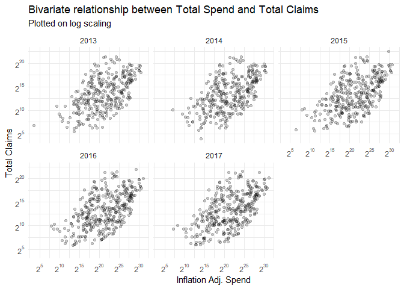<!-- -->

```r
partb_brandchng %>%
  select(everything(), -Year, -brandspend, -branddose, -brandclaims, -brandbens) %>%
  distinct() %>%
  ggplot(aes(x = nomchngspend, y = nomchngclaims)) +
  geom_point(stat = "identity", alpha = 0.05) +
  labs(x = "Inflation Adj. Change in Spend", y = "Change in Claims", title = "Bivariate relationship between spend delta and claims delta", subtitle = "Change deltas are between 2013 & 2017") +
  theme_minimal()
```

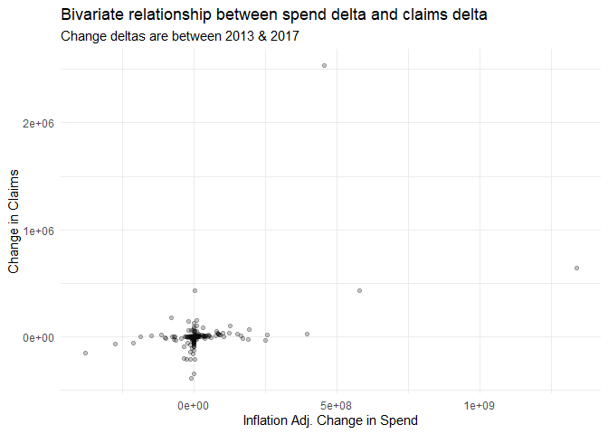<!-- -->

There are several things to note of the bivariate relationship of spend and claims for Medicare Part B:

1. When plotting spend and claims on a log axis, there still appears to be a somewhat positive linear relationship, but this relationship seems much less consistent than Medicare Part D. However, it's also important to note that there are also far fewer drugs that are offered under Medicare Part B relative to both Part D and Medicaid, and thus this variance could just be resulting from fewer observations.
2. Again, unlike Medicare Part D, there are not as many drugs that have increased as dramatically in claims while remaining relatively constant in spend. There are however still a number of drugs that dramatically increased in spend without much variation in claims. 
3. Overall this helps explain why the average cost per claim in aggregate for Medicare Part B has been increasing. 

Below are the top 20 drugs in terms of the change from 2013 to 2017 of their average spend per claim. Similar to Medicare Part D, the change in average spend per claim for these drugs is quite large, but drug number 20, Orencia*, did have a more substantial reach, serving over 20k beneficiaries in one year between 2013 and 2017. 


```r
partb_brandchng %>%
  ungroup(.) %>%
  group_by(`Brand Name`) %>%
  mutate(bens_max = max(`brandbens`)) %>%
  select(`Brand Name`, nomchngspendperclaim, perchngspendperclaim, Description, bens_max) %>%
  distinct() %>%
  arrange(desc(nomchngspendperclaim)) %>%
  ungroup(.) %>%
  top_n(20, wt = nomchngspendperclaim) %>%
  mutate(Rank = row_number(), 
         perchngspendperclaim = paste0(round(perchngspendperclaim*100, 2), "%"), 
         nomchngspendperclaim = ifelse(nomchngspendperclaim < 0, 
                                       paste0("($", abs(round(nomchngspendperclaim, 2)), ")"),
                                       paste0("$", round(nomchngspendperclaim, 2))
                                       )
         ) %>%
  rename("Nominal Average Spend per Claim Delta" = nomchngspendperclaim, "Percentage Average Spend per Claim Delta" = perchngspendperclaim, "Maximum Beneficiaries Between 2013-2017" = bens_max) %>%
  select(Rank, `Brand Name`, `Nominal Average Spend per Claim Delta`, `Percentage Average Spend per Claim Delta`, `Maximum Beneficiaries Between 2013-2017`, Description) %>%
  kable(format = "html") %>%
  kable_styling(bootstrap_options = c("striped", "hover")) %>%
  scroll_box(width = "100%", height = "600px")
```

<div style="border: 1px solid #ddd; padding: 0px; overflow-y: scroll; height:600px; overflow-x: scroll; width:100%; "><table class="table table-striped table-hover" style="margin-left: auto; margin-right: auto;">
 <thead>
  <tr>
   <th style="text-align:right;position: sticky; top:0; background-color: #FFFFFF;"> Rank </th>
   <th style="text-align:left;position: sticky; top:0; background-color: #FFFFFF;"> Brand Name </th>
   <th style="text-align:left;position: sticky; top:0; background-color: #FFFFFF;"> Nominal Average Spend per Claim Delta </th>
   <th style="text-align:left;position: sticky; top:0; background-color: #FFFFFF;"> Percentage Average Spend per Claim Delta </th>
   <th style="text-align:right;position: sticky; top:0; background-color: #FFFFFF;"> Maximum Beneficiaries Between 2013-2017 </th>
   <th style="text-align:left;position: sticky; top:0; background-color: #FFFFFF;"> Description </th>
  </tr>
 </thead>
<tbody>
  <tr>
   <td style="text-align:right;"> 1 </td>
   <td style="text-align:left;"> Miacalcin </td>
   <td style="text-align:left;"> $19712.56 </td>
   <td style="text-align:left;"> 4010.49% </td>
   <td style="text-align:right;"> 39 </td>
   <td style="text-align:left;"> This medication is used to treat certain bone problems (e.g., Paget's disease, postmenopausal osteoporosis) and to reduce high blood levels of calcium. Calcitonin is a man-made hormone that works by slowing bone loss and maintaining normal calcium levels in the blood. It may also help to reduce bone pain in people who have Paget's disease. </td>
  </tr>
  <tr>
   <td style="text-align:right;"> 2 </td>
   <td style="text-align:left;"> Krystexxa </td>
   <td style="text-align:left;"> $11932.44 </td>
   <td style="text-align:left;"> 322.67% </td>
   <td style="text-align:right;"> 408 </td>
   <td style="text-align:left;"> Pegloticase is used to treat gout which has not responded to the usual treatments. It works by lowering high levels of uric acid in your body. Increased uric acid in your body can cause gout. </td>
  </tr>
  <tr>
   <td style="text-align:right;"> 3 </td>
   <td style="text-align:left;"> Bicnu </td>
   <td style="text-align:left;"> $10922.72 </td>
   <td style="text-align:left;"> 1132.98% </td>
   <td style="text-align:right;"> 174 </td>
   <td style="text-align:left;"> This medication is used to treat certain types of cancer (including multiple myeloma, brain tumor, Hodgkin's disease, non-Hodgkin's lymphoma). Carmustine belongs to a class of drugs known as alkylating agents. It works by slowing or stopping the growth of cancer cells. </td>
  </tr>
  <tr>
   <td style="text-align:right;"> 4 </td>
   <td style="text-align:left;"> Ventavis </td>
   <td style="text-align:left;"> $7592.19 </td>
   <td style="text-align:left;"> 57.28% </td>
   <td style="text-align:right;"> 635 </td>
   <td style="text-align:left;"> This medication is used to treat a type of high blood pressure in the lungs (pulmonary arterial hypertension). Iloprost helps to increase your ability to exercise and improves symptoms such as shortness of breath and tiredness. It works by relaxing and widening the blood vessels (arteries) in the lungs and other parts of the body so that blood can flow more easily. This medication belongs to a class of drugs known as vasodilators. </td>
  </tr>
  <tr>
   <td style="text-align:right;"> 5 </td>
   <td style="text-align:left;"> Oncaspar </td>
   <td style="text-align:left;"> $5056.29 </td>
   <td style="text-align:left;"> 57.16% </td>
   <td style="text-align:right;"> 81 </td>
   <td style="text-align:left;"> This medication is usually used with other anti-cancer (chemotherapy) drugs to treat acute lymphocytic leukemia (ALL), especially in patients who are allergic to L-asparaginase. It works by starving tumor cells of a certain amino acid (asparagine), causing the tumor cells to die. </td>
  </tr>
  <tr>
   <td style="text-align:right;"> 6 </td>
   <td style="text-align:left;"> Provenge </td>
   <td style="text-align:left;"> $4751.8 </td>
   <td style="text-align:left;"> 13.59% </td>
   <td style="text-align:right;"> 2067 </td>
   <td style="text-align:left;"> This medication is used to treat advanced prostate cancer. Sipuleucel-T is a type of vaccine created from your own immune system cells that works by causing your immune system to attack prostate cancer cells. This requires that you have a procedure to remove some of your white blood cells, which are used to prepare sipuleucel-T. Talk to your doctor about the risks and benefits of this treatment. </td>
  </tr>
  <tr>
   <td style="text-align:right;"> 7 </td>
   <td style="text-align:left;"> Bebulin* </td>
   <td style="text-align:left;"> $4052.71 </td>
   <td style="text-align:left;"> 71.48% </td>
   <td style="text-align:right;"> 287 </td>
   <td style="text-align:left;"> This medication is used to prevent or control bleeding in people with little or no factor IX (due to hemophilia B, Christmas disease). Factor IX is a protein (clotting factor) in the blood that works with other clotting factors to help the blood clot and therefore stop bleeding. People with little or no factor IX are at risk for bleeding longer after an injury/surgery or bleeding suddenly (often in the joints/muscle) without an obvious cause. This medication should not be used to reverse the effects of "blood thinners" (e.g., warfarin). Most types of this medication should not be used to treat other types of factor deficiencies (e.g., factors II, VII, VIII, X) or factor problems (e.g., inhibitor to factor XIII). If you are using this medication for one of these conditions, consult your doctor or pharmacist to make sure that you are using the right product. </td>
  </tr>
  <tr>
   <td style="text-align:right;"> 8 </td>
   <td style="text-align:left;"> Adcetris </td>
   <td style="text-align:left;"> $3754.33 </td>
   <td style="text-align:left;"> 24.67% </td>
   <td style="text-align:right;"> 1072 </td>
   <td style="text-align:left;"> Brentuximab is used to treat certain types of cancers (Hodgkin's lymphoma, systemic anaplastic large cell lymphoma, primary cutaneous anaplastic large cell lymphoma or CD30-expressing mycosis fungoides). It works by slowing or stopping the growth of cancer cells. </td>
  </tr>
  <tr>
   <td style="text-align:right;"> 9 </td>
   <td style="text-align:left;"> Soliris </td>
   <td style="text-align:left;"> $3526.94 </td>
   <td style="text-align:left;"> 15.18% </td>
   <td style="text-align:right;"> 776 </td>
   <td style="text-align:left;"> This medication is used to treat a certain blood disorder (paroxysmal nocturnal hemoglobinuria). This disorder can cause a decrease in red blood cells (anemia). This medication helps to block the decrease in red blood cells and can improve the symptoms of anemia (e.g., tiredness, shortness of breath) and decrease the need for blood transfusions. This medication may also be used to treat a certain immune system disorder (atypical Hemolytic Uremic Syndrome). It helps to prevent blood clots caused by this disorder. Eculizumab is also used to treat a certain muscle condition (generalized Myasthenia Gravis). It may help to improve symptoms of this condition (such as difficulty swallowing, trouble breathing). </td>
  </tr>
  <tr>
   <td style="text-align:right;"> 10 </td>
   <td style="text-align:left;"> Panhematin </td>
   <td style="text-align:left;"> $3515.96 </td>
   <td style="text-align:left;"> 51.46% </td>
   <td style="text-align:right;"> 127 </td>
   <td style="text-align:left;"> This medication is used to treat the symptoms that occur with certain blood disorders (porphyrias). Other treatments are recommended for trial before using hemin, also called hematin. Hemin is not a cure for porphyria. In some cases, this medication may relieve symptoms such as pain, high blood pressure, rapid heartbeat, or mental changes that may occur during an acute attack of porphyria. If you have any questions about the use of this medication, consult your doctor. </td>
  </tr>
  <tr>
   <td style="text-align:right;"> 11 </td>
   <td style="text-align:left;"> Yervoy </td>
   <td style="text-align:left;"> $3365.9 </td>
   <td style="text-align:left;"> 9.92% </td>
   <td style="text-align:right;"> 2876 </td>
   <td style="text-align:left;"> Ipilimumab is used to treat melanoma (skin cancer) and kidney cancer. It works by changing the action of your own immune system, directing it to attack cancer cells. Unfortunately, other body parts may also be affected (see Warning section). Ipilimumab is a type of medication called a monoclonal antibody. </td>
  </tr>
  <tr>
   <td style="text-align:right;"> 12 </td>
   <td style="text-align:left;"> Stelara </td>
   <td style="text-align:left;"> $3211.96 </td>
   <td style="text-align:left;"> 41.51% </td>
   <td style="text-align:right;"> 3109 </td>
   <td style="text-align:left;"> Ustekinumab is used to treat plaque psoriasis, a certain type of arthritis (psoriatic arthritis), or a certain bowel condition (Crohn's disease). It works by blocking certain natural proteins in your body (interleukin-12 and interleukin-23) that cause inflammation (swelling) in these conditions. Ustekinumab does not cure these diseases, but helps to lessen symptoms of the disease. It can help to decrease the amount of plaques in plaque psoriasis, decrease the number of swollen/painful joints in psoriatic arthritis, and decrease symptoms such as abdominal pain/cramping and diarrhea in Crohn's disease. </td>
  </tr>
  <tr>
   <td style="text-align:right;"> 13 </td>
   <td style="text-align:left;"> Alphanine SD* </td>
   <td style="text-align:left;"> $3183.99 </td>
   <td style="text-align:left;"> 10.3% </td>
   <td style="text-align:right;"> 113 </td>
   <td style="text-align:left;"> This medication is used to prevent or control bleeding in people with little or no factor IX (due to hemophilia B, Christmas disease). Factor IX is a protein (clotting factor) in the blood that works with other clotting factors to help the blood clot and therefore stop bleeding. People with little or no factor IX are at risk for bleeding longer after an injury/surgery or bleeding suddenly (often in the joints/muscle) without an obvious cause. This medication should not be used to reverse the effects of "blood thinners" (e.g., warfarin). Most types of this medication should not be used to treat other types of factor deficiencies (e.g., factors II, VII, VIII, X) or factor problems (e.g., inhibitor to factor XIII). If you are using this medication for one of these conditions, consult your doctor or pharmacist to make sure that you are using the right product. </td>
  </tr>
  <tr>
   <td style="text-align:right;"> 14 </td>
   <td style="text-align:left;"> Berinert </td>
   <td style="text-align:left;"> $3173.47 </td>
   <td style="text-align:left;"> 69.36% </td>
   <td style="text-align:right;"> 87 </td>
   <td style="text-align:left;"> This medication is used to treat the swelling problems that occur with a certain immune disease passed down through families (hereditary angioedema-HAE). HAE is caused by low levels or improper function of a natural substance produced by the body (C1-inhibitor). Symptoms such as rapid swelling of the hands, feet, limbs, face, tongue, or throat can occur. Swelling of the intestinal tract may cause symptoms such as abdominal cramps, diarrhea, or vomiting. Attacks of swelling may occur without reason. However, anxiety, stress, sickness, and surgery may trigger attacks in some people. This medication increases the level of C1-inhibitor to help treat attacks of sudden swelling due to hereditary angioedema. </td>
  </tr>
  <tr>
   <td style="text-align:right;"> 15 </td>
   <td style="text-align:left;"> Somatuline Depot </td>
   <td style="text-align:left;"> $2633.31 </td>
   <td style="text-align:left;"> 71.04% </td>
   <td style="text-align:right;"> 3255 </td>
   <td style="text-align:left;"> This medication is a long-acting form of lanreotide. Lanreotide is used to treat a condition called acromegaly that occurs when the body makes too much of a certain natural substance called growth hormone. It is used when surgery or radiation treatment have not been fully successful or cannot be used. Treating acromegaly helps reduce the risk of serious problems such as diabetes and heart disease. Lanreotide works by decreasing the amount of growth hormone to normal levels. This drug is not a cure for acromegaly. It is used for the long-term treatment of this condition. This medication is also used to treat certain cancer or tumors of the stomach, intestines, or pancreas. It may help to slow down the growth of these tumors. Lanreotide is also used to treat carcinoid syndrome. It may help reduce the need to use another medication to treat diarrhea or flushing caused by carcinoid syndrome. </td>
  </tr>
  <tr>
   <td style="text-align:right;"> 16 </td>
   <td style="text-align:left;"> COsmegen </td>
   <td style="text-align:left;"> $2214.95 </td>
   <td style="text-align:left;"> 124.08% </td>
   <td style="text-align:right;"> 66 </td>
   <td style="text-align:left;"> Dactinomycin is used alone or with other anti-cancer drugs to treat cancer. It works by slowing or stopping the growth of cancer cells. </td>
  </tr>
  <tr>
   <td style="text-align:right;"> 17 </td>
   <td style="text-align:left;"> Busulfan* </td>
   <td style="text-align:left;"> $1877.06 </td>
   <td style="text-align:left;"> 47.38% </td>
   <td style="text-align:right;"> 84 </td>
   <td style="text-align:left;"> Busulfan is used as a pretreatment for patients who are undergoing stem cell transplant for chronic myelogenous leukemia (CML). </td>
  </tr>
  <tr>
   <td style="text-align:right;"> 18 </td>
   <td style="text-align:left;"> Istodax </td>
   <td style="text-align:left;"> $1774.98 </td>
   <td style="text-align:left;"> 23.26% </td>
   <td style="text-align:right;"> 411 </td>
   <td style="text-align:left;"> Romidepsin is used to treat certain types of cancer (cutaneous or peripheral T-cell lymphoma). Romidepsin works by stopping the growth of cancer cells. </td>
  </tr>
  <tr>
   <td style="text-align:right;"> 19 </td>
   <td style="text-align:left;"> Tyvaso* </td>
   <td style="text-align:left;"> $1728.2 </td>
   <td style="text-align:left;"> 13.29% </td>
   <td style="text-align:right;"> 2055 </td>
   <td style="text-align:left;"> This medication is used to treat a type of high blood pressure in the lungs (pulmonary arterial hypertension). Treprostinil helps to increase your ability to exercise and improves symptoms such as shortness of breath and tiredness. It works by relaxing and widening the blood vessels (arteries) in the lungs and other parts of the body so that blood can flow more easily. This medication belongs to a class of drugs known as vasodilators. </td>
  </tr>
  <tr>
   <td style="text-align:right;"> 20 </td>
   <td style="text-align:left;"> Orencia* </td>
   <td style="text-align:left;"> $1700 </td>
   <td style="text-align:left;"> 95.41% </td>
   <td style="text-align:right;"> 24409 </td>
   <td style="text-align:left;"> This medication is used to treat rheumatoid arthritis, a condition in which the body's own defense system (immune system) attacks healthy tissue. This leads to swelling in the joints, which causes pain and makes it harder to move. Abatacept works by weakening your immune system. This effect helps to slow down joint damage and reduce joint pain and swelling so you can move better. This medication is also used to treat other types of arthritis (such as juvenile idiopathic arthritis, psoriatic arthritis). </td>
  </tr>
</tbody>
</table></div>

Below are the top 20 drugs in terms of the cumulative amount of claims between 2013 to 2017. Again in contrast to Medicare Part D, half of the top 20 most claimed had their average spend per claim increase in that time period, with the second most claimed drug (Prevnar 13) having its average spend per claim increase by \$35.27 in real terms.


```r
partb_brandchng %>%
  ungroup(.) %>%
  group_by(`Brand Name`) %>%
  mutate(claims_time = sum(`brandclaims`)) %>%
  select(`Brand Name`, nomchngspendperclaim, perchngspendperclaim, claims_time, Description) %>%
  distinct() %>%
  arrange(desc(claims_time)) %>%
  ungroup(.) %>%
  top_n(20, wt = claims_time) %>%
  mutate(Rank = row_number(), 
         perchngspendperclaim = paste0(round(perchngspendperclaim*100, 2), "%"), 
         nomchngspendperclaim = ifelse(nomchngspendperclaim < 0, 
                                       paste0("($", abs(round(nomchngspendperclaim, 2)), ")"),
                                       paste0("$", round(nomchngspendperclaim, 2))
                                       )
         ) %>%
  rename("Nominal Average Spend per Claim Delta" = nomchngspendperclaim, "Percentage Average Spend per Claim Delta" = perchngspendperclaim, "Combined Claims 2013-2017" = claims_time) %>%
  select(Rank, `Brand Name`, `Nominal Average Spend per Claim Delta`, `Percentage Average Spend per Claim Delta`, `Combined Claims 2013-2017`, Description) %>%
  kable(format = "html") %>%
  kable_styling(bootstrap_options = c("striped", "hover")) %>%
  scroll_box(width = "100%", height = "600px")
```

<div style="border: 1px solid #ddd; padding: 0px; overflow-y: scroll; height:600px; overflow-x: scroll; width:100%; "><table class="table table-striped table-hover" style="margin-left: auto; margin-right: auto;">
 <thead>
  <tr>
   <th style="text-align:right;position: sticky; top:0; background-color: #FFFFFF;"> Rank </th>
   <th style="text-align:left;position: sticky; top:0; background-color: #FFFFFF;"> Brand Name </th>
   <th style="text-align:left;position: sticky; top:0; background-color: #FFFFFF;"> Nominal Average Spend per Claim Delta </th>
   <th style="text-align:left;position: sticky; top:0; background-color: #FFFFFF;"> Percentage Average Spend per Claim Delta </th>
   <th style="text-align:right;position: sticky; top:0; background-color: #FFFFFF;"> Combined Claims 2013-2017 </th>
   <th style="text-align:left;position: sticky; top:0; background-color: #FFFFFF;"> Description </th>
  </tr>
 </thead>
<tbody>
  <tr>
   <td style="text-align:right;"> 1 </td>
   <td style="text-align:left;"> Kenalog* </td>
   <td style="text-align:left;"> $0.19 </td>
   <td style="text-align:left;"> 2.43% </td>
   <td style="text-align:right;"> 14021787 </td>
   <td style="text-align:left;"> This medication is used in a variety of conditions such as allergic disorders, arthritis, blood diseases, breathing problems, certain cancers, eye diseases, intestinal disorders, collagen and skin diseases. Talk to your doctor about the risks and benefits of triamcinolone, especially if it is to be injected near your spine (epidural). Rare but serious side effects may occur with epidural use. Triamcinolone acetonide is known as a corticosteroid hormone (glucocorticoid). It works by decreasing your body's immune response to these diseases and reduces symptoms such as swelling. </td>
  </tr>
  <tr>
   <td style="text-align:right;"> 2 </td>
   <td style="text-align:left;"> Prevnar 13 </td>
   <td style="text-align:left;"> $35.27 </td>
   <td style="text-align:left;"> 24.7% </td>
   <td style="text-align:right;"> 13236873 </td>
   <td style="text-align:left;"> This vaccine is used to help protect from infection due to a certain bacteria (Streptococcus pneumoniae). This bacteria can cause ear infection or other more serious infections (such as pneumonia, meningitis). Some brands are approved for use only in children, while others can be used in both children and adults. Vaccines may not fully protect everyone who receives them. Another form of this vaccine should be used if the child or adult has certain medical conditions (such as heart disease, lung disease, liver disease, diabetes, spleen problems, sickle cell anemia, HIV infection). Talk to your health care professional for more details. </td>
  </tr>
  <tr>
   <td style="text-align:right;"> 3 </td>
   <td style="text-align:left;"> Dexamethasone Sodium Phosphate* </td>
   <td style="text-align:left;"> ($0.04) </td>
   <td style="text-align:left;"> -4.02% </td>
   <td style="text-align:right;"> 12464459 </td>
   <td style="text-align:left;"> This medication is used to treat various conditions such as severe allergic reactions, arthritis, blood diseases, breathing problems, certain cancers, eye diseases, intestinal disorders, and skin diseases. It is also used to test for an adrenal gland disorder (Cushing's syndrome). It decreases your body's natural defensive response and reduces symptoms such as swelling and allergic-type reactions. Dexamethasone is a corticosteroid hormone (glucocorticoid). This injectable form of dexamethasone is used when a similar drug cannot be taken by mouth or when a very fast response is needed, especially in patients with severe medical conditions. Talk to your doctor about the risks and benefits of dexamethasone, especially if it is to be injected near your spine (epidural). Rare but serious side effects may occur with epidural use. This drug may also be used with other medications as a replacement for certain hormones. </td>
  </tr>
  <tr>
   <td style="text-align:right;"> 4 </td>
   <td style="text-align:left;"> Cyanocobalamin Injection </td>
   <td style="text-align:left;"> $1.63 </td>
   <td style="text-align:left;"> 132.87% </td>
   <td style="text-align:right;"> 12121406 </td>
   <td style="text-align:left;"> Cyanocobalamin is a man-made form of vitamin B12 used to treat low levels (deficiency) of this vitamin. Vitamin B12 helps your body use fat and carbohydrates for energy and make new protein. It is also important for normal blood, cells, and nerves. Most people get enough vitamin B12 in their diet, but a deficiency may occur in certain health conditions (e.g., poor nutrition, stomach/intestinal problems, infection, cancer). Serious vitamin B12 deficiency may result in anemia, stomach problems, and nerve damage. </td>
  </tr>
  <tr>
   <td style="text-align:right;"> 5 </td>
   <td style="text-align:left;"> Depo-Medrol (J1030)* </td>
   <td style="text-align:left;"> $4.06 </td>
   <td style="text-align:left;"> 97.67% </td>
   <td style="text-align:right;"> 9584380 </td>
   <td style="text-align:left;"> Methylprednisolone is used to treat pain and swelling that occurs with arthritis and other joint disorders. This medication may also be used to treat various conditions such as blood disorders, severe allergic reactions, certain cancers, eye conditions, skin/intestinal/kidney/lung diseases, and immune system disorders. It decreases your immune system's response to these conditions and reduces symptoms such as swelling, pain, and allergic-type reactions. Talk to your doctor about the risks and benefits of methylprednisolone, especially if it is to be injected near your spine (epidural). Rare but serious side effects may occur with epidural use. Methylprednisolone is a corticosteroid hormone. Methylprednisolone may also be used with other medications in hormone disorders. </td>
  </tr>
  <tr>
   <td style="text-align:right;"> 6 </td>
   <td style="text-align:left;"> Albuterol Sulfate (J7613) </td>
   <td style="text-align:left;"> ($2.98) </td>
   <td style="text-align:left;"> -24.47% </td>
   <td style="text-align:right;"> 8047838 </td>
   <td style="text-align:left;"> Albuterol (also known as salbutamol) is used to treat wheezing and shortness of breath caused by breathing problems such as asthma. It is a quick-relief medication. Albuterol belongs to a class of drugs known as bronchodilators. It works in the airways by opening breathing passages and relaxing muscles. Controlling symptoms of breathing problems can decrease time lost from work or school. </td>
  </tr>
  <tr>
   <td style="text-align:right;"> 7 </td>
   <td style="text-align:left;"> Ipratropium-Albuterol </td>
   <td style="text-align:left;"> ($6.78) </td>
   <td style="text-align:left;"> -33.05% </td>
   <td style="text-align:right;"> 7511000 </td>
   <td style="text-align:left;"> This product is used to treat and prevent symptoms (wheezing and shortness of breath) caused by ongoing lung disease (chronic obstructive pulmonary disease-COPD which includes bronchitis and emphysema). This product contains 2 medications: ipratropium and albuterol (also known as salbutamol). Both drugs work by relaxing the muscles around the airways so that they open up and you can breathe more easily. Controlling symptoms of breathing problems can decrease time lost from work or school. </td>
  </tr>
  <tr>
   <td style="text-align:right;"> 8 </td>
   <td style="text-align:left;"> Depo-Medrol (J1040)* </td>
   <td style="text-align:left;"> $6 </td>
   <td style="text-align:left;"> 89.18% </td>
   <td style="text-align:right;"> 7489132 </td>
   <td style="text-align:left;"> Methylprednisolone is used to treat pain and swelling that occurs with arthritis and other joint disorders. This medication may also be used to treat various conditions such as blood disorders, severe allergic reactions, certain cancers, eye conditions, skin/intestinal/kidney/lung diseases, and immune system disorders. It decreases your immune system's response to these conditions and reduces symptoms such as swelling, pain, and allergic-type reactions. Talk to your doctor about the risks and benefits of methylprednisolone, especially if it is to be injected near your spine (epidural). Rare but serious side effects may occur with epidural use. Methylprednisolone is a corticosteroid hormone. Methylprednisolone may also be used with other medications in hormone disorders. </td>
  </tr>
  <tr>
   <td style="text-align:right;"> 9 </td>
   <td style="text-align:left;"> Hexabrix* </td>
   <td style="text-align:left;"> ($3.64) </td>
   <td style="text-align:left;"> -28.3% </td>
   <td style="text-align:right;"> 5904203 </td>
   <td style="text-align:left;"> This medication is used before X-ray imaging tests (such as CT scans). Iohexol contains iodine and belongs to a class of drugs known as contrast media or dyes. It works by adding contrast to body parts and fluids in these imaging tests. Iohexol improves the images obtained during a CT scan, so your doctor can more easily diagnose your condition. </td>
  </tr>
  <tr>
   <td style="text-align:right;"> 10 </td>
   <td style="text-align:left;"> Ceftriaxone* </td>
   <td style="text-align:left;"> ($0.99) </td>
   <td style="text-align:left;"> -28.4% </td>
   <td style="text-align:right;"> 5221419 </td>
   <td style="text-align:left;"> Ceftriaxone is used to treat a wide variety of bacterial infections. This medication belongs to a class of drugs known as cephalosporin antibiotics. It works by stopping the growth of bacteria. This drug is not recommended for use in newborns with high blood bilirubin levels and premature infants due to increased risk of side effects. Ask the doctor or pharmacist for details. </td>
  </tr>
  <tr>
   <td style="text-align:right;"> 11 </td>
   <td style="text-align:left;"> Avastin </td>
   <td style="text-align:left;"> ($238.04) </td>
   <td style="text-align:left;"> -16.88% </td>
   <td style="text-align:right;"> 4333152 </td>
   <td style="text-align:left;"> This medication is a man-made antibody (IgG1) used to treat kidney, cervical, ovarian, colon, and rectal cancer. Bevacizumab is also used to treat lung cancer (non-small cell type), certain types of brain tumors, and cancer found in the fallopian tube or lining of the abdominal wall (peritoneal). This drug works by blocking a certain protein (vascular endothelial growth factor-VEGF) thereby decreasing the blood supply to the tumor and slowing tumor growth. </td>
  </tr>
  <tr>
   <td style="text-align:right;"> 12 </td>
   <td style="text-align:left;"> Eylea </td>
   <td style="text-align:left;"> ($54.36) </td>
   <td style="text-align:left;"> -2.5% </td>
   <td style="text-align:right;"> 4219955 </td>
   <td style="text-align:left;"> Aflibercept is used to treat certain serious eye conditions (such as wet age-related macular degeneration - wet AMD, macular edema following central retinal vein occlusion, diabetic macular edema). This medication can help preserve vision and prevent blindness. Aflibercept belongs to a class of drugs known as growth factor inhibitors. It works by slowing the growth of abnormal new blood vessels in the eye and decreasing leakage from these blood vessels. </td>
  </tr>
  <tr>
   <td style="text-align:right;"> 13 </td>
   <td style="text-align:left;"> Aloxi </td>
   <td style="text-align:left;"> $23.02 </td>
   <td style="text-align:left;"> 10.95% </td>
   <td style="text-align:right;"> 4149822 </td>
   <td style="text-align:left;"> This medication is used to prevent nausea and vomiting caused by cancer drug treatment (chemotherapy). It is also used to prevent nausea and vomiting after surgery. Palonosetron works by blocking one of the body's natural substances (serotonin) that causes vomiting. </td>
  </tr>
  <tr>
   <td style="text-align:right;"> 14 </td>
   <td style="text-align:left;"> Ketorolac Tromethamine </td>
   <td style="text-align:left;"> $0.6 </td>
   <td style="text-align:left;"> 47.35% </td>
   <td style="text-align:right;"> 3783303 </td>
   <td style="text-align:left;"> Ketorolac is used for the short-term treatment of moderate to severe pain. It is usually used before or after medical procedures or after surgery. Reducing pain helps you recover more comfortably so that you can return to your normal daily activities. This medication is a nonsteroidal anti-inflammatory drug (NSAID). It works by blocking your body's production of certain natural substances that cause inflammation. This effect helps to decrease swelling, pain, or fever. Ketorolac should not be used for mild or long-term painful conditions (such as arthritis). </td>
  </tr>
  <tr>
   <td style="text-align:right;"> 15 </td>
   <td style="text-align:left;"> Budesonide* </td>
   <td style="text-align:left;"> ($133.15) </td>
   <td style="text-align:left;"> -41.93% </td>
   <td style="text-align:right;"> 3770684 </td>
   <td style="text-align:left;"> Budesonide is used to control and prevent symptoms (wheezing and shortness of breath) caused by asthma. This medication belongs to a class of drugs known as corticosteroids. It works directly in the lungs to make breathing easier by reducing the irritation and swelling of the airways. This medication must be used regularly to be effective. It does not work right away and should not be used to relieve sudden asthma attacks. If an asthma attack occurs, use your quick-relief inhaler as prescribed. </td>
  </tr>
  <tr>
   <td style="text-align:right;"> 16 </td>
   <td style="text-align:left;"> Prolia* </td>
   <td style="text-align:left;"> $21.73 </td>
   <td style="text-align:left;"> 1.7% </td>
   <td style="text-align:right;"> 3742512 </td>
   <td style="text-align:left;"> Denosumab is used to treat bone loss (osteoporosis) in women who are at high risk for bone fracture after menopause. It is also used to treat bone loss in men who are at high risk for bone fracture. Osteoporosis causes bones to become thinner and break more easily. Your chance of developing osteoporosis increases after menopause (in women), as you age, if someone in your family has osteoporosis, or if you take corticosteroid medications (such as prednisone) for long periods. Denosumab is also used to treat bone loss in women who are at high risk for bone fracture while receiving certain treatments for breast cancer. Denosumab is also used to treat bone loss in men who are at high risk of bone fracture while receiving certain treatments for prostate cancer that has not spread to other parts of the body. This medication works by slowing bone loss to help maintain strong bones and reduce the risk of broken bones (fractures). Denosumab belongs to a class of drugs called monoclonal antibodies. It prevents certain cells in the body (osteoclasts) from breaking down bone. </td>
  </tr>
  <tr>
   <td style="text-align:right;"> 17 </td>
   <td style="text-align:left;"> Sodium Chloride (J7050) </td>
   <td style="text-align:left;"> $0.26 </td>
   <td style="text-align:left;"> 52.04% </td>
   <td style="text-align:right;"> 3629147 </td>
   <td style="text-align:left;"> This solution is used to supply water and salt (sodium chloride) to the body. Sodium chloride solution may also be mixed with other medications given by injection into a vein. </td>
  </tr>
  <tr>
   <td style="text-align:right;"> 18 </td>
   <td style="text-align:left;"> Epogen (J0885)* </td>
   <td style="text-align:left;"> $79.46 </td>
   <td style="text-align:left;"> 19.67% </td>
   <td style="text-align:right;"> 3427117 </td>
   <td style="text-align:left;"> This medication is used to treat anemia (low red blood cell count) in people with long-term serious kidney disease (chronic kidney failure), people receiving zidovudine to treat HIV, and people receiving chemotherapy for some types of cancer (cancer that does not involve the bone marrow or blood cells). It may also be used in anemic patients to reduce the need for blood transfusions before certain planned surgeries that have a high risk of blood loss (usually given with an anticoagulant/"blood thinner" medication such as warfarin to lower the risk of serious blood clots). Epoetin alfa works by signaling the bone marrow to make more red blood cells. This medication is very similar to the natural substance in your body (erythropoietin) that prevents anemia. </td>
  </tr>
  <tr>
   <td style="text-align:right;"> 19 </td>
   <td style="text-align:left;"> Diphenhydramine HCL (J1200) </td>
   <td style="text-align:left;"> ($0.1) </td>
   <td style="text-align:left;"> -13% </td>
   <td style="text-align:right;"> 3348457 </td>
   <td style="text-align:left;"> Diphenhydramine injection is an antihistamine used to treat life-threatening allergic reactions (anaphylaxis) along with epinephrine and other treatments. It is also used to relieve symptoms of household allergies, hay fever and the common cold when medication cannot be given by mouth. Common allergy symptoms relieved by antihistamines include rash, itching, watery eyes, itchy eyes/nose/throat, cough, runny nose and sneezing. It is also used to treat nausea, vomiting and dizziness caused by motion sickness when medication cannot be given by mouth. Diphenhydramine works by blocking a certain natural substance (histamine) that your body makes during an allergic reaction. Its drying effects on such symptoms as watery eyes and runny nose are caused by blocking another natural substance made by your body (acetylcholine). Diphenhydramine should not be used in newborns or premature infants because of an increased risk of side effects. It should not be used for common cold symptoms in children less than 6 years of age due to the risk of serious side effects, such as slow/shallow breathing. Cough-and-cold products have not been shown to be safe or effective in children younger than 6. </td>
  </tr>
  <tr>
   <td style="text-align:right;"> 20 </td>
   <td style="text-align:left;"> Hecoria* </td>
   <td style="text-align:left;"> ($164.01) </td>
   <td style="text-align:left;"> -65.38% </td>
   <td style="text-align:right;"> 3337632 </td>
   <td style="text-align:left;"> Tacrolimus is used with other medications to prevent rejection of a kidney, heart, or liver transplant. This medication belongs to a class of drugs known as immunosuppressants. It works by weakening your body's defense system (immune system) to help your body accept the new organ as if it were your own. </td>
  </tr>
</tbody>
</table></div>

### Medicaid


```r
medicaid %>%
  group_by(`Brand Name`, Year) %>%
  summarise(brandspend = sum(`Inf Total Spend`), 
            branddose = sum(`Total Dosage Units`), 
            brandclaims = sum(`Total Claims`),
            avgspendperclaim = brandspend/brandclaims) %>%
  filter(brandspend >= 1) %>%
  ggplot(aes(x = brandspend, y = brandclaims)) +
  geom_point(stat = "identity", alpha = 0.2) +
  facet_wrap(~ as_factor(Year)) +
  scale_x_continuous(trans = log2_trans(),
    breaks = trans_breaks("log2", function(x) 2^x),
    labels = trans_format("log2", math_format(2^.x))) +
  scale_y_continuous(trans = log2_trans(),
    breaks = trans_breaks("log2", function(x) 2^x),
    labels = trans_format("log2", math_format(2^.x))) +
  labs(x = "Inflation Adj. Spend", y = "Total Claims", title = "Bivariate relationship between Total Spend and Total Claims", subtitle = "Plotted on log scaling") +
  theme_minimal()
```

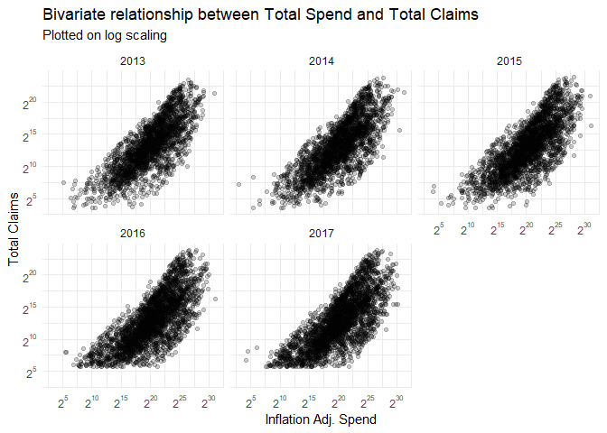<!-- -->

```r
medicaid_brandchng %>%
  select(everything(), -Year, -brandspend, -branddose, -brandclaims) %>%
  distinct() %>%
  ggplot(aes(x = nomchngspend, y = nomchngclaims)) +
  geom_point(stat = "identity", alpha = 0.05) +
  labs(x = "Inflation Adj. Change in Spend", y = "Change in Claims", title = "Bivariate relationship between spend delta and claims delta", subtitle = "Change deltas are between 2013 & 2017") +
  theme_minimal()
```

<!-- -->


There are two things to note of the bivariate relationship of spend and claims for Medicaid:

1. When plotting spend and claims on a log axis, there appears to be a stronger linear relationship that more closely resembles the relationship exhibited in Medicare Part D.
2. Medicaid spending and claims in general looks more similar to Medicare Part D than it does Part B. Again there seems to be two distinct clusters of drugs that are either have increased heavily in claims but not spend or vice versa but have not increased in both.

Below are the top 20 drugs in terms of the change from 2013 to 2017 of their average spend per claim. The Medicaid dataset didn't provide beneficiary information, so I'm looking at the maximum claims in a given year as a proxy measure of reach instead. Similar to Medicare Part D, the change in average spend per claim for these drugs is again quite large, but most of these drugs also have had a small reach. 


```r
medicaid_brandchng %>%
  ungroup(.) %>%
  group_by(`Brand Name`) %>%
  mutate(claims_max = max(`brandclaims`)) %>%
  select(`Brand Name`, nomchngspendperclaim, perchngspendperclaim, Description, claims_max) %>%
  distinct() %>%
  arrange(desc(nomchngspendperclaim)) %>%
  ungroup(.) %>%
  top_n(20, wt = nomchngspendperclaim) %>%
  mutate(Rank = row_number(), 
         perchngspendperclaim = paste0(round(perchngspendperclaim*100, 2), "%"), 
         nomchngspendperclaim = ifelse(nomchngspendperclaim < 0, 
                                       paste0("($", abs(round(nomchngspendperclaim, 2)), ")"),
                                       paste0("$", round(nomchngspendperclaim, 2))
                                       )
         ) %>%
  rename("Nominal Average Spend per Claim Delta" = nomchngspendperclaim, "Percentage Average Spend per Claim Delta" = perchngspendperclaim, "Maximum Claims Between 2013-2017" = claims_max) %>%
  select(Rank, `Brand Name`, `Nominal Average Spend per Claim Delta`, `Percentage Average Spend per Claim Delta`, `Maximum Claims Between 2013-2017`, Description) %>%
  kable(format = "html") %>%
  kable_styling(bootstrap_options = c("striped", "hover")) %>%
  scroll_box(width = "100%", height = "600px")
```

<div style="border: 1px solid #ddd; padding: 0px; overflow-y: scroll; height:600px; overflow-x: scroll; width:100%; "><table class="table table-striped table-hover" style="margin-left: auto; margin-right: auto;">
 <thead>
  <tr>
   <th style="text-align:right;position: sticky; top:0; background-color: #FFFFFF;"> Rank </th>
   <th style="text-align:left;position: sticky; top:0; background-color: #FFFFFF;"> Brand Name </th>
   <th style="text-align:left;position: sticky; top:0; background-color: #FFFFFF;"> Nominal Average Spend per Claim Delta </th>
   <th style="text-align:left;position: sticky; top:0; background-color: #FFFFFF;"> Percentage Average Spend per Claim Delta </th>
   <th style="text-align:right;position: sticky; top:0; background-color: #FFFFFF;"> Maximum Claims Between 2013-2017 </th>
   <th style="text-align:left;position: sticky; top:0; background-color: #FFFFFF;"> Description </th>
  </tr>
 </thead>
<tbody>
  <tr>
   <td style="text-align:right;"> 1 </td>
   <td style="text-align:left;"> Carbaglu </td>
   <td style="text-align:left;"> $34376.4 </td>
   <td style="text-align:left;"> 98.63% </td>
   <td style="text-align:right;"> 184 </td>
   <td style="text-align:left;"> Drugs uses not available </td>
  </tr>
  <tr>
   <td style="text-align:right;"> 2 </td>
   <td style="text-align:left;"> Provenge </td>
   <td style="text-align:left;"> $28482.64 </td>
   <td style="text-align:left;"> 104.07% </td>
   <td style="text-align:right;"> 97 </td>
   <td style="text-align:left;"> This medication is used to treat advanced prostate cancer. Sipuleucel-T is a type of vaccine created from your own immune system cells that works by causing your immune system to attack prostate cancer cells. This requires that you have a procedure to remove some of your white blood cells, which are used to prepare sipuleucel-T. Talk to your doctor about the risks and benefits of this treatment. </td>
  </tr>
  <tr>
   <td style="text-align:right;"> 3 </td>
   <td style="text-align:left;"> Demser </td>
   <td style="text-align:left;"> $27593.63 </td>
   <td style="text-align:left;"> 664.99% </td>
   <td style="text-align:right;"> 194 </td>
   <td style="text-align:left;"> This medication is used to treat high blood pressure in people with a certain adrenal gland tumor (pheochromocytoma). Metyrosine is used to prevent high blood pressure before and immediately after surgery to remove the tumor. It is also used long-term in people who cannot have the surgery. It is not used for other kinds of high blood pressure. Metyrosine prevents the tumor from making certain natural substances (catecholamines) that raise the blood pressure and make the heart beat faster. Lowering the amount of catecholamines lessens the risk of a very serious attack of high blood pressure (hypertensive crisis). </td>
  </tr>
  <tr>
   <td style="text-align:right;"> 4 </td>
   <td style="text-align:left;"> Adagen </td>
   <td style="text-align:left;"> $27165.22 </td>
   <td style="text-align:left;"> 64.07% </td>
   <td style="text-align:right;"> 276 </td>
   <td style="text-align:left;"> Pegademase is used to treat a certain rare genetic immune system problem (severe combined immune deficiency disease-SCID). Pegademase replaces a certain natural substance (an enzyme called adenosine deaminase-ADA) that is missing in people with SCID. This medication increases the number of blood cells that prevent and fight infection (lymphocytes) by helping the body get rid of certain substances that kill lymphocytes. This medication does not help immune system problems due to other causes (such as AIDS, bone marrow depression). </td>
  </tr>
  <tr>
   <td style="text-align:right;"> 5 </td>
   <td style="text-align:left;"> Actimmune </td>
   <td style="text-align:left;"> $24809.64 </td>
   <td style="text-align:left;"> 113.99% </td>
   <td style="text-align:right;"> 1443 </td>
   <td style="text-align:left;"> This medication is used to reduce the frequency and severity of serious infections due to chronic granulomatous disease, a disorder that runs in families. This drug is often used along with antibiotics to help prevent these serious infections. This medication is also used to slow the worsening of malignant osteopetrosis, another disorder that runs in families, that affects bones, nerves, and blood. This medication is the same as a protein that your body naturally produces (interferon). In the body, it is thought to work by affecting cell function/growth and the body's natural defenses (immune system) in many ways. Adding more interferon may help your body fight off serious infections. </td>
  </tr>
  <tr>
   <td style="text-align:right;"> 6 </td>
   <td style="text-align:left;"> Korlym </td>
   <td style="text-align:left;"> $21681.82 </td>
   <td style="text-align:left;"> 486.73% </td>
   <td style="text-align:right;"> 616 </td>
   <td style="text-align:left;"> This medication is used to control high blood sugar in people who have a certain condition (Cushing's syndrome), and who have failed surgery or cannot have surgery to correct the condition. Cushing's syndrome is caused by the body producing too much of a certain hormone (cortisol) which can cause glucose intolerance or type 2 diabetes. Mifepristone works by blocking the effects of cortisol. </td>
  </tr>
  <tr>
   <td style="text-align:right;"> 7 </td>
   <td style="text-align:left;"> Cuprimine </td>
   <td style="text-align:left;"> $20565.06 </td>
   <td style="text-align:left;"> 1682.01% </td>
   <td style="text-align:right;"> 902 </td>
   <td style="text-align:left;"> This medication is used to treat rheumatoid arthritis, Wilson's disease (a condition in which high levels of copper in the body cause damage to the liver, brain, and other organs), and a certain disorder which causes kidney stones (cystinuria). For the treatment of rheumatoid arthritis, penicillamine is known as a disease-modifying antirheumatic drug (DMARD). It helps to decrease pain/tenderness/swelling in the joints. For the treatment of Wilson's disease, penicillamine binds to copper and helps it to be removed from the body. Decreasing copper levels helps to improve liver function and the mental/mood/nerve problems (such as confusion, difficulty speaking/walking) caused by the disease. For the treatment of cystinuria, penicillamine helps to decrease the amount of a certain substance (cystine) in the urine which can cause kidney stones. </td>
  </tr>
  <tr>
   <td style="text-align:right;"> 8 </td>
   <td style="text-align:left;"> Novoseven RT </td>
   <td style="text-align:left;"> $19452.68 </td>
   <td style="text-align:left;"> 24.34% </td>
   <td style="text-align:right;"> 3359 </td>
   <td style="text-align:left;"> This medication is used to treat and prevent bleeding in people with certain conditions (such as hemophilia type A or B, low levels of factor VII, Glanzmann's thrombasthenia). People with these conditions are at risk for bleeding longer after an injury/surgery and for bleeding inside the body (especially into the joints and muscles). This product contains a man-made form of factor VIIa, which is a protein (clotting factor) in the blood that works with other clotting factors to help the blood clot and therefore stop bleeding. </td>
  </tr>
  <tr>
   <td style="text-align:right;"> 9 </td>
   <td style="text-align:left;"> Yervoy </td>
   <td style="text-align:left;"> $15114.47 </td>
   <td style="text-align:left;"> 59.83% </td>
   <td style="text-align:right;"> 1377 </td>
   <td style="text-align:left;"> Ipilimumab is used to treat melanoma (skin cancer) and kidney cancer. It works by changing the action of your own immune system, directing it to attack cancer cells. Unfortunately, other body parts may also be affected (see Warning section). Ipilimumab is a type of medication called a monoclonal antibody. </td>
  </tr>
  <tr>
   <td style="text-align:right;"> 10 </td>
   <td style="text-align:left;"> Iclusig </td>
   <td style="text-align:left;"> $13100.44 </td>
   <td style="text-align:left;"> 133.32% </td>
   <td style="text-align:right;"> 1435 </td>
   <td style="text-align:left;"> Ponatinib is used to treat certain types of blood cancer (chronic myelogenous leukemia-CML, acute lymphoblastic leukemia-ALL). It works by slowing or stopping the growth of cancer cells. It belongs to a class of drugs known as kinase inhibitors. </td>
  </tr>
  <tr>
   <td style="text-align:right;"> 11 </td>
   <td style="text-align:left;"> Procysbi </td>
   <td style="text-align:left;"> $12425.53 </td>
   <td style="text-align:left;"> 44.38% </td>
   <td style="text-align:right;"> 987 </td>
   <td style="text-align:left;"> This medication is used to help preserve kidney function and manage kidney damage and other problems in people with an inherited disorder that causes build-up of a certain natural substance (cystine) in the body (nephropathic cystinosis). Cystine build-up can cause problems such as kidney problems, slow growth, weak bones, and eye problems. Cysteamine helps the body get rid of cystine. </td>
  </tr>
  <tr>
   <td style="text-align:right;"> 12 </td>
   <td style="text-align:left;"> Proleukin </td>
   <td style="text-align:left;"> $11812.47 </td>
   <td style="text-align:left;"> 756.35% </td>
   <td style="text-align:right;"> 163 </td>
   <td style="text-align:left;"> Aldesleukin is used to treat advanced forms of kidney or skin cancer (cancer that has spread to other parts of the body). This medication is the same as a substance that your body normally makes (interleukin-2). In the body, this drug is thought to work by affecting the body's natural defenses (immune system). This effect slows or stops cancer cell growth. </td>
  </tr>
  <tr>
   <td style="text-align:right;"> 13 </td>
   <td style="text-align:left;"> Gattex </td>
   <td style="text-align:left;"> $11134.38 </td>
   <td style="text-align:left;"> 43.74% </td>
   <td style="text-align:right;"> 686 </td>
   <td style="text-align:left;"> Drugs uses not available </td>
  </tr>
  <tr>
   <td style="text-align:right;"> 14 </td>
   <td style="text-align:left;"> Supprelin La </td>
   <td style="text-align:left;"> $11094.56 </td>
   <td style="text-align:left;"> 65.63% </td>
   <td style="text-align:right;"> 754 </td>
   <td style="text-align:left;"> Histrelin is used in men to treat advanced prostate cancer. It is not a cure. Most types of prostate cancer need the male hormone testosterone to grow and spread. Histrelin works by reducing the amount of testosterone that the body makes. This helps slow or stop the growth of cancer cells and helps relieve symptoms such as painful/difficult urination. Talk to your doctor about the risks and benefits of treatment. Histrelin is also used in children to treat early puberty (central precocious puberty). It helps to slow abnormally fast bone development so that height and growth rate are near normal and to stop or reverse signs of early puberty (such as breast/pubic hair growth in girls, pubic hair growth in boys). Histrelin works by reducing the amount of testosterone in boys and estrogen in girls. This medication is used until the doctor decides it is time for puberty to resume. </td>
  </tr>
  <tr>
   <td style="text-align:right;"> 15 </td>
   <td style="text-align:left;"> Flucytosine </td>
   <td style="text-align:left;"> $10541.67 </td>
   <td style="text-align:left;"> 190.02% </td>
   <td style="text-align:right;"> 92 </td>
   <td style="text-align:left;"> Flucytosine is used to treat serious fungal infections in the body. It belongs to a class of drugs known as antifungal drugs. It is often used with other medications. It works by slowing the growth of certain types of fungus. </td>
  </tr>
  <tr>
   <td style="text-align:right;"> 16 </td>
   <td style="text-align:left;"> Oncaspar </td>
   <td style="text-align:left;"> $10444.8 </td>
   <td style="text-align:left;"> 141.52% </td>
   <td style="text-align:right;"> 1144 </td>
   <td style="text-align:left;"> This medication is usually used with other anti-cancer (chemotherapy) drugs to treat acute lymphocytic leukemia (ALL), especially in patients who are allergic to L-asparaginase. It works by starving tumor cells of a certain amino acid (asparagine), causing the tumor cells to die. </td>
  </tr>
  <tr>
   <td style="text-align:right;"> 17 </td>
   <td style="text-align:left;"> Zavesca </td>
   <td style="text-align:left;"> $10435.89 </td>
   <td style="text-align:left;"> 45.39% </td>
   <td style="text-align:right;"> 483 </td>
   <td style="text-align:left;"> Miglustat is used for the long-term treatment of a certain rare genetic problem (Gaucher's disease). It works by decreasing the amount of a certain natural fatty substance (glucosylceramide) that builds up due to this condition. This can help improve symptoms of Gaucher's disease, such as tiredness, pain in the joints/bones, and a swollen liver or spleen. </td>
  </tr>
  <tr>
   <td style="text-align:right;"> 18 </td>
   <td style="text-align:left;"> Kogenate FS </td>
   <td style="text-align:left;"> $9574.11 </td>
   <td style="text-align:left;"> 66.78% </td>
   <td style="text-align:right;"> 4449 </td>
   <td style="text-align:left;"> This medication is used to control and prevent bleeding episodes in people with low levels of factor VIII (hemophilia A). It is also used in these patients before surgery to prevent bleeding. People with low factor VIII levels are at risk for bleeding longer after an injury/surgery and for bleeding inside the body (especially into the joints and muscles). This product contains a man-made form of factor VIII, also called antihemophilic factor. This product is used to temporarily replace the missing factor VIII, a protein (clotting factor) that is normally in the blood, so that the blood can clot and the bleeding can stop. This medication should not be used to treat von Willebrand disease. </td>
  </tr>
  <tr>
   <td style="text-align:right;"> 19 </td>
   <td style="text-align:left;"> Subsys </td>
   <td style="text-align:left;"> $9364.63 </td>
   <td style="text-align:left;"> 189.45% </td>
   <td style="text-align:right;"> 1840 </td>
   <td style="text-align:left;"> See also Warning section. This medication is used to help relieve sudden (breakthrough) cancer pain in people who are regularly taking moderate to large amounts of opioid pain medication. Fentanyl belongs to a class of drugs known as opioid (narcotic) analgesics. It works in the brain to change how your body feels and responds to pain. This medication should not be used to relieve mild or short-term pain (such as due to headache/migraine, dental procedures, surgery). </td>
  </tr>
  <tr>
   <td style="text-align:right;"> 20 </td>
   <td style="text-align:left;"> Mononine </td>
   <td style="text-align:left;"> $8384.72 </td>
   <td style="text-align:left;"> 32.49% </td>
   <td style="text-align:right;"> 186 </td>
   <td style="text-align:left;"> This medication is used to prevent or control bleeding in people with little or no factor IX (due to hemophilia B, Christmas disease). Factor IX is a protein (clotting factor) in the blood that works with other clotting factors to help the blood clot and therefore stop bleeding. People with little or no factor IX are at risk for bleeding longer after an injury/surgery or bleeding suddenly (often in the joints/muscle) without an obvious cause. This medication should not be used to reverse the effects of "blood thinners" (e.g., warfarin). Most types of this medication should not be used to treat other types of factor deficiencies (e.g., factors II, VII, VIII, X) or factor problems (e.g., inhibitor to factor XIII). If you are using this medication for one of these conditions, consult your doctor or pharmacist to make sure that you are using the right product. </td>
  </tr>
</tbody>
</table></div>

Below are the top 20 drugs in terms of the cumulative amount of claims between 2013 to 2017. More similar to Medicare Part D, only 4 of the top 20 most claimed had their average spend per claim increase in that time period, with the eighteenth most claimed drug (Proair HFA) showing the largest increase in average spend per claim, at \$11.45 in real terms.


```r
medicaid_brandchng %>%
  ungroup(.) %>%
  group_by(`Brand Name`) %>%
  mutate(claims_time = sum(`brandclaims`)) %>%
  select(`Brand Name`, nomchngspendperclaim, perchngspendperclaim, claims_time, Description) %>%
  distinct() %>%
  arrange(desc(claims_time)) %>%
  ungroup(.) %>%
  top_n(20, wt = claims_time) %>%
  mutate(Rank = row_number(), 
         perchngspendperclaim = paste0(round(perchngspendperclaim*100, 2), "%"), 
         nomchngspendperclaim = ifelse(nomchngspendperclaim < 0, 
                                       paste0("($", abs(round(nomchngspendperclaim, 2)), ")"),
                                       paste0("$", round(nomchngspendperclaim, 2))
                                       )
         ) %>%
  rename("Nominal Average Spend per Claim Delta" = nomchngspendperclaim, "Percentage Average Spend per Claim Delta" = perchngspendperclaim, "Combined Claims 2013-2017" = claims_time) %>%
  select(Rank, `Brand Name`, `Nominal Average Spend per Claim Delta`, `Percentage Average Spend per Claim Delta`, `Combined Claims 2013-2017`, Description) %>%
  kable(format = "html") %>%
  kable_styling(bootstrap_options = c("striped", "hover")) %>%
  scroll_box(width = "100%", height = "600px")
```

<div style="border: 1px solid #ddd; padding: 0px; overflow-y: scroll; height:600px; overflow-x: scroll; width:100%; "><table class="table table-striped table-hover" style="margin-left: auto; margin-right: auto;">
 <thead>
  <tr>
   <th style="text-align:right;position: sticky; top:0; background-color: #FFFFFF;"> Rank </th>
   <th style="text-align:left;position: sticky; top:0; background-color: #FFFFFF;"> Brand Name </th>
   <th style="text-align:left;position: sticky; top:0; background-color: #FFFFFF;"> Nominal Average Spend per Claim Delta </th>
   <th style="text-align:left;position: sticky; top:0; background-color: #FFFFFF;"> Percentage Average Spend per Claim Delta </th>
   <th style="text-align:right;position: sticky; top:0; background-color: #FFFFFF;"> Combined Claims 2013-2017 </th>
   <th style="text-align:left;position: sticky; top:0; background-color: #FFFFFF;"> Description </th>
  </tr>
 </thead>
<tbody>
  <tr>
   <td style="text-align:right;"> 1 </td>
   <td style="text-align:left;"> Amoxicillin </td>
   <td style="text-align:left;"> ($1.23) </td>
   <td style="text-align:left;"> -15.03% </td>
   <td style="text-align:right;"> 69436923 </td>
   <td style="text-align:left;"> Amoxicillin is used to treat a wide variety of bacterial infections. This medication is a penicillin-type antibiotic. It works by stopping the growth of bacteria. This antibiotic treats only bacterial infections. It will not work for viral infections (such as common cold, flu). Using any antibiotic when it is not needed can cause it to not work for future infections. Amoxicillin is also used with other medications to treat stomach/intestinal ulcers caused by the bacteria H. pylori and to prevent the ulcers from returning. </td>
  </tr>
  <tr>
   <td style="text-align:right;"> 2 </td>
   <td style="text-align:left;"> Hydrocodone-Acetaminophen </td>
   <td style="text-align:left;"> ($0.51) </td>
   <td style="text-align:left;"> -3.43% </td>
   <td style="text-align:right;"> 64593626 </td>
   <td style="text-align:left;"> This combination medication is used to relieve moderate to severe pain. It contains an opioid (narcotic) pain reliever (hydrocodone) and a non-opioid pain reliever (acetaminophen). Hydrocodone works in the brain to change how your body feels and responds to pain. Acetaminophen can also reduce a fever. This product is not recommended for use in children younger than 6 years due to an increased risk of serious side effects (such as slow/shallow breathing). </td>
  </tr>
  <tr>
   <td style="text-align:right;"> 3 </td>
   <td style="text-align:left;"> Ibuprofen </td>
   <td style="text-align:left;"> ($0.44) </td>
   <td style="text-align:left;"> -6.22% </td>
   <td style="text-align:right;"> 56599397 </td>
   <td style="text-align:left;"> Ibuprofen is used to relieve pain from various conditions such as headache, dental pain, menstrual cramps, muscle aches, or arthritis. It is also used to reduce fever and to relieve minor aches and pain due to the common cold or flu. Ibuprofen is a nonsteroidal anti-inflammatory drug (NSAID). It works by blocking your body's production of certain natural substances that cause inflammation. This effect helps to decrease swelling, pain, or fever. If you are treating a chronic condition such as arthritis, ask your doctor about non-drug treatments and/or using other medications to treat your pain. See also Warning section. Check the ingredients on the label even if you have used the product before. The manufacturer may have changed the ingredients. Also, products with similar names may contain different ingredients meant for different purposes. Taking the wrong product could harm you. </td>
  </tr>
  <tr>
   <td style="text-align:right;"> 4 </td>
   <td style="text-align:left;"> Omeprazole </td>
   <td style="text-align:left;"> ($6.68) </td>
   <td style="text-align:left;"> -48.16% </td>
   <td style="text-align:right;"> 49086968 </td>
   <td style="text-align:left;"> Omeprazole is used to treat certain stomach and esophagus problems (such as acid reflux, ulcers). It works by decreasing the amount of acid your stomach makes. It relieves symptoms such as heartburn, difficulty swallowing, and persistent cough. This medication helps heal acid damage to the stomach and esophagus, helps prevent ulcers, and may help prevent cancer of the esophagus. Omeprazole belongs to a class of drugs known as proton pump inhibitors (PPIs). If you are self-treating with this medication, over-the-counter omeprazole products are used to treat frequent heartburn (occurring 2 or more days a week). Since it may take 1 to 4 days to have full effect, these products do not relieve heartburn right away. For over-the-counter products, carefully read the package instructions to make sure the product is right for you. Check the ingredients on the label even if you have used the product before. The manufacturer may have changed the ingredients. Also, products with similar brand names may contain different ingredients meant for different purposes. Taking the wrong product could harm you. </td>
  </tr>
  <tr>
   <td style="text-align:right;"> 5 </td>
   <td style="text-align:left;"> Gabapentin </td>
   <td style="text-align:left;"> ($11.13) </td>
   <td style="text-align:left;"> -42.29% </td>
   <td style="text-align:right;"> 49007876 </td>
   <td style="text-align:left;"> Gabapentin is used with other medications to prevent and control seizures. It is also used to relieve nerve pain following shingles (a painful rash due to herpes zoster infection) in adults. Gabapentin is known as an anticonvulsant or antiepileptic drug. </td>
  </tr>
  <tr>
   <td style="text-align:right;"> 6 </td>
   <td style="text-align:left;"> Lisinopril </td>
   <td style="text-align:left;"> ($1.28) </td>
   <td style="text-align:left;"> -23.46% </td>
   <td style="text-align:right;"> 48962622 </td>
   <td style="text-align:left;"> Lisinopril is used to treat high blood pressure. Lowering high blood pressure helps prevent strokes, heart attacks, and kidney problems. It is also used to treat heart failure and to improve survival after a heart attack. Lisinopril belongs to a class of drugs known as ACE inhibitors. It works by relaxing blood vessels so blood can flow more easily. </td>
  </tr>
  <tr>
   <td style="text-align:right;"> 7 </td>
   <td style="text-align:left;"> Azithromycin* </td>
   <td style="text-align:left;"> ($4.83) </td>
   <td style="text-align:left;"> -28.68% </td>
   <td style="text-align:right;"> 41139264 </td>
   <td style="text-align:left;"> Azithromycin is used to treat a wide variety of bacterial infections. It is a macrolide-type antibiotic. It works by stopping the growth of bacteria. This medication will not work for viral infections (such as common cold, flu). Unnecessary use or misuse of any antibiotic can lead to its decreased effectiveness. </td>
  </tr>
  <tr>
   <td style="text-align:right;"> 8 </td>
   <td style="text-align:left;"> Levothyroxine Sodium* </td>
   <td style="text-align:left;"> $4.56 </td>
   <td style="text-align:left;"> 50.95% </td>
   <td style="text-align:right;"> 40235445 </td>
   <td style="text-align:left;"> Levothyroxine is used to treat an underactive thyroid (hypothyroidism). It replaces or provides more thyroid hormone, which is normally produced by the thyroid gland. Low thyroid hormone levels can occur naturally or when the thyroid gland is injured by radiation/medications or removed by surgery. Having enough thyroid hormone is important for maintaining normal mental and physical activity. In children, having enough thyroid hormone is important for normal mental and physical development. This medication is also used to treat other types of thyroid disorders (such as certain types of goiters, thyroid cancer). This medication should not be used to treat infertility unless it is caused by low thyroid hormone levels. </td>
  </tr>
  <tr>
   <td style="text-align:right;"> 9 </td>
   <td style="text-align:left;"> Fluticasone Propionate* </td>
   <td style="text-align:left;"> ($12.5) </td>
   <td style="text-align:left;"> -50.59% </td>
   <td style="text-align:right;"> 39021039 </td>
   <td style="text-align:left;"> Fluticasone is used to relieve seasonal and year-round allergic and non-allergic nasal symptoms, such as stuffy/runny nose, itching, and sneezing. It can also help relieve allergy eye symptoms such as itchy, watery eyes. This medication belongs to a class of drugs known as corticosteroids. It works in your nose to block the effects of substances that cause allergies (such as pollen, pet dander, dust mites, mold) and to reduce swelling. </td>
  </tr>
  <tr>
   <td style="text-align:right;"> 10 </td>
   <td style="text-align:left;"> Metformin HCl </td>
   <td style="text-align:left;"> ($1.74) </td>
   <td style="text-align:left;"> -24.24% </td>
   <td style="text-align:right;"> 38624723 </td>
   <td style="text-align:left;"> Metformin is used with a proper diet and exercise program and possibly with other medications to control high blood sugar. It is used in patients with type 2 diabetes. Controlling high blood sugar helps prevent kidney damage, blindness, nerve problems, loss of limbs, and sexual function problems. Proper control of diabetes may also lessen your risk of a heart attack or stroke. Metformin works by helping to restore your body's proper response to the insulin you naturally produce. It also decreases the amount of sugar that your liver makes and that your stomach/intestines absorb. </td>
  </tr>
  <tr>
   <td style="text-align:right;"> 11 </td>
   <td style="text-align:left;"> Ventolin HFA </td>
   <td style="text-align:left;"> $8.15 </td>
   <td style="text-align:left;"> 17.73% </td>
   <td style="text-align:right;"> 37563267 </td>
   <td style="text-align:left;"> Albuterol (also known as salbutamol) is used to prevent and treat wheezing and shortness of breath caused by breathing problems (such as asthma, chronic obstructive pulmonary disease). It is also used to prevent asthma brought on by exercise. It is a quick-relief drug. Albuterol belongs to a class of drugs known as bronchodilators. It works in the airways by opening breathing passages and relaxing muscles. Controlling symptoms of breathing problems can decrease time lost from work or school. </td>
  </tr>
  <tr>
   <td style="text-align:right;"> 12 </td>
   <td style="text-align:left;"> Amlodipine Besylate </td>
   <td style="text-align:left;"> ($1.42) </td>
   <td style="text-align:left;"> -22.82% </td>
   <td style="text-align:right;"> 36019183 </td>
   <td style="text-align:left;"> Amlodipine is used with or without other medications to treat high blood pressure. Lowering high blood pressure helps prevent strokes, heart attacks, and kidney problems. Amlodipine belongs to a class of drugs known as calcium channel blockers. It works by relaxing blood vessels so blood can flow more easily. Amlodipine is also used to prevent certain types of chest pain (angina). It may help to increase your ability to exercise and decrease the frequency of angina attacks. It should not be used to treat attacks of chest pain when they occur. Use other medications (such as sublingual nitroglycerin) to relieve attacks of chest pain as directed by your doctor. </td>
  </tr>
  <tr>
   <td style="text-align:right;"> 13 </td>
   <td style="text-align:left;"> Montelukast Sodium </td>
   <td style="text-align:left;"> ($18.27) </td>
   <td style="text-align:left;"> -58.1% </td>
   <td style="text-align:right;"> 35806205 </td>
   <td style="text-align:left;"> Montelukast is used regularly to prevent the wheezing and shortness of breath caused by asthma and decrease the number of asthma attacks. Montelukast is also used before exercise to prevent breathing problems during exercise (bronchospasm). This medication can help decrease the number of times you need to use your rescue inhaler. This medication is also used to relieve symptoms of hay fever and allergic rhinitis (such as sneezing, stuffy/runny/itchy nose). This medication does not work right away and should not be used to treat sudden asthma attacks or other breathing problems. This drug works by blocking certain natural substances (leukotrienes) that may cause or worsen asthma and allergies. It helps make breathing easier by reducing swelling (inflammation) in the airways. </td>
  </tr>
  <tr>
   <td style="text-align:right;"> 14 </td>
   <td style="text-align:left;"> Atorvastatin Calcium </td>
   <td style="text-align:left;"> ($14.93) </td>
   <td style="text-align:left;"> -59.28% </td>
   <td style="text-align:right;"> 34021440 </td>
   <td style="text-align:left;"> Atorvastatin is used along with a proper diet to help lower "bad" cholesterol and fats (such as LDL, triglycerides) and raise "good" cholesterol (HDL) in the blood. It belongs to a group of drugs known as "statins." It works by reducing the amount of cholesterol made by the liver. Lowering "bad" cholesterol and triglycerides and raising "good" cholesterol decreases the risk of heart disease and helps prevent strokes and heart attacks. In addition to eating a proper diet (such as a low-cholesterol/low-fat diet), other lifestyle changes that may help this medication work better include exercising, losing weight if overweight, and stopping smoking. Consult your doctor for more details. </td>
  </tr>
  <tr>
   <td style="text-align:right;"> 15 </td>
   <td style="text-align:left;"> Sertraline HCl </td>
   <td style="text-align:left;"> ($0.92) </td>
   <td style="text-align:left;"> -11.03% </td>
   <td style="text-align:right;"> 31302181 </td>
   <td style="text-align:left;"> Sertraline is used to treat depression, panic attacks, obsessive compulsive disorder, post-traumatic stress disorder, social anxiety disorder (social phobia), and a severe form of premenstrual syndrome (premenstrual dysphoric disorder). This medication may improve your mood, sleep, appetite, and energy level and may help restore your interest in daily living. It may decrease fear, anxiety, unwanted thoughts, and the number of panic attacks. It may also reduce the urge to perform repeated tasks (compulsions such as hand-washing, counting, and checking) that interfere with daily living. Sertraline is known as a selective serotonin reuptake inhibitor (SSRI). It works by helping to restore the balance of a certain natural substance (serotonin) in the brain. </td>
  </tr>
  <tr>
   <td style="text-align:right;"> 16 </td>
   <td style="text-align:left;"> Albuterol Sulfate* </td>
   <td style="text-align:left;"> ($3.17) </td>
   <td style="text-align:left;"> -17.17% </td>
   <td style="text-align:right;"> 31216586 </td>
   <td style="text-align:left;"> Albuterol (also known as salbutamol) is used to treat wheezing and shortness of breath caused by breathing problems such as asthma. It is a quick-relief medication. Albuterol belongs to a class of drugs known as bronchodilators. It works in the airways by opening breathing passages and relaxing muscles. Controlling symptoms of breathing problems can decrease time lost from work or school. </td>
  </tr>
  <tr>
   <td style="text-align:right;"> 17 </td>
   <td style="text-align:left;"> Vitamin D2 </td>
   <td style="text-align:left;"> ($1.81) </td>
   <td style="text-align:left;"> -32.42% </td>
   <td style="text-align:right;"> 30121962 </td>
   <td style="text-align:left;"> Vitamin D (ergocalciferol-D2, cholecalciferol-D3, alfacalcidol) is a fat-soluble vitamin that helps your body absorb calcium and phosphorus. Having the right amount of vitamin D, calcium, and phosphorus is important for building and keeping strong bones. Vitamin D is used to treat and prevent bone disorders (such as rickets, osteomalacia). Vitamin D is made by the body when skin is exposed to sunlight. Sunscreen, protective clothing, limited exposure to sunlight, dark skin, and age may prevent getting enough vitamin D from the sun. Vitamin D with calcium is used to treat or prevent bone loss (osteoporosis). Vitamin D is also used with other medications to treat low levels of calcium or phosphate caused by certain disorders (such as hypoparathyroidism, pseudohypoparathyroidism, familial hypophosphatemia). It may be used in kidney disease to keep calcium levels normal and allow normal bone growth. Vitamin D drops (or other supplements) are given to breast-fed infants because breast milk usually has low levels of vitamin D. </td>
  </tr>
  <tr>
   <td style="text-align:right;"> 18 </td>
   <td style="text-align:left;"> Proair HFA </td>
   <td style="text-align:left;"> $11.45 </td>
   <td style="text-align:left;"> 20.48% </td>
   <td style="text-align:right;"> 29238619 </td>
   <td style="text-align:left;"> Albuterol (also known as salbutamol) is used to prevent and treat wheezing and shortness of breath caused by breathing problems (such as asthma, chronic obstructive pulmonary disease). It is also used to prevent asthma brought on by exercise. It is a quick-relief drug. Albuterol belongs to a class of drugs known as bronchodilators. It works in the airways by opening breathing passages and relaxing muscles. Controlling symptoms of breathing problems can decrease time lost from work or school. </td>
  </tr>
  <tr>
   <td style="text-align:right;"> 19 </td>
   <td style="text-align:left;"> Trazodone HCl </td>
   <td style="text-align:left;"> $0.76 </td>
   <td style="text-align:left;"> 9.95% </td>
   <td style="text-align:right;"> 29006929 </td>
   <td style="text-align:left;"> This medication is used to treat depression. It may help to improve your mood, appetite, and energy level as well as decrease anxiety and insomnia related to depression. Trazodone works by helping to restore the balance of a certain natural chemical (serotonin) in the brain. </td>
  </tr>
  <tr>
   <td style="text-align:right;"> 20 </td>
   <td style="text-align:left;"> Simvastatin </td>
   <td style="text-align:left;"> ($3.18) </td>
   <td style="text-align:left;"> -42.44% </td>
   <td style="text-align:right;"> 28758194 </td>
   <td style="text-align:left;"> Simvastatin is used along with a proper diet to help lower "bad" cholesterol and fats (such as LDL, triglycerides) and raise "good" cholesterol (HDL) in the blood. It belongs to a group of drugs known as "statins." It works by reducing the amount of cholesterol made by the liver. Lowering "bad" cholesterol and triglycerides and raising "good" cholesterol decreases the risk of heart disease and helps prevent strokes and heart attacks. In addition to eating a proper diet (such as a low-cholesterol/low-fat diet), other lifestyle changes that may help this medication work better include exercising, losing weight if overweight, and stopping smoking. Consult your doctor for more details. </td>
  </tr>
</tbody>
</table></div>


## Part D - Categories

Based on either the description field provided in the original datasets or through my own research, I've assigned each brand of drug to the most appropriate category. I now want to highlight a few categories of my interest.

### Insulin

Inspired by some of the news coverage over the past six months, I wanted to validate whether Insulin products have been becoming more expensive. Indeed, average spend per claim on Insulin related drugs in Medicare Part D has risen \$109.23 since 2013.


```r
partd_cats_all %>% 
  filter(Category == "diabetes/insulin") %>%
  ggplot(aes(x=Year, y = brandlvl_avg_spend_perclaim, color = "foo")) +
  geom_line(size = 1) +
  scale_y_continuous(labels = function(x) paste0("$", x)) +
  scale_color_manual(values = "#00204DFF") +
  labs(y = "Average Spend Per Claim", title = "Average Spend Per Claim in Medicare Part D on Insulin related drugs\nhas grown by 77% ($109)") +
  expand_limits(y = 0) +
  theme_minimal() +
  theme(legend.position = "none") 
```

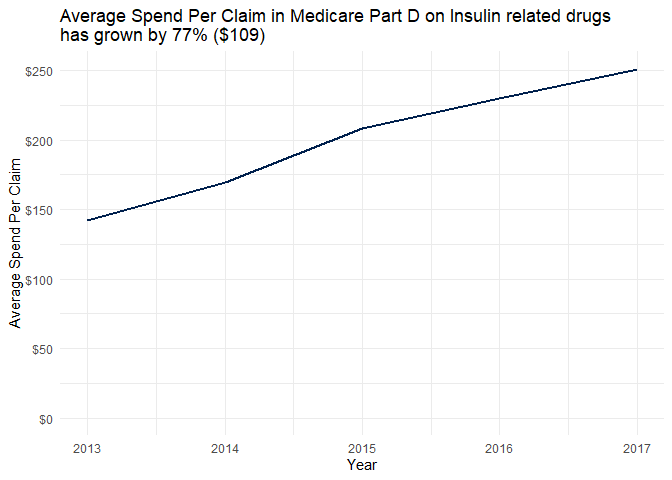<!-- -->

### Cancer

At a baseline, Chemotherapy/Cancer drugs are some of the most expensive on a per claim basis, and their growth as a category has continued between 2013 and 2017. Average spend per claim grew \$1264 in real terms since 2013.


```r
partd_cats_all %>% 
  filter(Category == "chemotherapy/cancer") %>%
  ggplot(aes(x=Year, y = brandlvl_avg_spend_perclaim, color = "foo")) +
  geom_line(size = 1) +
  scale_y_continuous(labels = function(x) paste0("$", x)) +
  scale_color_manual(values = "#00204DFF") +
  labs(y = "Average Spend Per Claim", title = "Average Spend Per Claim in Medicare Part D on Chemotherapy/Cancer related drugs\nhas grown by 80% ($1264)") +
  expand_limits(y = 0) +
  theme_minimal() +
  theme(legend.position = "none") 
```

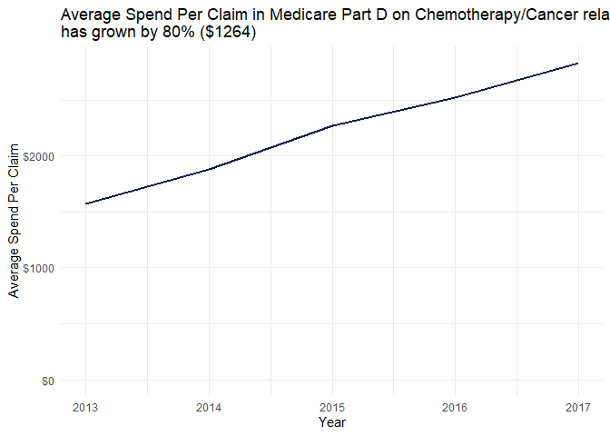<!-- -->

### HIV/AIDS

The average spend per claim for HIV/AIDS prescription drugs grew \$671 between 2013 and 2017.  


```r
partd_cats_all %>% 
  filter(Category == "HIV/AIDS") %>%
  ggplot(aes(x=Year, y = brandlvl_avg_spend_perclaim, color = "foo")) +
  geom_line(size = 1) +
  scale_y_continuous(labels = function(x) paste0("$", x)) +
  scale_color_manual(values = "#00204DFF") +
  labs(y = "Average Spend Per Claim", title = "Average Spend Per Claim in Medicare Part D on HIV/AIDS related drugs\nhas grown by 71% ($671)") +
  expand_limits(y = 0) +
  theme_minimal() +
  theme(legend.position = "none") 
```

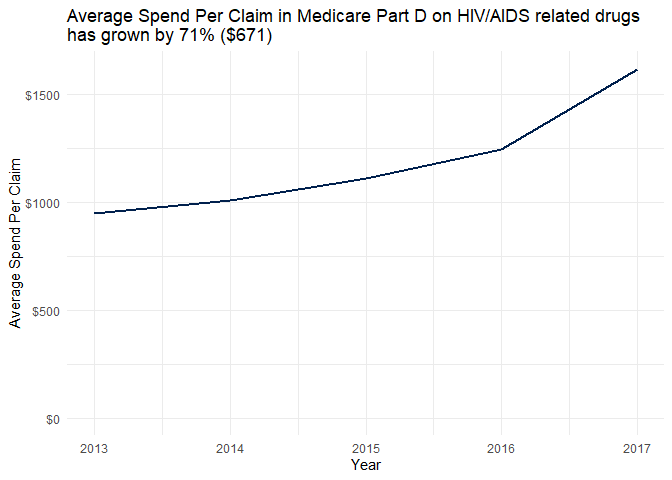<!-- -->

### Sterilization

Perhaps a more obscure category, sterilization is comprised of materials such as alcohol wipes or other items which help provide a sterile environment. Although this is not a particulary impactful category, it is surprising to see that these items have gone up by \$25 between 2013 and 2017 in real terms, which is a 227% increase from their starting point of \$11 per claim.


```r
partd_cats_all %>% 
  filter(Category == "sterilization") %>%
  ggplot(aes(x=Year, y = brandlvl_avg_spend_perclaim, color = "foo")) +
  geom_line(size = 1) +
  scale_y_continuous(labels = function(x) paste0("$", x)) +
  scale_color_manual(values = "#00204DFF") +
  labs(y = "Average Spend Per Claim", title = "Average Spend Per Claim in Medicare Part D on Sterilization related drugs\nhas grown by 227% ($25)") +
  expand_limits(y = 0) +
  theme_minimal() +
  theme(legend.position = "none") 
```

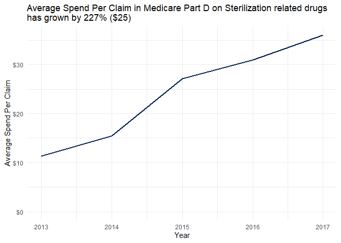<!-- -->

# Open Areas of Inquiry

1. Is there a trend that can be indentified among manufacturers across the various drugs that they produce?


